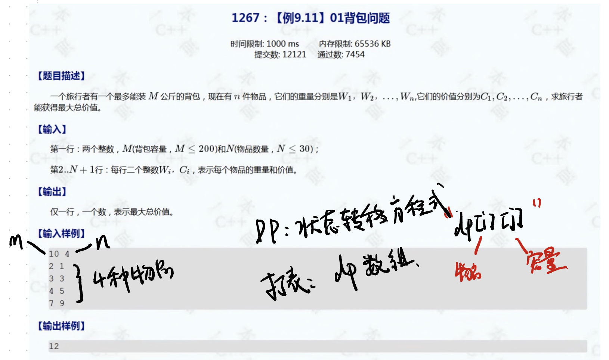
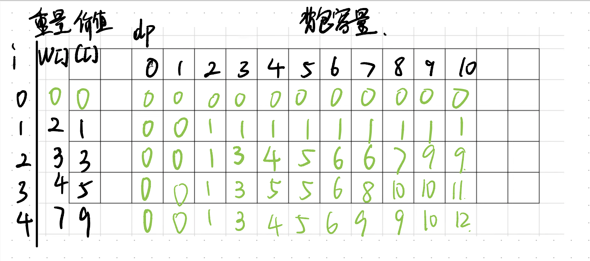
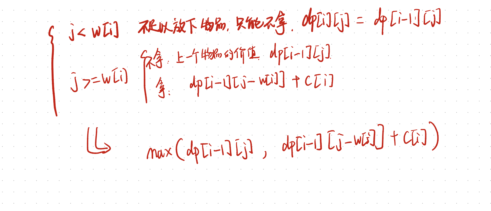
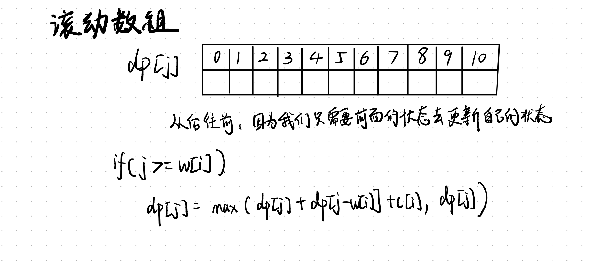

# 01背包


---

# 1.01背包问题

给定n种物品和一个容量为c的背包，物品的重量为W[i]，价值为C[i]，应该如何选择装入背包的物品，使得装入背包的物品的价值最大？



这种情况下可以考虑动态规划

构建dp数组，dp[i][j]中i为物品，j为容量，dp[i][j]为价值

---

# 2.思路

可以通过打表来寻找规律



从上方的表可以得知

```java
if(j<w[i]){
    dp[i][j]=dp[i-1][j];//拿不了，只能保留上一个状态的价值
}else{//j>=w[i]
    //判断上一种状态的价值大还是当前扣去拿取之后的价值大
    dp[i][j]=Math.max(dp[i][j-w[i])+c[i],dp[i-1][j])
}
```

---

# 3.动态规划公式



---

# 4.优化(滚动数组)

由于我们的每次判断，都是从dp[i][j-w[i]]来判断价值，所以可以考虑从上一个状态的数组的末尾开始向前遍历，以减小内存消耗



