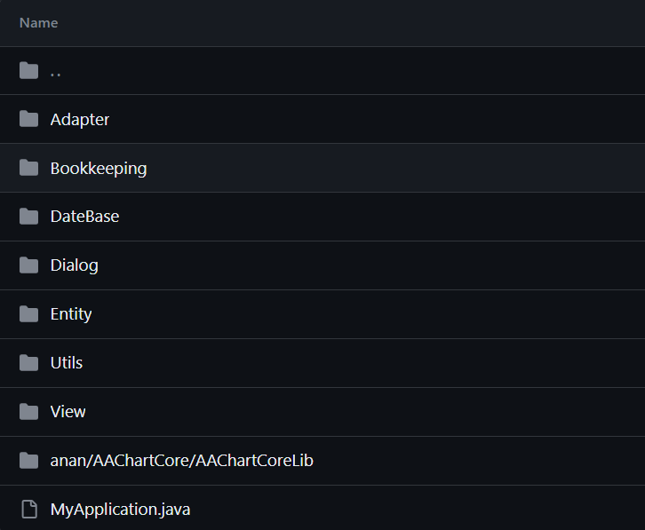
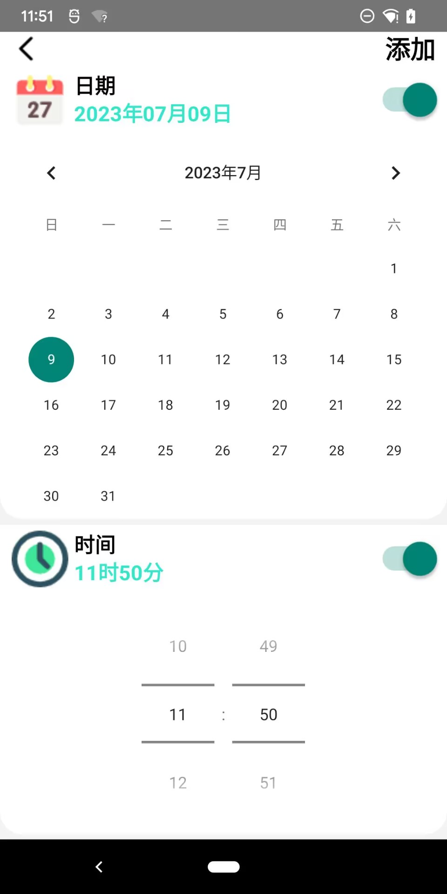
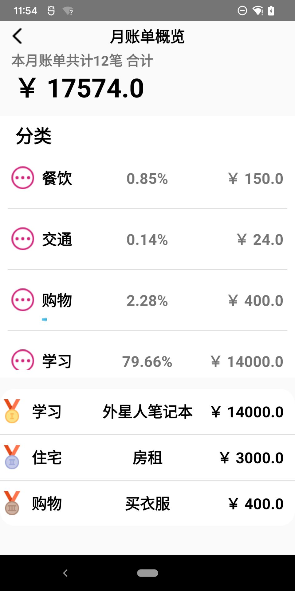
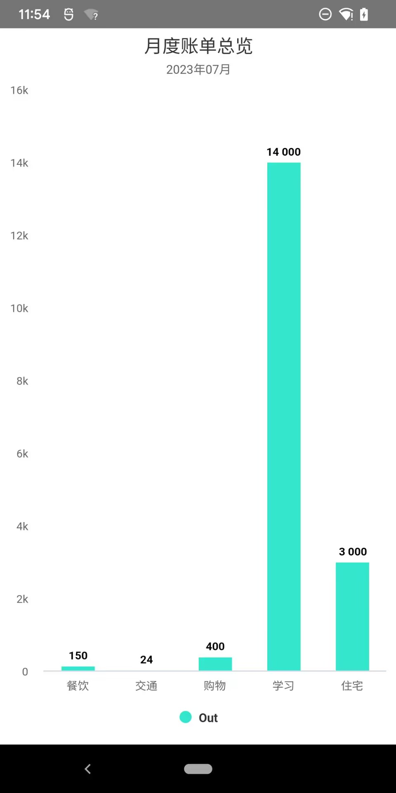
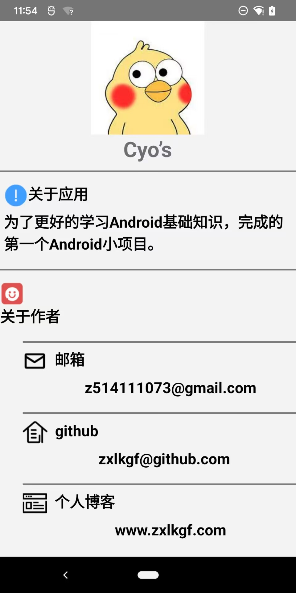

# Android基础学习_Bookkeeping

---

# 1.Bookkeeping  
实现功能:  
1. 主界面显示本月收支，本日收支，本月收支的条目  
2. 主界面右下角实现记一笔，菜单功能  
3. 菜单 包括账单概览，账单图表化概览，设置，关于  

具体实现请参考如下连接  
[记账本源码仓库](https://github.com/zxlkgf/Bookkeeping)  

--- 

## 1.1 文件夹结构
文件夹
1. Adapter 各类适配器
2. Bookkeeping Activity.java文件存放地址
3. DataBase 数据库操作类
4. Dialog 自定义弹窗
5. Entity 存储数据类
6. Utils 工具
7. View  自定义View
8. AAChartCoreLib AAChart图标
9. MyApplication.java 自定义Application

---

## 1.2 效果图

  

  

