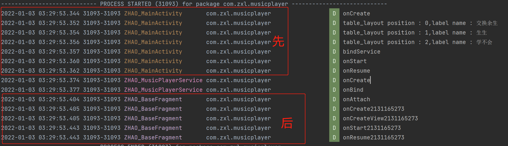

# Android基础学习_MediaPlayer(音乐播放器)利用Message


# 基于原生安卓的音乐播放器
## 1.BaseFragment

```java
public class BaseFragment extends Fragment {
    private static final String TAG = "ZHAO_BaseFragment";
    private static final Boolean DEBUG = true;
    private static final String MUSIC_BG = "music_bg";
    private static final String MUSIC_SRC = "music_src";

    private Integer mMusic_bg;
    private Integer mMusic_src;
    private View root;

    public BaseFragment() {
    }

    public static BaseFragment newInstance(Integer mMusic_bg, Integer mMusic_src) {
        BaseFragment fragment = new BaseFragment();
        Bundle args = new Bundle();
        args.putInt(MUSIC_BG, mMusic_bg);
        args.putInt(MUSIC_SRC, mMusic_src);
        fragment.setArguments(args);
        return fragment;
    }

    @Override
    public void onAttach(@NonNull Context context) {
        super.onAttach(context);
        log("onAttach");
    }

    @Override
    public void onCreate(Bundle savedInstanceState) {
        super.onCreate(savedInstanceState);
        if (getArguments() != null) {
            this.mMusic_bg = getArguments().getInt(MUSIC_BG);
            this.mMusic_src = getArguments().getInt(MUSIC_SRC);
        }
        log("onCreate"+mMusic_bg);
    }

    @Override
    public void onStart() {
        log("onStart"+mMusic_bg);
        super.onStart();
    }
    @Override
    public void onResume() {
        log("onResume"+mMusic_bg);
        super.onResume();
    }

    @Override
    public View onCreateView(LayoutInflater inflater, ViewGroup container,
                             Bundle savedInstanceState) {
        log("onCreateView"+mMusic_bg);
        if(root == null){
            root = inflater.inflate(R.layout.fragment_base,container,false);
            root.findViewById(R.id.ll_main).setBackgroundResource(getMusic_bg());
        }
        return root;
    }
    public int getMusic_src(){
        return mMusic_src;
    }
    public int getMusic_bg(){
        return mMusic_bg;
    }
    public View getRoot(){
        return root;
    }


    @Override
    public void onPause() {
        log("onPause"+mMusic_bg);
        super.onPause();
    }

    @Override
    public void onStop() {
        log("onStop"+mMusic_bg);
        super.onStop();
    }

    @Override
    public void onDestroy() {
        log("onDestroy"+mMusic_bg);
        super.onDestroy();
    }

    private void log(String str){
        if(DEBUG){
            Log.d(TAG,str);
        }
    }
}

```

fragment_xml部分

```xml
<?xml version="1.0" encoding="utf-8"?>
<FrameLayout xmlns:android="http://schemas.android.com/apk/res/android"
    xmlns:tools="http://schemas.android.com/tools"
    android:layout_width="match_parent"
    android:layout_height="match_parent"
    tools:context=".BaseFragment">

    <LinearLayout
        android:id="@+id/ll_main"
        android:layout_width="match_parent"
        android:layout_height="match_parent"
        android:background="@drawable/bg"
        android:gravity="center"
        android:orientation="vertical">
        <ImageView
            android:id="@+id/im_music"
            android:layout_width="240dp"
            android:layout_height="240dp"
            android:layout_gravity="center_horizontal"
            android:layout_margin="15dp"
            android:src="@drawable/music_disk"
            />
        <SeekBar
            android:id="@+id/sb_music"
            android:layout_width="match_parent"
            android:layout_height="wrap_content"
            android:progressBackgroundTint="#fff"/>
        <RelativeLayout
            android:layout_width="match_parent"
            android:layout_height="wrap_content"
            android:paddingLeft="8dp"
            android:paddingRight="8dp"
            >
            <TextView
                android:id="@+id/tv_progress"
                android:layout_width="wrap_content"
                android:layout_height="wrap_content"
                android:textColor="#fff"
                android:text="00:00"
                />
            <TextView
                android:id="@+id/tv_total"
                android:layout_width="wrap_content"
                android:layout_height="wrap_content"
                android:layout_alignParentRight="true"
                android:textColor="#fff"
                android:text="00:00"
                />
        </RelativeLayout>
        <LinearLayout
            android:layout_width="wrap_content"
            android:layout_height="wrap_content"
            android:orientation="horizontal"
            >
            <Button
                android:id="@+id/btn_play"
                android:layout_width="0dp"
                android:layout_height="wrap_content"
                android:layout_weight="1"
                android:paddingLeft="10dp"
                android:paddingRight="10dp"
                android:text="播放音乐"/>
            <Button
                android:id="@+id/btn_pause"
                android:layout_width="0dp"
                android:layout_height="wrap_content"
                android:layout_weight="1"
                android:paddingLeft="10dp"
                android:paddingRight="10dp"
                android:text="暂停播放"/>
            <Button
                android:id="@+id/btn_continue"
                android:layout_width="0dp"
                android:layout_height="wrap_content"
                android:layout_weight="1"
                android:paddingLeft="10dp"
                android:paddingRight="10dp"
                android:text="继续播放"/>
            <Button
                android:id="@+id/btn_exit"
                android:layout_width="0dp"
                android:layout_height="wrap_content"
                android:layout_weight="1"
                android:paddingLeft="10dp"
                android:paddingRight="10dp"
                android:text="退出播放"/>
        </LinearLayout>

    </LinearLayout>

</FrameLayout>
```

## Ui界面

```xml
<?xml version="1.0" encoding="utf-8"?>
<LinearLayout xmlns:android="http://schemas.android.com/apk/res/android"
    android:id="@+id/ll_main"
    android:layout_width="match_parent"
    android:layout_height="match_parent"
    android:gravity="center"
    android:orientation="vertical">

    <com.google.android.material.tabs.TabLayout
        android:id="@+id/tab_layout"
        android:layout_width="match_parent"
        android:layout_height="wrap_content"
        />

    <androidx.viewpager2.widget.ViewPager2
        android:id="@+id/viewpager2"
        android:layout_width="match_parent"
        android:layout_height="match_parent"
        />

</LinearLayout>
```


## MainActivity部分

```java

public class MainActivity extends AppCompatActivity {
    private static final String TAG = "ZHAO_MainActivity";
    private static final Boolean DEBUG = true;
    private static final int EVENT_PLAY = 1000;
    private static final int EVENT_PAUSE = 1001;
    private static final int EVENT_RESUME = 1002;
    private static final int EVENT_EXIT = 1003;
    private static final int EVENT_UPDATE_MUSIC_INFO = 1004;
    private static final int EVENT_SEEKBAR_CHANGED = 1005;
    private static final int EVENT_UPDATE_MUSIC_SRC = 1006;

    private ViewPager2 viewPager;
    private TabLayout tab_layout;
    private ArrayList<BaseFragment> fragmentList;
    private ArrayList<String> tab_label;
    private LinearLayout ll_main;
    private ImageView im_music;
    private SeekBar sb_music;
    private TextView tv_progress;
    private TextView tv_total;
    private Button btn_play,btn_pause,btn_resume,btn_exit;
    private ObjectAnimator animator;
    private BaseFragment currentFragment;
    private Messenger mMessenger ;
    private Handler mHandler = new Handler(){
        @Override
        public void handleMessage(@NonNull Message msg) {
            super.handleMessage(msg);
            switch (msg.what){
                case EVENT_UPDATE_MUSIC_INFO:
                    log("EVENT_UPDATE_MUSIC_INFO");
                    Bundle data = msg.getData();
                    int progress = data.getInt("progress");
                    int duration = data.getInt("duration");
                    sb_music.setMax(duration);
                    sb_music.setProgress(progress);
                    tv_progress.setText(msToSeekBar(progress));
                    tv_total.setText(msToSeekBar(duration));
                    sb_music.setProgress(progress);
                    break;
            }
        }
    };
    private ServiceConnection connection = new ServiceConnection() {
        @Override
        public void onServiceConnected(ComponentName name, IBinder service) {
            mMessenger = new Messenger(service);
        }

        @Override
        public void onServiceDisconnected(ComponentName name) {
            mMessenger = null;
        }
    };

    @Override
    protected void onCreate(@Nullable Bundle savedInstanceState) {
        super.onCreate(savedInstanceState);
        setContentView(R.layout.activity_main);
        log("onCreate");
        init();
        bindService();
    }
    @Override
    protected void onResume() {
        super.onResume();
        log("onResume");
    }
    //初始化用
    private void init(){
        viewPager = findViewById(R.id.viewpager2);
        tab_layout = findViewById(R.id.tab_layout);
        //生成ViewPager
        fragmentList = new ArrayList<>();
        fragmentList.add(BaseFragment.newInstance(R.drawable.bg_jiaohuanyusheng,R.raw.jjay_jiaohuanyusheng));
        fragmentList.add(BaseFragment.newInstance(R.drawable.bg_shengsheng,R.raw.jjay_shengsheng));
        fragmentList.add(BaseFragment.newInstance(R.drawable.bg_xuebuhui,R.raw.jjay_xuebuhui));
        MyFragmentAdapter myFragmentAdapter = new MyFragmentAdapter(this,fragmentList);
        viewPager.setAdapter(myFragmentAdapter);
        //初始化tabLabel
        tab_label = new ArrayList<>();
        tab_label.add("交换余生");
        tab_label.add("生生");
        tab_label.add("学不会");
        //创建滑动动画联动ViewPager和TabLayout
        new TabLayoutMediator(tab_layout, viewPager,true,false ,new TabLayoutMediator.TabConfigurationStrategy() {
            @Override
            public void onConfigureTab(@NonNull TabLayout.Tab tab, int position) {
                log("table_layout position : "+position+",label name : "+tab_label.get(position));
                tab.setText(tab_label.get(position));
            }
        }).attach();
        //需要设置TabLayout滑动监听来查看当前的Fragment
        //获取当前的Fragment
        //由于按照ViewPager默认生成的Fragment的Tag的命名是"f" + position 我们可以使用如下方法获取当前正在运行的Fragment
        tab_layout.addOnTabSelectedListener(new TabLayout.OnTabSelectedListener() {
            @Override
            public void onTabSelected(TabLayout.Tab tab) {
                initSelectedTabItem();
            }

            @Override
            public void onTabUnselected(TabLayout.Tab tab) {
            }

            @Override
            public void onTabReselected(TabLayout.Tab tab) {
            }
        });
    }
    private void initSelectedTabItem(){
        log(tab_layout.getTabAt(viewPager.getCurrentItem()).getText()+"");
        currentFragment = (BaseFragment) getSupportFragmentManager().findFragmentByTag("f"+viewPager.getCurrentItem());
        log(currentFragment.getTag());
        //并且切换有页面需要发送音乐源文件的SRC
        Message msg = mHandler.obtainMessage(EVENT_UPDATE_MUSIC_SRC);
        msg.obj = currentFragment.getMusic_src();
        msg.replyTo = new Messenger(mHandler);
        try {
            mMessenger.send(msg);
        } catch (RemoteException e) {
            throw new RuntimeException(e);
        }
        // 切换的时候控件需要置空
        ll_main = null;
        im_music = null;
        sb_music = null;
        tv_progress = null;
        tv_total = null;
        btn_play = null;
        btn_pause = null;
        btn_resume = null;
        btn_exit = null;
        //获取控件id
        ll_main = currentFragment.getRoot().findViewById(R.id.ll_main);
        im_music = currentFragment.getRoot().findViewById(R.id.im_music);
        sb_music = currentFragment.getRoot().findViewById(R.id.sb_music);
        tv_progress = currentFragment.getRoot().findViewById(R.id.tv_progress);
        tv_total = currentFragment.getRoot().findViewById(R.id.tv_total);
        btn_play = currentFragment.getRoot().findViewById(R.id.btn_play);
        btn_pause = currentFragment.getRoot().findViewById(R.id.btn_pause);
        btn_resume = currentFragment.getRoot().findViewById(R.id.btn_continue);
        btn_exit = currentFragment.getRoot().findViewById(R.id.btn_exit);
        onClick click = new onClick();
        btn_play.setOnClickListener(click);
        btn_pause.setOnClickListener(click);
        btn_resume.setOnClickListener(click);
        btn_exit.setOnClickListener(click);
        sb_music.setOnSeekBarChangeListener(new onSeekBarChanged());
        //设置背景,为相对于的背景
        ll_main.setBackgroundResource(currentFragment.getMusic_bg());
        //设置动画
        //设置为360旋转
        animator = ObjectAnimator.ofFloat(im_music,"rotation",0F,360F);
        //设置旋转为线性旋转，匀速旋转
        animator.setInterpolator(new LinearInterpolator());
        //设置动画持续时间10s
        animator.setDuration(10000);
        //设置动画重复次数,-1为重复
        animator.setRepeatCount(-1);

    }
    private void bindService(){
        log("bindService");
        Intent intent = new Intent(this, MusicPlayerService.class);
        bindService(intent,connection,BIND_AUTO_CREATE);
    }
    private void unBindService(){
        log("unBindService");
        unbindService(connection);
    }

    class onClick implements View.OnClickListener {
        @Override
        public void onClick(View v) {
            Message msg = mHandler.obtainMessage();
            if(v.getId() == R.id.btn_play){
                //发送播放请求
                msg.what = EVENT_PLAY;
                msg.replyTo = new Messenger(mHandler);
                try {
                    mMessenger.send(msg);
                } catch (RemoteException e) {
                    throw new RuntimeException(e);
                }
            }else if(v.getId() == R.id.btn_pause){
                //发送暂停请求
                msg.what = EVENT_PAUSE;
                try {
                    mMessenger.send(msg);
                } catch (RemoteException e) {
                    throw new RuntimeException(e);
                }
            }else if(v.getId() == R.id.btn_continue){
                //发送继续播放请求
                msg.what = EVENT_RESUME;
                try {
                    mMessenger.send(msg);
                } catch (RemoteException e) {
                    throw new RuntimeException(e);
                }
            }else if(v.getId() == R.id.btn_exit){
                //发送暂停请求
                msg.what = EVENT_PAUSE;
                try {
                    mMessenger.send(msg);
                } catch (RemoteException e) {
                    throw new RuntimeException(e);
                }
                //发送完毕之后执行关闭
                finish();
            }
        }
    }
    class onSeekBarChanged implements SeekBar.OnSeekBarChangeListener{
        @Override
        public void onProgressChanged(SeekBar seekBar, int progress, boolean fromUser) {
            if(progress == seekBar.getMax()){
                Message msg = mHandler.obtainMessage(EVENT_PAUSE);
                msg.obj = progress;
                try {
                    mMessenger.send(msg);
                } catch (RemoteException e) {
                    throw new RuntimeException(e);
                }
            }
            if(fromUser){
                Message msg = mHandler.obtainMessage(EVENT_SEEKBAR_CHANGED);
                msg.obj = progress;
                try {
                    mMessenger.send(msg);
                } catch (RemoteException e) {
                    throw new RuntimeException(e);
                }
            }
        }

        @Override
        public void onStartTrackingTouch(SeekBar seekBar) {
            Message msg = mHandler.obtainMessage(EVENT_PLAY);
            try {
                mMessenger.send(msg);
            } catch (RemoteException e) {
                throw new RuntimeException(e);
            }
        }

        @Override
        public void onStopTrackingTouch(SeekBar seekBar) {
            Message msg = mHandler.obtainMessage(EVENT_PAUSE);
            try {
                mMessenger.send(msg);
            } catch (RemoteException e) {
                throw new RuntimeException(e);
            }
        }
    }

    private String msToSeekBar(int ms){
        int sec = ms/1000;
        int min = sec/60;
        sec -= min * 60;
        return String.format("%02d:%02d",min,sec);
    }

    @Override
    protected void onStart() {
        log("onStart");
        super.onStart();
    }

    @Override
    protected void onPause() {
        super.onPause();
    }

    @Override
    protected void onDestroy() {
        super.onDestroy();
        log("onDestroy");
        unBindService();
    }

    private void log(String str){
        if(DEBUG){
            Log.d(TAG,str);
        }
    }
}


```

## service部分
```java
public class MusicPlayerService extends Service {
    private static final String TAG = "ZHAO_MusicPlayerService";
    private static final boolean DEBUG = true;
    private static final int EVENT_PLAY = 1000;
    private static final int EVENT_PAUSE = 1001;
    private static final int EVENT_RESUME = 1002;
    private static final int EVENT_EXIT = 1003;
    private static final int EVENT_UPDATE_MUSIC_INFO = 1004;
    private static final int EVENT_SEEKBAR_CHANGED = 1005;
    private static final int EVENT_UPDATE_MUSIC_SRC = 1006;
    private int mMusic_src;
    private MediaPlayer mediaPlayer;
    private Timer timer;
    private TimerTask timerTask;
    private Messenger mMessenger;
    private Messenger mClientMessenger;

    private Handler mHandler = new Handler(){
        @Override
        public void handleMessage(@NonNull Message msg) {
            super.handleMessage(msg);
            switch (msg.what){
                case EVENT_PLAY:
                    log("EVENT_PLAY");
                    play();
                    break;
                case EVENT_PAUSE:
                    log("EVENT_PAUSE");
                    pause();
                    break;
                case EVENT_RESUME:
                    log("EVENT_RESUME");
                    resume();
                    break;
                case EVENT_EXIT:
                    log("EVENT_EXIT");
                    stop();
                    break;
                case EVENT_SEEKBAR_CHANGED:
                    log("EVENT_SEEKBAR_CHANGED");
                    int progress = (int)msg.obj;
                    seekTo(progress);
                    break;
                case EVENT_UPDATE_MUSIC_SRC:
                    if(mediaPlayer != null){
                        pause();
                    }
                    log("EVENT_UPDATE_MUSIC_SRC");
                    mClientMessenger = msg.replyTo;
                    int music_src = (int)msg.obj;
                    compareMusicSrc(music_src);
            }
        }
    };

    @Override
    public void onCreate() {
        super.onCreate();
        log("onCreate");
        mediaPlayer = new MediaPlayer();
        mMessenger = new Messenger(mHandler);
        mMusic_src = R.raw.jjay_jiaohuanyusheng;
    }

    @Nullable
    @Override
    public IBinder onBind(Intent intent) {
        log("onBind");
        return mMessenger.getBinder();
    }

    @Override
    public int onStartCommand(Intent intent, int flags, int startId) {
        return super.onStartCommand(intent, flags, startId);
    }

    @Override
    public void onDestroy() {
        log("onDestroy");
        super.onDestroy();
    }
    private void addTimer(){
        timer = new Timer();
        timerTask = new TimerTask() {
            @Override
            public void run() {
                Message msg = mHandler.obtainMessage(EVENT_UPDATE_MUSIC_INFO);
                Bundle bundle = new Bundle();
                int duration = mediaPlayer.getDuration();
                int progress = mediaPlayer.getCurrentPosition();
                bundle.putInt("duration",duration);
                bundle.putInt("progress",progress);
                msg.setData(bundle);
                try {
                    mClientMessenger.send(msg);
                } catch (RemoteException e) {
                    throw new RuntimeException(e);
                }
            }
        };
        timer.schedule(timerTask,5,1000);
    }
    private void removeTimer(){
        if(timer !=null && timerTask!=null){
            timerTask.cancel();
            timer.purge();
        }
    }
    private void compareMusicSrc(int music_src){
        log("compareMusicSrc");
        if(mMusic_src != music_src){
            mMusic_src = music_src;
            mediaPlayer.reset();
            mediaPlayer = MediaPlayer.create(getApplicationContext(),mMusic_src);
        }
    }
    //播放音乐
    private void play(){
        log("play");
        mediaPlayer.start();
        addTimer();
    }
    //暂停音乐
    private void pause(){
        log("pause");
        mediaPlayer.pause();
        removeTimer();
    }
    //继续音乐
    private void resume(){
        log("resume");
        mediaPlayer.start();
        addTimer();
    }
    private void stop(){
        mediaPlayer.stop();
        mediaPlayer.release();
    }

    private void seekTo(int ms){
        log("seekTo");
        mediaPlayer.seekTo(ms);
    }

    private void log(String str){
        if(DEBUG){
            Log.d(TAG,str);
        }
    }
}

```


## 思路
### BaseFragment
提供了一个getInstance静态方法,创建实例。并在内部设置两个变量，  
music_src:音乐源    
music_bg:音乐背景    
获取BaseFragment实例的时候，会在onCreate方法中对music_src和music_bg进行赋值  
并在onCreateView方法中，对背景进行赋值，设置对应的背景。  

### 主界面
#### Service和Activity互相通信的方法之Activity向Service通信
在MyService中创建Handler,并以该Handler创建Messenger对象，在OnBind方法中返回Messenger.getBinder方法返回Binder对象。在Activity中创建ServiceConnection，并重写该接口的onServiceConnected和onServiceDisconnected连接方法。在onServiceConnected内利用传入参数Binder创建Messenger对象，该Messenger(信使)指向Service的Handler对象。  

#### Service和Activity互相通信的方法之AService向Activity通信
通过将Activity传向Service的Message内的replyTo设置为由Activity类的Handler生成的Messenger,并在Service内接收到该消息之后,获取msg.replyTo的Messenger对象，即可以向Activity的Handler对象发送信息。  

#### 主界面的设置
设置如下几种事件类型来传递消息。  
private static final int EVENT_PLAY = 1000;  
private static final int EVENT_PAUSE = 1001;  
private static final int EVENT_RESUME = 1002;  
private static final int EVENT_EXIT = 1003;  
private static final int EVENT_UPDATE_MUSIC_INFO = 1004;  
private static final int EVENT_SEEKBAR_CHANGED = 1005;  
private static final int EVENT_UPDATE_MUSIC_SRC = 1006;  

利用ViewPager2和TabLayout，建立页面滑动效果，并在页面切换的时候，传递Music_src，对播放源进行重置。**但是由于在Fragment的声明周期后于Avtivity,导致在进入主界面的时候，第一个页面的控件无法赋值和设置点击函数,必须在接触TabLayout的滑动监听效果,去重置赋值**。
  

点击播放按钮，生成EVENT_PLAY消息发送,并每秒接受从service发送的EVENT_UPDATE_MUSIC_INFO更新SeekBar等信息.
点击暂停按钮，生成EVENT_PAUSE消息发送  
点击继续按钮，生成EVENT_RESUME消息发送  
点击退出按钮，生成EVENT_PAUSE，并在本页面调用finish()  

滑动界面，触发addOnTabSelectedListener.onTabSelected 发送EVENT_PAUSE之后，发送EVENT_UPDATE_MUSIC_SRC，接着对控件重新赋值  

### Service
接收EVENT_PLAY信息，调用play(),mediaPlay重新赋值,添加计时器任务。  
接收EVENT_PAUSE,调用pause(),timerTask.cancel(),并让Timer.purge清除被标记为cancel的任务  
接收EVENT_RESUME,调用resume(),重新为timer添加timerTask,向Activity传输任务。  
接收EVENT_EXIT，调用stop()  
接收EVENT_SEEKBAR_CHANGED,调用seekTo,将mediaplayer的进度调到参数位置  
接收EVENT_UPDATE_MUSIC_SRC，更新音乐源，并重新创建赋值mediaplayer  

### 问题点
1.如何获取第一个Fragment并赋值  
2.使用Aidl进行进程间通信。  
3.对某些资源的释放。  


### 效果图
  


