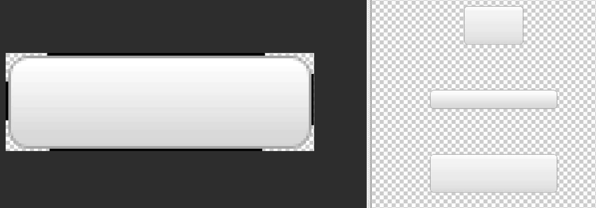
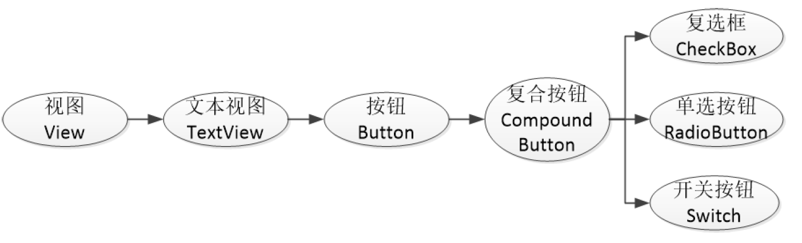
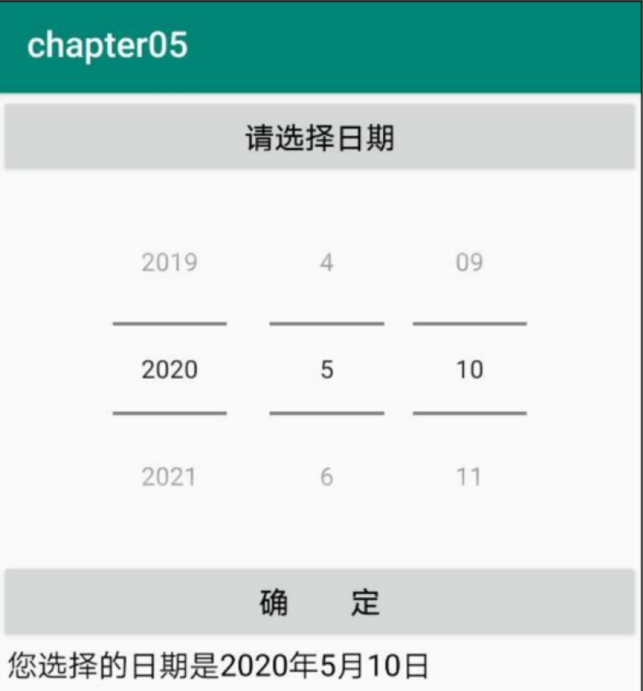
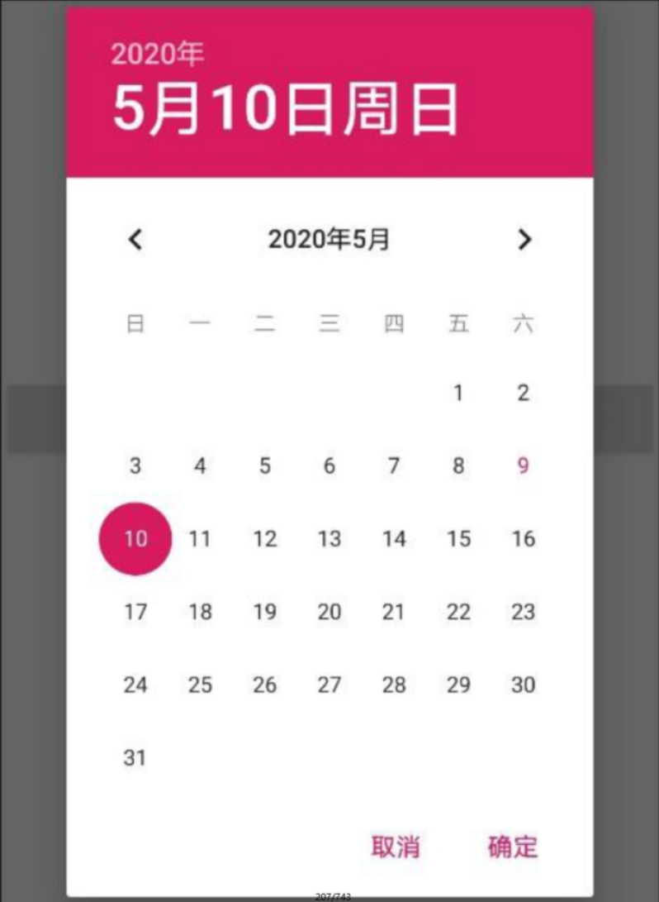
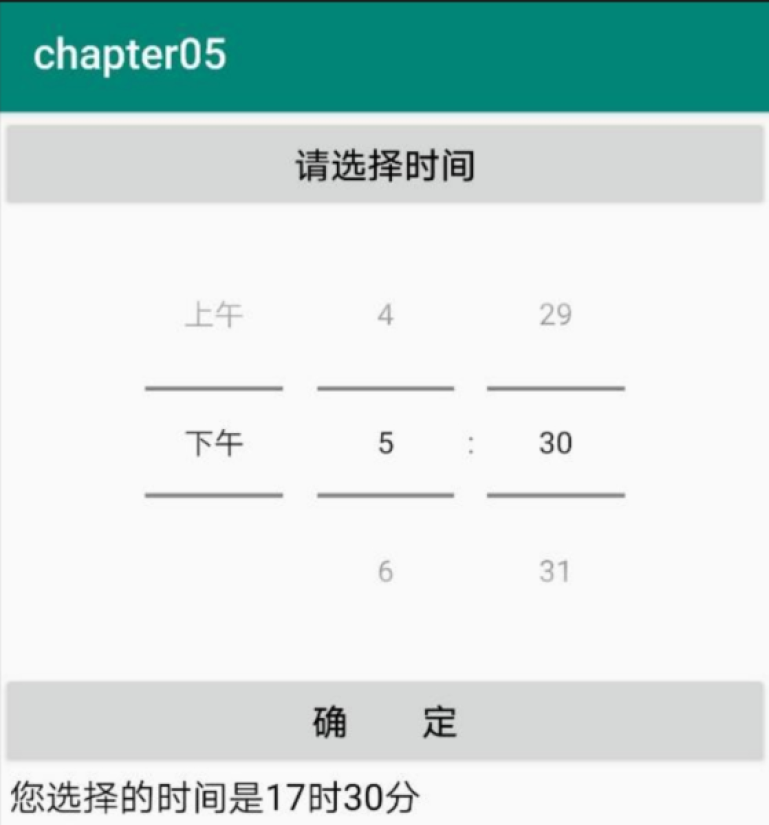
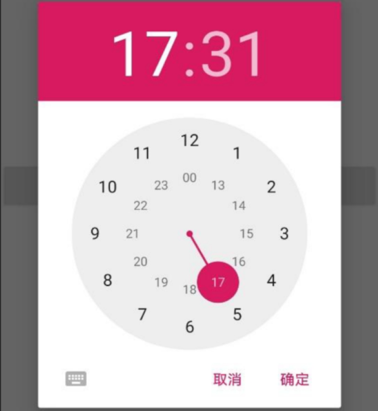

# Android基础学习_中级控件


# 1.Android开发 中级控件
## 1.1 图形定制
### 1.1.1 图形Drawable
Android把所有能够显示的图形都抽象为Drawable类（可绘制的）。这里的图形不止是图片，还包括色块、画板、背景等。包含图片在内的图形文件放在res目录的各个drawable目录下，其中drawable目录一般保存描述性的
XML文件，而图片文件一般放在具体分辨率的drawable目录下。  

例如：  
drawable-ldpi里面存放低分辨率的图片（如240×320），现在基本没有这样的智能手机了。  
drawable-mdpi里面存放中等分辨率的图片（如320×480），这样的智能手机已经很少了。  
drawable-hdpi里面存放高分辨率的图片（如480×800），一般对应4英寸～4.5英寸的手机（但不绝对，同尺寸的手机有可能分辨率不同，手机分辨率就高不就低，因为分辨率低了屏幕会有模糊的感觉）。  
drawable-xhdpi里面存放加高分辨率的图片（如720×1280），一般对应5英寸～5.5英寸的手机。  
drawable-xxhdpi里面存放超高分辨率的图片（如1080×1920），一般对应6英寸～6.5英寸的手机。  
drawable-xxxhdpi里面存放超超高分辨率的图片（如1440×2560），一般对应7英寸以上的平板电脑。  

基本上，分辨率每加大一级，宽度和高度就要增加二分之一或三分之一像素。如果各目录存在同名图
片，Android就会根据手机的分辨率分别适配对应文件夹里的图片。在开发App时，为了兼容不同的手机
屏幕，在各目录存放不同分辨率的图片，才能达到最合适的显示效果。例如，在drawable-hdpi放了一
张背景图片bg.png（分辨率为480×800），其他目录没放，使用分辨率为480×800的手机查看该App界
面没有问题，但是使用分辨率为720×1280的手机查看该App会发现背景图片有点模糊，原因是Android
为了让bg.png适配高分辨率的屏幕，强行把bg.png拉伸到了720×1280，拉伸的后果是图片变模糊了。  

在XML布局文件中引用图形文件可使用“@drawable/不含扩展名的文件名称”这种形式，如各视图的
background属性、ImageView和ImageButton的src属性、TextView和Button四个方向的drawable***
系列属性都可以引用图形文件。

---


### 1.1.2 shape视图
Shape图形又称形状图形，它用来描述常见的几何形状，包括矩形、圆角矩形、圆形、椭圆等。用好形状图形可以让App页面不再呆板，还可以节省美工不少工作量。  

形状图形的定义文件放在drawable目录下，它是以shape标签为根节点的XML描述文件。根节点下定义
了6个节点，分别是：size（尺寸）、stroke（描边）、corners（圆角）、solid（填充）、padding
（间隔）、gradient（渐变），各节点的属性值主要是长宽、半径、角度以及颜色等。下面是形状图形
各个节点及其属性的简要说明。

#### 1.1.2.1 shape(形状)
shape是形状图形文件的根节点，它描述了当前是哪种几何图形。下面是shape节点的常用属性说明。  

shape：字符串类型，表示图形的形状。形状类型的取值说明见下表。  

|形状类型|说明|
|---|---|
|rectangle|矩形,默认值|
|ring|圆形|
|oval|椭圆,此时corner节点会失效|
|line|直线,必须设置stroke，否则会报错|

#### 1.1.2.2 size
size是shape的下级节点，它描述了形状图形的宽高尺寸。若无size节点，则表示宽高与宿主视图一样大小。下面是size节点的常用属性说明。  
height：像素类型，图形高度。  
width：像素类型，图形宽度。

#### 1.1.2.3 stroke(描边)
stroke是shape的下级节点，它描述了形状图形的描边规格。若无stroke节点，则表示不存在描边。下面是stroke节点的常用属性说明。  
color：颜色类型，描边的颜色。  
dashGap：像素类型，每段虚线之间的间隔。  
dashWidth：像素类型，每段虚线的宽度。若dashGap和dashWidth有一个值为0，则描边为实
线。  
width：像素类型，描边的厚度。

#### 1.1.2.4 corners(圆角)
corners是shape的下级节点，它描述了形状图形的圆角大小。若无corners节点，则表示没有圆角。下
面是corners节点的常用属性说明。  
bottomLeftRadius：像素类型，左下圆角的半径。  
bottomRightRadius：像素类型，右下圆角的半径。  
topLeftRadius：像素类型，左上圆角的半径。  
topRightRadius：像素类型，右上圆角的半径。  
radius：像素类型，4个圆角的半径（若有上面4个圆角半径的定义，则不需要radius定义）。  

#### 1.1.2.5 solid(填充)
solid是shape的下级节点，它描述了形状图形的填充色彩。若无solid节点，则表示无填充颜色。下面是
solid节点的常用属性说明。  
color：颜色类型，内部填充的颜色。

#### 1.1.2.6 padding(间隔)
padding是shape的下级节点，它描述了形状图形与周围边界的间隔。若无padding节点，则表示四周不
设间隔。下面是padding节点的常用属性说明。  
top：像素类型，与上方的间隔。  
bottom：像素类型，与下方的间隔。  
left：像素类型，与左边的间隔。  
right：像素类型，与右边的间隔。  

#### 1.1.2.7 gradient(渐变)
gradient是shape的下级节点，它描述了形状图形的颜色渐变。若无gradient节点，则表示没有渐变效
果。下面是gradient节点的常用属性说明。  

angle：整型，渐变的起始角度。为0时表示时钟的9点位置，值增大表示往逆时针方向旋转。例
如，值为90表示6点位置，值为180表示3点位置，值为270表示0点/12点位置  

type：字符串类型，渐变类型。渐变类型的取值说明见下表

|渐变类型|说明|
|linear|线性渐变,默认值|
|radial|放射渐变,起始颜色就是圆心颜色|
|sweep|滚动渐变,即一个线段以某个端点为圆心做360°旋转|


centerX：浮点型，圆心的X坐标。当android:type="linear"时不可用。  
centerY：浮点型，圆心的Y坐标。当android:type="linear"时不可用。  
gradientRadius：整型，渐变的半径。当android:type="radial"时需要设置该属性。  
centerColor：颜色类型，渐变的中间颜色。  
startColor：颜色类型，渐变的起始颜色。  
endColor：颜色类型，渐变的终止颜色。  
useLevel：布尔类型，设置为true为无渐变色、false为有渐变色。  


----

### 1.1.3 九宫格图片
将某张图片设置成视图背景时，如果图片尺寸太小，则系统会自动拉伸图片使之填满背景。可是一旦图
片拉得过大，其画面容易变得模糊，如图5-3所示，上面按钮的背景图片被拉得很宽，此时左右两边的边
缘线既变宽又变模糊了。

为了解决这个问题，Android专门设计了点九图片。点九图片的扩展名是png，文件名后面常带有“.9”字
样。因为该图片划分了3×3的九宫格区域，所以得名点九图片，也叫九宫格图片。如果背景是一个形状
图形，其stroke节点的width属性已经设置了固定数值（如1dp），那么无论该图形被拉到多大，描边宽
度始终是1dp。点九图片的实现原理与之类似，即拉伸图形时，只拉伸内部区域，不拉伸边缘线条。

NinePhoto
  

图1的左侧窗口是图片加工区域，右侧窗口是图片预览区域，从上到下依次是纵向拉伸预览、横向
拉伸预览、两方向同时拉伸预览。在左侧窗口图片四周的马赛克处单击会出现一个黑点，把黑点左右或
上下拖动会拖出一段黑线，不同方向上的黑线表示不同的效果。  

界面上边的黑线指的是水平方向的拉伸区域。水平方向拉伸图片时，只有黑线区域内的图像会拉伸，黑线以外的图像保持原状，从而保证左右两侧的边框厚度不变。   

界面左边的黑线指的是垂直方向的拉伸区域。垂直方向拉伸图片时，只有黑线区域内的图像会拉伸，黑线以外的图像保持原状，从而保证上下两侧的边框厚度不变。  

界面下边的黑线指的是该图片作为控件背景时，控件内部的文字左右边界只能放在黑线区域内。这里Horizontal Padding的效果就相当于android:paddingLeft与android:paddingRight  

界面右边的黑线指的是该图片作为控件背景时，控件内部的文字上下边界只能放在黑线区域内。这里Vertical Padding的效果就相当于android:paddingTop与android:paddingBottom  

尤其注意，如果点九图片被设置为视图背景，且该图片指定了Horizontal Padding和Vertical Padding，
那么视图内部将一直与视图边缘保持固定间距，无论怎么调整XML文件和Java代码都无法缩小间隔，缘由是点九图片早已在水平和垂直方向都设置了padding  

---

### 1.1.4 状态列表图形
常见的图形文件一般为静态图形，但有时会用到动态图形，比如按钮控件的背景在正常情况下是凸起
的，在按下时是凹陷的，从按下到弹起的过程，用户便晓得点击了该按钮。根据不同的触摸情况变更图
形状态，这种情况用到了Drawable的一个子类StateListDrawable（状态列表图形），它在XML文件中
规定了不同状态时候所呈现的图形列表。  

接下来演示一下状态列表图形的界面效果，右击drawable目录，并依次选择右键菜单的
New→Drawable resource file，在弹窗中输入文件名称再单击OK按钮，即可自动生成一个XML描述文
件。往该文件填入下面的状态列表图形定义：

接下来演示一下状态列表图形的界面效果，右击drawable目录，并依次选择右键菜单的
New→Drawable resource file，在弹窗中输入文件名称再单击OK按钮，即可自动生成一个XML描述文
件。往该文件填入下面的状态列表图形定义：

```xml
<?xml version="1.0" encoding="utf-8"?>
<selector xmlns:android="http://schemas.android.com/apk/res/android">
    <item 
        android:state_pressed="true" 
        android:drawable="@drawable/button_pressed"
        />
    <item 
        android:drawable="@drawable/button_normal"
        />
</selector>
```
上述XML文件的关键点是state_pressed属性，该属性表示按下状态，值为true表示按下时显示
button_pressed图像，其余情况显示button_normal图像。

效果图如下:  
  


状态列表图形不仅用于按钮控件，还可用于其他拥有多种状态的控件，这取决于开发者在XML文件中指
定了哪种状态类型，各种状态类型的取值说明详见下表.

|状态类型的属性名称|说明|使用的控件|
|---|---|---|
|state_pressed|是否按下|按钮|
|state_checked|是否勾选|复选框CheckBox、单选按钮RadioButton|
|state_focused|是否获取焦点|文本编辑框EditText|
|state_selected|是否选中|各控件均适用|

---

## 1.2 选择按钮
几个常用的特殊控制按钮
### 1.2.1  复选框CheckBox
在学习复选框之前，先了解一下CompoundButton。在Android体系中，CompoundButton类是抽象的
复合按钮，因为是抽象类，所以它不能直接使用。实际开发中用的是CompoundButton的几个派生类，
主要有复选框CheckBox、单选按钮RadioButton以及开关按钮Switch，这些派生类均可使用
CompoundButton的属性和方法。加之CompoundButton本身继承了Button类，故以上几种按钮同时
具备Button的属性和方法，它们之间的继承关系如图4所示。  

  

CompoundButton在XML文件中主要使用下面两个属性。  
checked：指定按钮的勾选状态，true表示勾选，false则表示未勾选。默认为未勾选。  
button：指定左侧勾选图标的图形资源，如果不指定就使用系统的默认图标。  

CompoundButton在Java代码中主要使用下列4种方法。  
setChecked：设置按钮的勾选状态。  
setButtonDrawable：设置左侧勾选图标的图形资源。  
setOnCheckedChangeListener：设置勾选状态变化的监听器。  
isChecked：判断按钮是否勾选。  

复选框CheckBox是CompoundButton一个最简单的实现控件，点击复选框将它勾选，再次点击取消勾
选。复选框对象调用setOnCheckedChangeListener方法设置勾选监听器，这样在勾选和取消勾选时就
会触发监听器的勾选事件。  

接下来演示复选框的操作过程，首先编写活动页面的XML文件如下所示：
```xml
    <CheckBox
        android:id="@+id/ck_system"
        android:layout_width="match_parent"
        android:layout_height="wrap_content"
        android:text="这是systemStyle CheckBox"
        android:textSize="20sp"
        />
```
接着编写对应的Java代码，主要是如何处理勾选监听器，具体代码如下所示：
```java
public class CheckBoxReviewActivity extends AppCompatActivity implements CompoundButton.OnCheckedChangeListener {

    @Override
    protected void onCreate(Bundle savedInstanceState) {
        super.onCreate(savedInstanceState);
        setContentView(R.layout.activity_check_box_review);
        CheckBox ck_system = findViewById(R.id.ck_system);
        CheckBox ck_custom  = findViewById(R.id.ck_custom);

        ck_system.setOnCheckedChangeListener(this);
        ck_custom.setOnCheckedChangeListener(this);
    }

    @Override
    public void onCheckedChanged(CompoundButton buttonView, boolean isChecked) {
            String desc = String.format("你%s了这个CheckBox",(isChecked ? "勾选" : "取消勾选"));
            buttonView.setText(desc);
    }
}
```

---

### 1.2.2  开关按钮switch
Switch是开关按钮，它像一个高级版本的CheckBox，在选中与取消选中时可展现的界面元素比复选框丰
富。Switch控件新添加的XML属性说明如下：  

textOn：设置右侧开启时的文本。  
textOff：设置左侧关闭时的文本。  
track：设置开关轨道的背景。  
thumb：设置开关标识的图标。  

下面介绍类IOSUI的Switch控件的设计。
主要思路是借助状态列表图形，首先创建一个图形专用的XML文件，给状态列表指定选中与未选中时候的开关图标，如下所示：
```xml
<selector xmlns:android="http://schemas.android.com/apk/res/android">
<item android:state_checked="true" android:drawable="@drawable/switch_on"/>
<item android:drawable="@drawable/switch_off"/>
</selector>
```
然后把CheckBox标签的background属性设置为@drawable/switch_selector，同时将button属性设置
为@null。完整的CheckBox标签内容示例如下：
```xml
<CheckBox
android:id="@+id/ck_status"
android:layout_width="60dp"
android:layout_height="30dp"
android:background="@drawable/switch_selector"
android:button="@null" />
```

---

### 1.2.3 单选按钮RadioButton
所谓单选按钮，指的是在一组按钮中选择其中一项，并且不能多选，这要求有个容器确定这组按钮的范
围，这个容器便是单选组RadioGroup。单选组实质上是个布局，同一组RadioButton都要放在同一个
RadioGroup节点下。RadioGroup提供了orientation属性指定下级控件的排列方向，该属性为horizontal时，单选按钮在水平方向排列；该属性为vertical时，单选按钮在垂直方向排列。

下面是RadioGroup在Java代码中的3个常用方法。  

check：选中指定资源编号的单选按钮。  
getCheckedRadioButtonId：获取已选中单选按钮的资源编号。  
setOnCheckedChangeListener：设置单选按钮勾选变化的监听器。  

与CheckBox不同的是，RadioButton默认未选中，点击后显示选中，但是再次点击不会取消选中。只有
点击同组的其他单选按钮时，原来选中的单选按钮才会取消选中。另需注意，单选按钮的选中事件不是
由RadioButton处理，而是由RadioGroup处理。


---

## 1.3 文本输入
### 1.3.1 编辑框EditText
编辑框EditText用于接收软键盘输入的文字，例如用户名、密码、评价内容等，它由文本视图派生而
来，除了TextView已有的各种属性和方法，EditText还支持下列XML属性。  

inputType：指定输入的文本类型。输入类型的取值说明见下表，若同时使用多种文本类型，则可使用竖线“|”把多种文本类型拼接起来。  
maxLength：指定文本允许输入的最大长度。  
hint：指定提示文本的内容。  
textColorHint：指定提示文本的颜色。  

|输入类型|说明|
|---|---|
|text|文本|
|textPassword|文本密码。显示时用圆点"."代替显示|
|number|整型数|
|numberSigned|带符号的数字。允许在开头带负号|
|numberDecimal|带小数点的数字|
|numberPassword|数字密码。显示时用圆点"."代替显示|
|datetime|时间日期格式。除了数字外，还允许输入横线、斜杆、空格、冒号|
|date|日期格式。除了数字外，还允许输入横线“-”和斜杆“/”|
|time|时间格式。除了数字外，还允许输入冒号“:”|

---

### 1.3.2 焦点变更监听器
虽然编辑框EditText提供了maxLength属性，用来设置可输入文本的最大长度，但是它没提供对应的
minLength属性，也就无法设置可输入文本的最小长度。譬如手机号码为固定的11位数字，用户必须输
满11位才是合法的，然而编辑框不会自动检查手机号码是否达到11位，即使用户少输一位只输入十位数
字，编辑框依然认为这是合法的手机号。  

焦点变更监听器来自于接口View.OnFocusChangeListener，若想注册该监听器，就要调用编辑框对象
的setOnFocusChangeListener方法，即可在光标切换之时（获得光标和失去光标）触发焦点变更事
件。下面是给密码框注册焦点变更监听器的代码例子

```java
// 从布局文件中获取名为et_password的编辑框
EditText et_password = findViewById(R.id.et_password);
// 给编辑框注册一个焦点变化监听器，一旦焦点发生变化，就触发监听器的onFocusChange方法
et_password.setOnFocusChangeListener(this);
```
以上代码把焦点变更监听器设置到当前页面，则需让活动页面实现接口
View.OnFocusChangeListener，并重写该接口定义的onFocusChange方法，判断如果是密码框获得焦
点，就检查输入的手机号码是否达到11位。具体的焦点变更处理方法如下所示：

```java
// 焦点变更事件的处理方法，hasFocus表示当前控件是否获得焦点。
// 为什么光标进入事件不选onClick？因为要点两下才会触发onClick动作（第一下是切换焦点动作）
@Override
public void onFocusChange(View v, boolean hasFocus) {
// 判断密码编辑框是否获得焦点。hasFocus为true表示获得焦点，为false表示失去焦点
if (v.getId()==R.id.et_password && hasFocus) {
  String phone = et_phone.getText().toString();
    if (TextUtils.isEmpty(phone) || phone.length()<11) { // 手机号码不足11位
    // 手机号码编辑框请求焦点，也就是把光标移回手机号码编辑框
    et_phone.requestFocus();
    Toast.makeText(this, "请输入11位手机号码", Toast.LENGTH_SHORT).show();
    }
  }
}
```

---

### 1.3.3 文本监视器

监控文本的监控操作用到文本监听器接口TextWatcher，该接口提供了3个监控方法，具体说明如下：  
beforeTextChanged：在文本改变之前触发。  
onTextChanged：在文本改变过程中触发。  
afterTextChanged：在文本改变之后触发。  

具体到编码实现，需要自己写个监听器实现TextWatcher接口，再调用编辑框对象的
addTextChangedListener方法注册文本监听器。监听操作建议在afterTextChanged方法中完成、

---

## 1.4 对话框
本节介绍几种常用的对话框控件，包括：如何使用提醒对话框处理不同的选项，如何使用日期对话框获
取用户选择的日期，如何使用时间对话框获取用户选择的时间。
### 1.4.1  提醒对话框AlertDialog
AlertDialog名为提醒对话框，它是Android中最常用的对话框，可以完成常见的交互操作，例如提示、
确认、选择等功能。由于AlertDialog没有公开的构造方法，因此必须借助建造器AlertDialog.Builder才
能完成参数设置，AlertDialog.Builder的常用方法说明如下。  

setIcon：设置对话框的标题图标。  
setTitle：设置对话框的标题文本。  
setMessage：设置对话框的内容文本。  
setPositiveButton：设置肯定按钮的信息，包括按钮文本和点击监听器。  
setNegativeButton：设置否定按钮的信息，包括按钮文本和点击监听器。  
setNeutralButton：设置中性按钮的信息，包括按钮文本和点击监听器，该方法比较少用。  

首先，我们来了解一下AlertDialog的大体创建顺序。与TextView、Button这些控件稍有不同, AlertDialog并不是初始化（findViewById）之后就直接调用各种方法了。仔细想想AlertDialog的使用场景,它并不像TextView和Button那些控件似的一般都是固定在界面上,而是在某个时机才会触发出来（比如用户点击了某个按钮或者断网了）。所以AlertDialog并不需要到布局文件中创建，而是在代码中通过构造器（AlertDialog.Builder）来构造标题、图标和按钮等内容的。  

  1.创建构造器AlertDialog.Builder的对象；  
  2.通过构造器对象调用setTitle、setMessage、setIcon等方法构造对话框的标题、信息和图标等内容；  
  3.根据需要调用setPositive/Negative/NeutralButton()方法设置正面按钮、负面按钮和中立按钮；  
  4.调用构造器对象的create方法创建AlertDialog对象；  
  5.AlertDialog对象调用show方法，让对话框在界面上显示。  

注：AlertDialog.Builder自己也有一个show方法，可以显示对话框，所以上面的第4、第5步可以简化为一步。

下面是构建并显示提醒对话框的Java代码例子：
```java
public class AlertDialogReviewActivity extends AppCompatActivity implements View.OnClickListener {

    private TextView tv_show;

    @Override
    protected void onCreate(Bundle savedInstanceState) {
        super.onCreate(savedInstanceState);
        setContentView(R.layout.activity_alert_dialog_review);
        Button delete_soft = findViewById(R.id.delete_soft);
        delete_soft.setOnClickListener(this);
    }

    @Override
    public void onClick(View v) {
        AlertDialog.Builder builder = new AlertDialog.Builder(this);
        builder.setTitle("尊敬的用户:");
        builder.setMessage("您真的要卸载我么");
        builder.setPositiveButton("残忍卸载", new DialogInterface.OnClickListener() {
            @Override
            public void onClick(DialogInterface dialog, int which) {
                Toast.makeText(AlertDialogReviewActivity.this,"虽然依依不舍，但是只能离开了",Toast.LENGTH_SHORT).show();
            }
        });
        builder.setNegativeButton("我再想想", new DialogInterface.OnClickListener() {
            @Override
            public void onClick(DialogInterface dialog, int which) {
                Toast.makeText(AlertDialogReviewActivity.this,"陪你三百六十五个日夜",Toast.LENGTH_SHORT).show();
            }
        });
        AlertDialog alertDialog = builder.create();
        alertDialog.show();
    }
}
```

---

### 1.4.2  日期对话框DatePickerDialog
虽然EditText提供了inputType="date"的日期输入，但是很少有人会手工输入完整日期，况且EditText
还不支持“ 年 ** 月 **日”这样的中文日期，所以系统提供了专门的日期选择器DatePicker，供用户选择
具体的年月日。不过，DatePicker并非弹窗模式，而是在当前页面占据一块区域，并且不会自动关闭。
按习惯来说，日期控件应该弹出对话框，选择完日期就要自动关闭对话框。因此，很少直接在界面上显
示DatePicker，而是利用已经封装好的日期选择对话框DatePickerDialog。  

DatePickerDialog相当于在AlertDialog上装载了DatePicker，编码时只需调用构造方法设置当前的年、
月、日，然后调用show方法即可弹出日期对话框。日期选择事件则由监听器OnDateSetListener负责响
应，在该监听器的onDateSet方法中，开发者获取用户选择的具体日期，再做后续处理。特别注意
onDateSet的月份参数，它的起始值不是1而是0。也就是说，一月份对应的参数值为0，十二月份对应的
参数值为11，中间月份的数值以此类推。  

在界面上内嵌显示DatePicker的效果如图5所示，其中，年、月、日通过上下滑动选择。单独弹出日
期对话框的效果如图5-34所示，其中年、月、日按照日历风格展示  

  



下面是使用日期对话框的Java代码例子，包括弹出日期对话框和处理日期监听事件：
```java
// 该页面类实现了接口OnDateSetListener，意味着要重写日期监听器的onDateSet方法
public class DatePickerActivity extends AppCompatActivity implements
View.OnClickListener, DatePickerDialog.OnDateSetListener {
private TextView tv_date; // 声明一个文本视图对象
private DatePicker dp_date; // 声明一个日期选择器对象
@Override
protected void onCreate(Bundle savedInstanceState) {
super.onCreate(savedInstanceState);
setContentView(R.layout.activity_date_picker);
tv_date = findViewById(R.id.tv_date);
// 从布局文件中获取名叫dp_date的日期选择器
dp_date = findViewById(R.id.dp_date);
findViewById(R.id.btn_date).setOnClickListener(this);
}
@Override
public void onClick(View v) {
if (v.getId() == R.id.btn_date) {
// 获取日历的一个实例，里面包含了当前的年月日
Calendar calendar = Calendar.getInstance();
// 构建一个日期对话框，该对话框已经集成了日期选择器。
// DatePickerDialog的第二个构造参数指定了日期监听器
DatePickerDialog dialog = new DatePickerDialog(this, this,
calendar.get(Calendar.YEAR), // 年份
calendar.get(Calendar.MONTH), // 月份
calendar.get(Calendar.DAY_OF_MONTH)); // 日子
dialog.show(); // 显示日期对话框
}
}
// 一旦点击日期对话框上的确定按钮，就会触发监听器的onDateSet方法
@Override
public void onDateSet(DatePicker view, int year, int monthOfYear, int
dayOfMonth) {
// 获取日期对话框设定的年月份
String desc = String.format("您选择的日期是%d年%d月%d日",
year, monthOfYear + 1, dayOfMonth);
tv_date.setText(desc);
}
}
```
### 1.4.3  时间对话框TimePickerDialog
既然有了日期选择器，还得有对应的时间选择器。同样，实际开发中也很少直接用TimePicker，而是用
封装好的时间选择对话框TimePickerDialog。该对话框的用法类似DatePickerDialog，不同之处主要有
两个：  

（1）构造方法传的是当前的小时与分钟，最后一个参数表示是否采取24小时制，一般为true表示小时
的数值范围为0～23；若为false则表示采取12小时制。  
（2）时间选择监听器为OnTimeSetListener，对应需要实现onTimeSet方法，在该方法中可获得用户选
择的小时和分钟。  

在界面上内嵌显示TimePicker的效果如图7所示，其中，小时与分钟可通过上下滑动选择。单独弹出
时间对话框的效果如图8所示，其中小时与分钟按照钟表风格展示。






下面是使用时间对话框的Java代码例子，包括弹出时间对话框和处理时间监听事件：
```java
// 该页面类实现了接口OnTimeSetListener，意味着要重写时间监听器的onTimeSet方法
public class TimePickerActivity extends AppCompatActivity implements
View.OnClickListener, TimePickerDialog.OnTimeSetListener {
private TextView tv_time; // 声明一个文本视图对象
private TimePicker tp_time; // 声明一个时间选择器对象
@Override
protected void onCreate(Bundle savedInstanceState) {
super.onCreate(savedInstanceState);
setContentView(R.layout.activity_time_picker);
tv_time = findViewById(R.id.tv_time);
// 从布局文件中获取名叫tp_time的时间选择器
tp_time = findViewById(R.id.tp_time);
findViewById(R.id.btn_time).setOnClickListener(this);
}
@Override
public void onClick(View v) {
if (v.getId() == R.id.btn_time) {
// 获取日历的一个实例，里面包含了当前的时分秒
Calendar calendar = Calendar.getInstance();
// 构建一个时间对话框，该对话框已经集成了时间选择器。
// TimePickerDialog的第二个构造参数指定了时间监听器
TimePickerDialog dialog = new TimePickerDialog(this, this,
calendar.get(Calendar.HOUR_OF_DAY), // 小时
calendar.get(Calendar.MINUTE), // 分钟
true); // true表示24小时制，false表示12小时制
dialog.show(); // 显示时间对话框
}
}
// 一旦点击时间对话框上的确定按钮，就会触发监听器的onTimeSet方法
@Override
public void onTimeSet(TimePicker view, int hourOfDay, int minute) {
// 获取时间对话框设定的小时和分钟
String desc = String.format("您选择的时间是%d时%d分", hourOfDay, minute);
tv_time.setText(desc);
}
}
```

