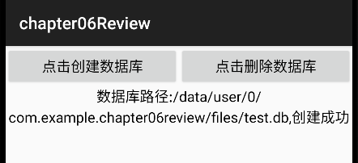
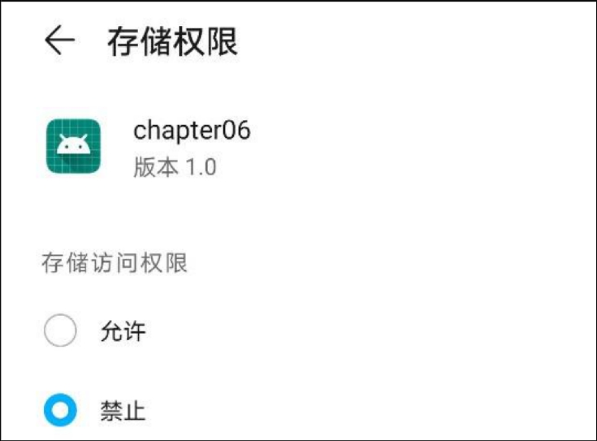

# Android基础学习_数据存储


# 1.Android开发 数据存储
## 1.1 共享参数sharePrefrence
本节介绍Android的键值对存储方式——共享参数SharedPreferences的使用方法，包括：如何将数据保存到共享参数，如何从共享参数读取数据，如何使用共享参数实现登录页面的记住密码功能，如何利用设备浏览器找到共享参数文件。

### 1.1.1 共享参数的使用方法
SharedPreferences是Android的一个轻量级存储工具，它采用的存储结构是**Key-Value**的键值对方式，类似于Java的Properties，二者都是把Key-Value的键值对保存在配置文件中。不同的是，Properties的文件内容形如**Key=Value**，而SharedPreferences的存储介质是XML文件，且以XML标记保存键值对。保存共享参数键值对信息的文件路径为：/data/data/应用包名/shared_prefs/文件名.xml。下面是一个共享参数的XML文件例子：  

```xml
<?xml version='1.0' encoding='utf-8' standalone='yes' ?>
<map>
    <int name="isMarried" value="0" />
    <string name="name">李易</string>
    <float name="weight" value="90.0" />
    <int name="age" value="24" />
    <long name="height" value="180" />
</map>

```

基于XML格式的特点，共享参数主要用于如下场合：  
（1）简单且孤立的数据。若是复杂且相互关联的数据，则要保存于关系数据库。  
（2）文本形式的数据。若是二进制数据，则要保存至文件。  
（3）需要持久化存储的数据。App退出后再次启动时，之前保存的数据仍然有效。  
实际开发中，共享参数经常存储的数据包括：App的个性化配置信息、用户使用App的行为信息、临时需要保存的片段信息等。  
共享参数对数据的存储和读取操作类似于Map，也有存储数据的put方法，以及读取数据的get方法。调
用getSharedPreferences方法可以获得共享参数实例，获取代码示例如下：
```java
// 从share.xml获取共享参数实例
SharedPreferences sp = getSharedPreferences("user_info", MODE_PRIVATE);
```
由以上代码可知，getSharedPreferences方法的第一个参数是文件名，填share表示共享参数的文件名
是share.xml；第二个参数是操作模式，填MODE_PRIVATE表示私有模式。往共享参数存储数据要借助于Editor类，保存数据的代码示例如下：  
```java
            SharedPreferences.Editor editor = sp.edit();
            editor.putString("name",name);
            editor.putInt("age",Integer.parseInt(age));
            editor.putLong("height",Long.parseLong(height));
            editor.putFloat("weight",Float.parseFloat(weight));
            editor.putInt("isMarried",(ck_isMarried.isChecked()?1:0));
            editor.commit();
```
从共享参数读取数据相对简单，直接调用共享参数实例的get方法即可读取键值，注意 get方法
的第二个参数表示默认值，读取数据的代码示例如下：
```java
                StringBuilder sb = new StringBuilder();
                sb.append(sp.getString("name","")).append("\n")
                        .append(sp.getInt("age",0)).append("\n")
                        .append(sp.getLong("height",0)).append("\n")
                        .append(sp.getFloat("weight",0.0f)).append("\n")
                        .append((sp.getInt("isMarried",0)==1)?"已婚":"未婚");
                tv_result.setText(sb.toString());
```

---

## 1.2 数据库SQLite
本节介绍Android的数据库存储方式—SQLite的使用方法，包括：SQLite用到了哪些SQL语法，如何使用
数据库管理器操纵SQLite，如何使用数据库帮助器简化数据库操作等，以及如何利用SQLite改进登录页
面的记住密码功能。

### 1.2.1 SQL的基本语法
此处省略

### 1.2.2 数据库管理器SQLiteDatabase
SQL语句毕竟只是SQL命令，若要在Java代码中操纵SQLite，还需专门的工具类。SQLiteDatabase便是
Android提供的SQLite数据库管理器，开发者可以在活动页面代码调用openOrCreateDatabase方法获
取数据库实例，参考代码如下：
```java
        public void onClick(View v) {
            if(v.getId() == R.id.btn_create_db){
                // 创建名为test.db的数据库。数据库如果不存在就创建它，如果存在就打开它
                sqLiteDatabase = openOrCreateDatabase(
                        getFilesDir() + File.separator + "test.db",
                        Context.MODE_PRIVATE,
                        null);
                //输出创建成功
                String desc = String.format("数据库路径:%s,创建%s",sqLiteDatabase.getPath(),(sqLiteDatabase!=null)?"成功":"失败");
                tv_show.setText(desc);
            }else if(v.getId() == R.id.btn_delete_db){
                String path = sqLiteDatabase.getPath();
                boolean flag = deleteDatabase(path);
                String desc = String.format("数据库路径:%s,创建%s",path,(flag)?"成功":"失败");
                tv_show.setText(desc);
            }
        }
```
  

获得数据库实例之后，就能对该数据库开展各项操作了。数据库管理器SQLiteDatabase提供了若干操作
数据表的API，常用的方法有3类，列举如下：  

#### 管理类，用于数据库层面的操作 
openDatabase：打开指定路径的数据库。  
isOpen：判断数据库是否已打开。  
close：关闭数据库。  
getVersion：获取数据库的版本号。  
setVersion：设置数据库的版本号。  

#### 事务类，用于事务层面的操作
beginTransaction：开始事务。  
setTransactionSuccessful：设置事务的成功标志。  
endTransaction：结束事务。执行本方法时，系统会判断之前是否调用了  
setTransactionSuccessful方法，如果之前已调用该方法就提交事务，如果没有调用该方法就回滚事务。  

#### 数据处理类，用于数据表层面的操作
execSQL：执行拼接好的SQL控制语句。一般用于建表、删表、变更表结构。  
delete：删除符合条件的记录。  
update：更新符合条件的记录信息。  
insert：插入一条记录。  
query：执行查询操作，并返回结果集的游标。  
rawQuery：执行拼接好的SQL查询语句，并返回结果集的游标。  

---

### 1.2.3 数据库帮助器SQLiteOpenHelper
由于SQLiteDatabase存在局限性，一不小心就会重复打开数据库，处理数据库的升级也不方便；因此
Android提供了数据库帮助器SQLiteOpenHelper，帮助开发者合理使用SQLite。  

SQLiteOpenHelper的具体使用步骤如下：  

1\.新建一个继承自SQLiteOpenHelper的数据库操作类，按提示重写onCreate和onUpgrade两个方法。其中，onCreate方法只在第一次打开数据库时执行，在此可以创建表结构；而onUpgrade方法在数据库版本升高时执行，在此可以根据新旧版本号变更表结构。  

2\.为保证数据库安全使用，需要封装几个必要方法，包括获取单例对象、打开数据库连接、关闭
数据库连接，说明如下：    
2.1 获取单例对象：确保在App运行过程中数据库只会打开一次，避免重复打开引起错误。  

2.2 打开数据库连接：SQLite有锁机制，即读锁和写锁的处理；故而数据库连接也分两种，读连接可调用getReadableDatabase方法获得，写连接可调用getWritableDatabase获得。  

2.3 关闭数据库连接：数据库操作完毕，调用数据库实例的close方法关闭连接。  

3\.提供对表记录增加、删除、修改、查询的操作方法。  

能被SQLite直接使用的数据结构是ContentValues类，它类似于映射Map，也提供了put和get方法存取
键值对。区别之处在于：ContentValues的键只能是字符串，不能是其他类型。ContentValues主要用于
增加记录和更新记录，对应数据库的insert和update方法。  
记录的查询操作用到了游标类Cursor，调用query和rawQuery方法返回的都是Cursor对象，若要获取全
部的查询结果，则需根据游标的指示一条一条遍历结果集合。Cursor的常用方法可分为3类，说明如
下：
#### 1.2.3.1 游标控制类方法，用于指定游标的状态
close：关闭游标。  
isClosed：判断游标是否关闭。  
isFirst：判断游标是否在开头。  
isLast：判断游标是否在末尾。  

#### 1.2.3.2 游标移动类方法，把游标移动到指定位置 
moveToFirst：移动游标到开头。  
moveToLast：移动游标到末尾。  
moveToNext：移动游标到下一条记录。  
moveToPrevious：移动游标到上一条记录。  
move：往后移动游标若干条记录。  
moveToPosition：移动游标到指定位置的记录。  

#### 1.2.3.3 获取记录类方法，可获取记录的数量、类型以及取值
getCount：获取结果记录的数量。  
getInt：获取指定字段的整型值。  
getLong：获取指定字段的长整型值。  
getFloat：获取指定字段的浮点数值。  
getString：获取指定字段的字符串值。  
getType：获取指定字段的字段类型。  


整体创建流程见如下代码,效果图不具体展示:
layout_file
```xml
<?xml version="1.0" encoding="utf-8"?>
<LinearLayout xmlns:android="http://schemas.android.com/apk/res/android"
    xmlns:app="http://schemas.android.com/apk/res-auto"
    xmlns:tools="http://schemas.android.com/tools"
    android:layout_width="match_parent"
    android:layout_height="match_parent"
    tools:context=".SharePrefrenceActivity"
    android:orientation="vertical">

    <LinearLayout
        android:layout_width="match_parent"
        android:layout_height="wrap_content"
        android:orientation="horizontal"
        >
        <TextView
            android:layout_width="120dp"
            android:layout_height="wrap_content"
            android:layout_weight="1"
            android:text="姓名:"
            android:textSize="17sp"
            android:textColor="@color/black"
            />
        <EditText
            android:id="@+id/et_name"
            android:layout_width="match_parent"
            android:layout_height="40dp"
            android:layout_weight="1"
            android:hint="请输入您的名字"
            android:textSize="17sp"
            android:inputType="text"
            android:background="@drawable/editext_selector"
            />
    </LinearLayout>
    <LinearLayout
        android:layout_width="match_parent"
        android:layout_height="wrap_content"
        android:orientation="horizontal"
        >
        <TextView
            android:layout_width="120dp"
            android:layout_height="wrap_content"
            android:layout_weight="1"
            android:text="年龄:"
            android:textSize="17sp"
            android:textColor="@color/black"
            />
        <EditText
            android:id="@+id/et_age"
            android:layout_width="match_parent"
            android:layout_height="40dp"
            android:layout_weight="1"
            android:hint="请输入您的年龄"
            android:textSize="17sp"
            android:inputType="number"
            android:background="@drawable/editext_selector"
            />
    </LinearLayout>
    <LinearLayout
        android:layout_width="match_parent"
        android:layout_height="wrap_content"
        android:orientation="horizontal"
        >
        <TextView
            android:layout_width="120dp"
            android:layout_height="wrap_content"
            android:layout_weight="1"
            android:text="身高:"
            android:textSize="17sp"
            android:textColor="@color/black"
            />
        <EditText
            android:id="@+id/et_height"
            android:layout_width="match_parent"
            android:layout_height="40dp"
            android:layout_weight="1"
            android:hint="请输入您的身高"
            android:textSize="17sp"
            android:inputType="number"
            android:background="@drawable/editext_selector"
            />
    </LinearLayout>
    <LinearLayout
        android:layout_width="match_parent"
        android:layout_height="wrap_content"
        android:orientation="horizontal"
        >
        <TextView
            android:layout_width="120dp"
            android:layout_height="wrap_content"
            android:layout_weight="1"
            android:text="体重:"
            android:textSize="17sp"
            android:textColor="@color/black"
            />
        <EditText
            android:id="@+id/et_weight"
            android:layout_width="match_parent"
            android:layout_height="40dp"
            android:layout_weight="1"
            android:hint="请输入您的体重"
            android:textSize="17sp"
            android:inputType="number"
            android:background="@drawable/editext_selector"
            />
    </LinearLayout>
    <CheckBox
        android:id="@+id/ck_isMarried"
        android:layout_width="match_parent"
        android:layout_height="40dp"
        android:text="婚否"
        android:textSize="17sp"/>
    <Button
        android:id="@+id/btn_insert"
        android:layout_width="match_parent"
        android:layout_height="wrap_content"
        android:text="insert"
        android:textSize="17sp"
        android:textColor="@color/black"/>

    <Button
        android:id="@+id/btn_delete"
        android:layout_width="match_parent"
        android:layout_height="wrap_content"
        android:text="delete"
        android:textSize="17sp"
        android:textColor="@color/black"/>
    <Button
        android:id="@+id/btn_update"
        android:layout_width="match_parent"
        android:layout_height="wrap_content"
        android:text="update"
        android:textSize="17sp"
        android:textColor="@color/black"/>
    <Button
        android:id="@+id/btn_query"
        android:layout_width="match_parent"
        android:layout_height="wrap_content"
        android:text="query"
        android:textSize="17sp"
        android:textColor="@color/black"/>

    <TextView
        android:id="@+id/tv_result"
        android:layout_width="match_parent"
        android:layout_height="wrap_content"
        />

</LinearLayout>
```
```java
package com.dongnaoedu.chapter06.database;

import android.content.ContentValues;
import android.content.Context;
import android.database.Cursor;
import android.database.sqlite.SQLiteDatabase;
import android.database.sqlite.SQLiteOpenHelper;
import android.view.WindowAnimationFrameStats;

import com.dongnaoedu.chapter06.enity.User;

import java.util.ArrayList;
import java.util.List;

public class UserDBHelper extends SQLiteOpenHelper {

    private static final String DB_NAME = "user.db";
    private static final String TABLE_NAME = "user_info";
    private static final int DB_VERSION = 2;
    private static UserDBHelper mHelper = null;
    private SQLiteDatabase mRDB = null;
    private SQLiteDatabase mWDB = null;

    private UserDBHelper(Context context) {
        super(context, DB_NAME, null, DB_VERSION);
    }

    // 利用单例模式获取数据库帮助器的唯一实例
    public static UserDBHelper getInstance(Context context) {
        if (mHelper == null) {
            mHelper = new UserDBHelper(context);
        }
        return mHelper;
    }

    // 打开数据库的读连接
    public SQLiteDatabase openReadLink() {
        if (mRDB == null || !mRDB.isOpen()) {
            mRDB = mHelper.getReadableDatabase();
        }
        return mRDB;
    }

    // 打开数据库的写连接
    public SQLiteDatabase openWriteLink() {
        if (mWDB == null || !mWDB.isOpen()) {
            mWDB = mHelper.getWritableDatabase();
        }
        return mWDB;
    }

    // 关闭数据库连接
    public void closeLink() {
        if (mRDB != null && mRDB.isOpen()) {
            mRDB.close();
            mRDB = null;
        }

        if (mWDB != null && mWDB.isOpen()) {
            mWDB.close();
            mWDB = null;
        }
    }

    // 创建数据库，执行建表语句
    @Override
    public void onCreate(SQLiteDatabase db) {
        String sql = "CREATE TABLE IF NOT EXISTS " + TABLE_NAME + " (" +
                "_id INTEGER PRIMARY KEY AUTOINCREMENT NOT NULL," +
                " name VARCHAR NOT NULL," +
                " age INTEGER NOT NULL," +
                " height LONG NOT NULL," +
                " weight FLOAT NOT NULL," +
                " married INTEGER NOT NULL);";
        db.execSQL(sql);
    }

    @Override
    public void onUpgrade(SQLiteDatabase db, int oldVersion, int newVersion) {
        String sql = "ALTER TABLE " + TABLE_NAME + " ADD COLUMN phone VARCHAR;";
        db.execSQL(sql);
        sql = "ALTER TABLE " + TABLE_NAME + " ADD COLUMN password VARCHAR;";
        db.execSQL(sql);
    }

    public long insert(User user) {
        ContentValues values = new ContentValues();
        values.put("name", user.name);
        values.put("age", user.age);
        values.put("height", user.height);
        values.put("weight", user.weight);
        values.put("married", user.married);
        // 执行插入记录动作，该语句返回插入记录的行号
        // 如果第三个参数values 为Null或者元素个数为0， 由于insert()方法要求必须添加一条除了主键之外其它字段为Null值的记录，
        // 为了满足SQL语法的需要， insert语句必须给定一个字段名 ，如：insert into person(name) values(NULL)，
        // 倘若不给定字段名 ， insert语句就成了这样： insert into person() values()，显然这不满足标准SQL的语法。
        // 如果第三个参数values 不为Null并且元素的个数大于0 ，可以把第二个参数设置为null 。
        //return mWDB.insert(TABLE_NAME, null, values);

        try {
            mWDB.beginTransaction();
            mWDB.insert(TABLE_NAME, null, values);
            //int i = 10 / 0;
            mWDB.insert(TABLE_NAME, null, values);
            mWDB.setTransactionSuccessful();
        } catch (Exception e) {
            e.printStackTrace();
        } finally {
            mWDB.endTransaction();
        }

        return 1;
    }

    public long deleteByName(String name) {
        //删除所有
        //mWDB.delete(TABLE_NAME, "1=1", null);
        return mWDB.delete(TABLE_NAME, "name=?", new String[]{name});
    }

    public long update(User user) {
        ContentValues values = new ContentValues();
        values.put("name", user.name);
        values.put("age", user.age);
        values.put("height", user.height);
        values.put("weight", user.weight);
        values.put("married", user.married);
        return mWDB.update(TABLE_NAME, values, "name=?", new String[]{user.name});
    }

    public List<User> queryAll() {
        List<User> list = new ArrayList<>();
        // 执行记录查询动作，该语句返回结果集的游标
        Cursor cursor = mRDB.query(TABLE_NAME, null, null, null, null, null, null);
        // 循环取出游标指向的每条记录
        while (cursor.moveToNext()) {
            User user = new User();
            user.id = cursor.getInt(0);
            user.name = cursor.getString(1);
            user.age = cursor.getInt(2);
            user.height = cursor.getLong(3);
            user.weight = cursor.getFloat(4);
            //SQLite没有布尔型，用0表示false，用1表示true
            user.married = (cursor.getInt(5) == 0) ? false : true;
            list.add(user);
        }
        return list;
    }

    public List<User> queryByName(String name) {
        List<User> list = new ArrayList<>();
        // 执行记录查询动作，该语句返回结果集的游标
        Cursor cursor = mRDB.query(TABLE_NAME, null, "name=?", new String[]{name}, null, null, null);
        // 循环取出游标指向的每条记录
        while (cursor.moveToNext()) {
            User user = new User();
            user.id = cursor.getInt(0);
            user.name = cursor.getString(1);
            user.age = cursor.getInt(2);
            user.height = cursor.getLong(3);
            user.weight = cursor.getFloat(4);
            //SQLite没有布尔型，用0表示false，用1表示true
            user.married = (cursor.getInt(5) == 0) ? false : true;
            list.add(user);
        }
        return list;
    }
}

```

---

## 1.3 存储卡的文件操作
本节介绍Android的文件存储方式—在存储卡上读写文件，包括：公有存储空间与私有存储空间有什么
区别、如何利用存储卡读写文本文件、如何利用存储卡读写图片文件等。
### 1.3.1 　私有存储空间与公共存储空间
为了更规范地管理手机存储空间，Android从7.0开始将存储卡划分为私有存储和公共存储两大部分，也就是分区存储方式，系统给每个App都分配了默认的私有存储空间。App在私有空间上读写文件无何授权，但是若想在公共空间读写文件，则要在AndroidManifest.xml里面添加下述的权限配置。
```xml
<!-- 存储卡读写 -->
<uses-permission android:name="android.permission.WRITE_EXTERNAL_STORAGE"/>
<uses-permission android:name="android.permission.READ_EXTERNAL_STORAG" />
```
但是即使App声明了完整的存储卡操作权限，系统仍然默认禁止该App访问公共空间。打开手机的系统设置界面，进入到具体应用的管理页面，会发现该应用的存储访问权限被禁止了，如图2所示。  
  

当然图示的禁止访问只是不让访问存储卡的公共空间，App自身的私有空间依旧可以正常读写。这缘于
Android把存储卡分成了两块区域，一块是所有应用均可访问的公共空间，另一块是只有应用自己才可
访问的专享空间。虽然Android给每个应用都分配了单独的安装目录，但是安装目录的空间很紧张，所
以Android在存储卡的“Android/data”目录下给每个应用又单独建了一个文件目录，用来保存应用自己
需要处理的临时文件。这个目录只有当前应用才能够读写文件，其他应用是不允许读写的。由于私有空
间本身已经加了访问权限控制，因此它不受系统禁止访问的影响，应用操作自己的文件目录自然不成问
题。因为私有的文件目录只有属主应用才能访问，所以一旦属主应用被卸载，那么对应的目录也会被删
掉。  

既然存储卡分为公共空间和私有空间两部分，它们的空间路径获取也就有所不同。若想获取公共空间的
存储路径，调用的是Environment.getExternalStoragePublicDirectory方法；若想获取应用私有空间的
存储路径，调用的是getExternalFilesDir方法。下面是分别获取两个空间路径的代码例子：
```java
        //获取系统公共存储路径
        String publicPath = Environment.getExternalStoragePublicDirectory(Environment.DIRECTORY_DOWNLOADS).toString();

        //当前app的私有路径
        String privatePath = getExternalFilesDir(Environment.DIRECTORY_DOWNLOADS).toString();

        boolean isLegacy = true;
        if (Build.VERSION.SDK_INT >= Build.VERSION_CODES.Q) {
        // Android10的存储空间默认采取分区方式，此处判断是传统方式还是分区方式
            isLegacy = Environment.isExternalStorageLegacy();
        }
        String desc = "系统的公共存储路径位于" + publicPath +
                "\n\n当前App的私有存储路径位于" + privatePath +
                "\n\nAndroid7.0之后默认禁止访问公共存储目录" +
                "\n\n当前App的存储空间采取" + (isLegacy?"传统方式":"分区方式");
        tv_show.setText(desc);
```

----

### 1.3.2 在存储卡上读写文本文件
公共区域和私有区域的读写，均依赖于IO流的读写。下面代码定义了读写的FILE工具类:
```java
public class FileUtil {
    //把字符串保存到指定路径的文本文件
    public static void saveText(String path,String text){
        BufferedWriter bw = null;
        try{
            bw = new BufferedWriter(new FileWriter(path));
            bw.write(text);
        }catch (Exception e){
            e.printStackTrace();
        }finally {
            if(bw!=null){
                try {
                    bw.close();
                } catch (IOException e) {
                    throw new RuntimeException(e);
                }
            }
        }
    }
    //从指定路径抽出文本
    public static String readText(String path){
        BufferedReader br = null;
        StringBuilder sb = new StringBuilder();
        try{
            br = new BufferedReader(new FileReader(path));
            String str = null;
            while((str = br.readLine())!=null){
                sb.append(str);
            }
        }catch (Exception e){
            e.printStackTrace();
        }finally {
            if(br!=null){
                try {
                    br.close();
                } catch (IOException e) {
                    throw new RuntimeException(e);
                }
            }
        }
        return sb.toString();
    }
}

```
需要在公共区域写入文件时,可以传入path  
```java
String path = Environment.getExternalStoragePublicDirectory(Environment.DIRECTORY_DOWNLOADS).toString() +  File.separatorChar + filename;  
```
需要在私有区域写入文件时，可以传入path
```java
String path = getExternalFilesDir(Environment.DIRECTORY_DOWNLOADS).toString() File.separatorChar + filename;  

```

---

### 1.3.3 在存储卡上读取图片
文本文件读写可以转换为对字符串的读写，而图片文件保存的是图像数据，需要专门的位图工具Bitmap
处理。位图对象依据来源不同又分成3种获取方式，分别对应位图工厂BitmapFactory的下列3种方法：

decodeResource：从指定的资源文件中获取位图数据  
decodeFile：从指定路径的文件中获取位图数据。注意从Android 10开始，该方法只适用于私有目
录下的图片，不适用公共空间下的图片。  
decodeStream：从指定的输入流中获取位图数据。比如使用IO流打开图片文件，此时文件输入流
对象即可作为decodeStream方法的入参。  

```java
    //从文件读取位图信息
    public static Bitmap readImage(String path){
        Bitmap b1 = null;
        BufferedInputStream bis = null;
        try{
            bis = new BufferedInputStream(new FileInputStream(path));
            b1 = BitmapFactory.decodeStream(bis);
        }catch (Exception e){
            e.printStackTrace();
        }finally {
            if(bis != null){
                try {
                    bis.close();
                } catch (IOException e) {
                    throw new RuntimeException(e);
                }
            }
        }
        return  b1;
    }
```
得到位图对象之后，就能在图像视图上显示位图。图像视图ImageView提供了下列方法显示各种来源的
图片：
setImageResource：设置图像视图的图片资源，该方法的入参为资源图片的编号，形如“R.drawable.去掉扩展名的图片名称”。  
setImageBitmap：设置图像视图的位图对象，该方法的入参为Bitmap类型。  
setImageURI：设置图像视图的路径对象，该方法的入参为Uri类型。字符串格式的文件路径可通过代码“Uri.parse(file_path)”转换成路径对象。  
读取图片文件的花样倒是挺多，把位图数据写入图片文件却只有一种，即通过位图对象的compress方法
将位图数据压缩到文件输出流。具体的图片写入代码如下所示：

```java
    //将图片写入文件
    public static void saveImage(String path, Bitmap bitmap){
        BufferedOutputStream bos = null;
        try {
            bos = new BufferedOutputStream(new FileOutputStream(path));
            bitmap.compress(Bitmap.CompressFormat.JPEG,100,bos);
        }catch (Exception e){
            e.printStackTrace();
        }finally {
            if(bos!=null){
                try {
                    bos.close();
                } catch (IOException e) {
                    throw new RuntimeException(e);
                }
            }
        }
    }
```


---

## 1.4 应用组件Application
本节介绍Android重要组件Application的基本概念和常见用法。首先说明Application的生命周期贯穿了
App的整个运行过程，接着利用Application实现App全局变量的读写，然后阐述了如何借助App实例来
操作Room数据库框架。

### 1.4.1 Application的生命周期

Application是Android的一大组件，在App运行过程中有且仅有一个Application对象贯穿应用的整个生
命周期。打开AndroidManifest.xml，发现activity节点的上级正是application节点，不过该节点并未指
定name属性，此时App采用默认的Application实例。  
注意到每个activity节点都指定了name属性，譬如常见的name属性值为.MainActivity，让人知晓该
activity的入口代码是MainActivity.java。现在尝试给application节点加上name属性，看看其庐山真面
目，具体步骤说明如下：  
（1）打开AndroidManifest.xml，给application节点加上name属性，表示application的入口代码是
MainApplication.java。修改后的application节点示例如下：  
```xml
<application
android:name=".MainApplication"
android:icon="@mipmap/ic_launcher"
android:label="@string/app_name"
android:theme="@style/AppTheme">
```
（2）在Java代码的包名目录下创建MainApplication.java，要求该类继承Application，继承之后可供重
写的方法主要有以下3个。  
onCreate：在App启动时调用。  
onTerminate：在App终止时调用（按字面意思）。  
onConfigurationChanged：在配置改变时调用，例如从竖屏变为横屏。  
光看字面意思的话，与生命周期有关的方法是onCreate和onTerminate，那么重写这两个方法，并在重
写后的方法中打印日志，修改后的Java代码如下所示：  
```java
    @Override
    public void onCreate() {
        super.onCreate();
        Log.d("zhao","onCreate");
    }

    @Override
    public void onTerminate() {
        super.onTerminate();
        Log.d("zhao","onTerminate");
    }

    @Override
    public void onConfigurationChanged(@NonNull Configuration newConfig) {
        super.onConfigurationChanged(newConfig);
        Log.d("zhao","onConfigurationChanged");
    }
```
(3)运行测试App，在logcat窗口观察应用日志。但是只在启动一开始看到MainApplication的
onCreate日志（该日志先于MainActivity的onCreate日志），却始终无法看到它的onTerminate日志，
无论是自行退出App还是强行杀掉App，日志都不会打印onTerminate。

无论你怎么折腾，这个onTerminate日志都不会出来。Android明明提供了这个方法，同时提供了关于
该方法的解释，说明文字如下：This method is for use in emulated process environments．It will
never be called on a production Android device, where processes are removed by simply killing
them; no user code (including this callback) is executed when doing so。这段话的意思是：该方法
供模拟环境使用，它在真机上永远不会被调用，无论是直接杀进程还是代码退出；执行该操作时，不会
执行任何用户代码。  
现在很明确了，onTerminate方法就是个摆设，中看不中用。如果读者想在App退出前回收系统资源，
就不能指望onTerminate方法的回调了。

---

### 1.4.2 利用Application操作全局变量
C/C++有全局变量的概念，因为全局变量保存在内存中，所以操作全局变量就是操作内存，显然内存的
读写速度远比读写数据库或读写文件快得多。所谓全局，指的是其他代码都可以引用该变量，因此全局
变量是共享数据和消息传递的好帮手。不过Java没有全局变量的概念，与之比较接近的是类里面的静态
成员变量，该变量不但能被外部直接引用，而且它在不同地方引用的值是一样的（前提是在引用期间不
能改动变量值），所以借助静态成员变量也能实现类似全局变量的功能。  
根据上一小节的介绍可知，Application的生命周期覆盖了App运行的全过程。不像短暂的Activity生命周
期，一旦退出该页面，Activity实例就被销毁。因此，利用Application的全生命特性，能够在
Application实例中保存全局变量。  
适合在Application中保存的全局变量主要有下面3类数据：  
（1）会频繁读取的信息，例如用户名、手机号码等。  
（2）不方便由意图传递的数据，例如位图对象、非字符串类型的集合对象等。  
（3）容易因频繁分配内存而导致内存泄漏的对象，例如Handler处理器实例等。  
要想通过Application实现全局内存的读写，得完成以下3项工作：  
（1）编写一个继承自Application的新类MainApplication。该类采用单例模式，内部先声明自身类的一
个静态成员对象，在创建App时把自身赋值给这个静态对象，然后提供该对象的获取方法getInstance。
具体实现代码示例如下：
```java
public class MyApplication extends Application {
    private static MainApplication mApp; // 声明一个当前应用的静态实例
    // 声明一个公共的信息映射对象，可当作全局变量使用
    public HashMap<String, String> infoMap = new HashMap<String, String>();

    // 利用单例模式获取当前应用的唯一实例
    public static MainApplication getInstance() {
        return mApp;
    }
    @Override
    public void onCreate() {
        super.onCreate();
        Log.d("zhao","onCreate");
    }

    @Override
    public void onTerminate() {
        super.onTerminate();
        Log.d("zhao","onTerminate");
    }

    @Override
    public void onConfigurationChanged(@NonNull Configuration newConfig) {
        super.onConfigurationChanged(newConfig);
        Log.d("zhao","onConfigurationChanged");
    }
}

```
在活动页面代码中调用MainApplication的getInstance方法，获得它的一个静态对象，再通过该对
象访问MainApplication的公共变量和公共方法。  
不要忘了在AndroidManifest.xml中注册新定义的Application类名，也就是给application节点增
加android:name属性，其值为.MainApplication。  
接下来演示如何读写内存中的全局变量，首先分别创建写内存页面和读内存页面，其中写内存页面把用
户的注册信息保存到全局变量infoMap  

---

### 1.4.3 利用Room简化数据库操作

虽然Android提供了数据库帮助器，但是开发者在进行数据库编程时仍有诸多不便，比如每次增加一张
新表，开发者都得手工实现以下代码逻辑：  
（1）重写数据库帮助器的onCreate方法，添加该表的建表语句。  
（2）在插入记录之时，必须将数据实例的属性值逐一赋给该表的各字段。  
（3）在查询记录之时，必须遍历结果集游标，把各字段值逐一赋给数据实例。  
（4）每次读写操作之前，都要先开启数据库连接；读写操作之后，又要关闭数据库连接。  
上述的处理操作无疑存在不少重复劳动，数年来引得开发者叫苦连连。为此各类数据库处理框架纷纷涌
现，包括GreenDao、OrmLite、Realm等，可谓百花齐放。眼见SQLite渐渐乏人问津，谷歌公司干脆整
了个自己的数据库框架—Room，该框架同样基于SQLite，但它通过注解技术极大地简化了数据库操
作，减少了原来相当一部分编码工作量。   
由于Room并未集成到SDK中，而是作为第三方框架提供，因此要修改模块的build.gradle文件，往
dependencies节点添加下面两行配置，表示导入指定版本的Room库：

```xml
    def room_version = "2.5.1"//目前最新的稳定版本
    implementation "androidx.room:room-runtime:$room_version"
    annotationProcessor "androidx.room:room-compiler:$room_version"
```

添加依赖之后。我们需要进行如下五个步骤  
1.编写信息表对应的实体类，该类添加"@Entitiy"注解  
2.编写信息表对应的持久化类，该类添加"@Dao"注解  
3.编写信息表对应的数据库类，该类继承RoomDatabase，并添加"@Database"注解  
4.在自定义的application类中声明数据库的唯一实例  
5.在操作信息表的地方获取数据表的持久化对象  

#### 1.编写信息表的Entity类
```java
package com.example.chapter06review.Entity;

import androidx.room.ColumnInfo;
import androidx.room.Entity;
import androidx.room.PrimaryKey;

@Entity
public class BookInfo {

    @PrimaryKey(autoGenerate = true)
    private int id;

    @ColumnInfo(name = "name")
    private String name;

    @ColumnInfo(name = "author")
    private String author;

    @ColumnInfo(name = "press")
    private String press;

    @ColumnInfo(name = "price")
    private double price;

    @Override
    public String toString() {
        return "BookInfo{" +
                "id=" + id +
                ", name='" + name + '\'' +
                ", author='" + author + '\'' +
                ", press='" + press + '\'' +
                ", price=" + price +
                '}';
    }

    public int getId() {
        return id;
    }

    public void setId(int id) {
        this.id = id;
    }

    public String getName() {
        return name;
    }

    public void setName(String name) {
        this.name = name;
    }

    public String getAuthor() {
        return author;
    }

    public void setAuthor(String author) {
        this.author = author;
    }

    public String getPress() {
        return press;
    }

    public void setPress(String press) {
        this.press = press;
    }

    public double getPrice() {
        return price;
    }

    public void setPrice(double price) {
        this.price = price;
    }
}

```

---

#### 2.编写信息表对应的持久化类

```java
@Dao
public interface BookInfoDao {

    @Insert
    void insert(BookInfo... bookInfo);

    @Delete
    void delete(BookInfo... bookInfo);

    @Update
    void update(BookInfo... bookInfo);

    //根据名字查询
    @Query("SELECT * FROM BookInfo WHERE name = :name ORDER BY uid DESC limit 1")
    BookInfo queryByName(String name );

    //查询所有信息
    @Query("SELECT * FROM BOOKINFO")
    List<BookInfo> queryAll();

}
```

---

### 3.编写信息表对应的Database类
```java
//entities表示该数据库有哪些表，version表示数据库的版本号
//exportSchema表示是否导出数据库信息的json串，建议设为false，若设为true还需指定json文件的保存路径
@Database(entities = {BookInfo.class},version = 1, exportSchema = false)
public abstract class BookDatabase extends RoomDatabase {
// 获取该数据库中某张表的持久化对象
public abstract BookDao bookDao();
}
```

### 4.在自定义的Application类中声明图书数据库的唯一实例
为了避免重复打开数据库造成的内存泄漏问题，每个数据库在App运行过程中理应只有一个实例，此时
要求开发者自定义新的Application类，在该类中声明并获取图书数据库的实例，并将自定义的
Application类设为单例模式，保证App运行之时有且仅有一个应用实例。下面是自定义Application类的
代码例子：
```java
public class MyApplication extends Application {
    private static MyApplication mApp;

    public static MyApplication getInstance(){
        return mApp;
    }
    //声明一个书籍数据库对象
    private BookInfoDatabase bookInfoDatabase;

    @Override
    public void onCreate() {
        super.onCreate();
        mApp = this;
        Log.d("zhao","onCreate");

        //构建数据库实例
        bookInfoDatabase = Room.databaseBuilder(this, BookInfoDatabase.class,"book")
                //允许迁移数据库(数据库发生变更是，Room默认删除源数据库再创建新数据库，如此一来原来的记录就会丢失，故而要改用迁移方式以保存原有记录
                .addMigrations()
                //允许在主线程中操作数据库
                .allowMainThreadQueries()
                .build();
    }

    //获取数据库实例
    public BookInfoDatabase getBookInfoDatabase(){
        return bookInfoDatabase;
    }
}
```
#### 5.在操作图书信息表的地方获取数据表的持久化对象
```java
        //构建
        bookInfoDao = MyApplication.getInstance().getBookInfoDatabase().bookInfoDao();
```

完成以上5个编码步骤之后，接着调用持久化对象的queryXXX、insertXXX、updateXXX、deleteXXX等
方法，就能实现图书信息的增删改查操作了。


