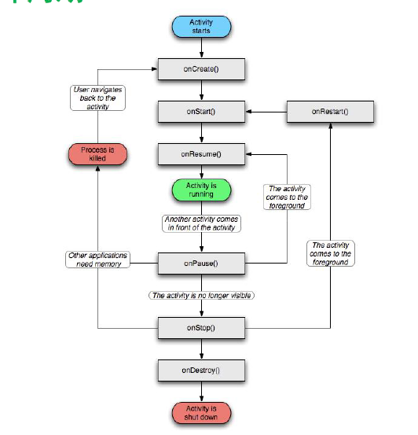
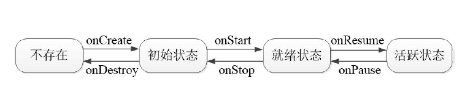
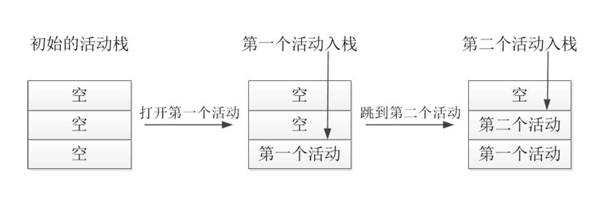
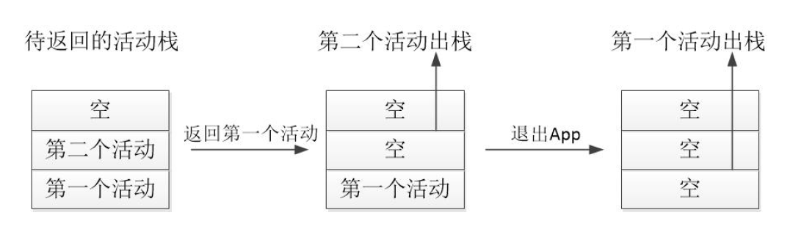

# Android基础学习_活动Activity


# 1.Android开发 活动Activity
## 1.1 启停活动页面
本节介绍如何正确地启动和停止活动页面，首先描述活动页面的启动方法与结束方法，用户看到的页面就是开发者塑造的活动；接着详细分析活动的完整生命周期，以及每个周期方法的发生场景和流转过程；然后描述活动的几种启动模式，以及如何在代码中通过启动标志控制活动的跳转行为。  


---

### 1.1.1 Activity的启动和结束
在之前的基础控件中，我们使用startActivity(源页面.this,目标页面.class);跳转想要跳转的界面。而当我们需要关闭某个也页面也就是一个Activity的时候，我们可以通过一个按钮，去设置这个按钮的setOnClickListener，并在onClick()方法中调用finish方法，即可关闭当前页面,并返回上一级页面。

---

### 1.1.2 Activity的生命周期
每次创建新的活动页面，自动生成的Java代码都给出了onCreate方法，该方法用于执行活动创建的相关操作，包括加载XML布局、设置文本视图的初始文字、注册按钮控件的点击监听，等等。onCreate方法所代表的创建动作，正是一个活动最开始的行为，除了onCreate，活动还有其他几种生命周期行为，它们对应的方法说明如下：  
1\.onCreate:创建活动。此时会把页面布局加载进内存，进入了初始状态。  

2\.onStart：开启活动。此时会把活动页面显示在屏幕上，进入了就绪状态。  

3\.onResume：恢复活动。此时活动页面进入活跃状态，能够与用户正常交互，例如允许响应用户的点击动作、允许用户输入文字等。  

4\.onPause：暂停活动。此时活动页面进入暂停状态（也就是退回就绪状态），无法与用户正常交互。  

5\.onStop：停止活动。此时活动页面将不在屏幕上显示。  

6\.onDestroy：销毁活动。此时回收活动占用的系统资源，把页面从内存中清除掉。  

7\.onRestart：重启活动。处于停止状态的活动，若想重新开启的话，无须经历onCreate的重复创建过程，而是走onRestart的重启过程。  

8\.onNewIntent：重用已有的活动实例。  
上述的生命周期方法，涉及复杂的App运行状态，更直观的活动状态切换过程如下图2所示。


---

### 1.1.3 Activity的启动模式
系统给每个正在运行的App都分配了活动栈，栈里面容纳着已经创建且尚未销毁的活动信息。鉴于栈是一种先进后出、后进先出的数据结构，故而后面入栈的活动总是先出栈，假设3个活动的入栈顺序为：活动A→活动B→活动C，则它们的出栈顺序将变为：活动C→活动B→活动A，可见活动C结束之后会返回活动B，而不是返回活动A或者别的地方。假定某个App分配到的活动栈大小为3，该App先后打开两个活动，此时活动栈的变动情况如图3所示。  

然后按下返回键，依次结束已打开的两个活动，此时活动栈的变动情况如图4所示。  


结合图3与图4的入栈与出栈流程，即可验证结束活动之时的返回逻辑了。不过前述的出入栈情况仅是默认的标准模式，实际上Android允许在创建活动时指定该活动的启动模式，通过启动模式控制活动的出入栈行为。App提供了两种办法用于设置活动页面的启动模式，其一是修改AndroidManifest.xml，在指定的activity节点添加属性android:launchMode，表示本活动以哪个启动模式运行。其二是在代码中调用Intent对象的setFlags方法，表明后续打开的活动页面采用该启动标志。下面分别予以详细说明。

#### 1.1.3.1 在配置文件中指定启动模式
打开AndroidManifest.xml，给activity节点添加属性android:launchMode，属性值填入standard表示
采取标准模式，当然不添加属性的话默认就是标准模式。具体的activity节点配置内容示例如下：
```xml
<activity android:name=".JumpFirstActivity" android:launchMode="standard" />
```
其中launchMode属性的几种取值说明见下表。
|Intent类的启动标志|说明|
|---|---|
|Intene.FLAGS_ACTIVITY_NEW_TASK|开辟一个新的任务栈，该值类似于launchMode="standard",不同之处在于，如果原本不存在活动栈，则FLAGS_ACTIVITY_NEW_TASK会创建一个新栈|
|Intene.FLAGS_ACTIVITY_SINGLE_TOP|当栈顶为待跳转的活动实例时,则重复使用栈顶的实例.该值等于launchMode="singleTop"|
|Intene.FLAGS_ACTIVITY_CLEAR_TOP|当栈中存在待跳转的实例时,则重新创建一个新实例，并清除原实例上方的所有实例。该值与launchMode="singleTask"类似,但singleTask采用onNewIntent方法启用原任务，而FLAGS_ACTIVITY_CLEAR_TOP采取先调用onDestroy再调用onCreate来创建新任务|
|Intene.FLAGS_ACTIVITY_NO_HISTORY|该标志与launchMode="standard"情况类似，但栈中不保存新启动的活动实例。这样无论下次以何种方式再启动该实例,也要走standard模式的完整流程|
|Intene.FLAGS_ACTIVITY_CLEAR_TASK|该标志非常暴力,栈中的原有实例都被清空。注意该标志需要结合FLAGS_ACTIVITY_NEW_TASK使用,即调用Intent实例调用setFlags()时需要设置为FLAGS_ACTIVITY_CLEAR_TASK\|FLAGS_ACTIVITY_NEW_TASK|

##### 1.两个活动之间相互交替
假设活动A有个按钮，点击该按钮会跳到活动B；同时活动B也有个按钮，点击按钮会跳到活动A；从首页打开活动A之后，就点击按钮在活动A与活动B之间轮流跳转。此时活动页面的跳转流程为：首页→活动A→活动B→活动A→活动B→活动A→活动B→……多次跳转之后想回到首页，正常的话返回流程是这样
的：……→活动B→活动A→活动B→活动A→活动B→活动A→首页，注意每个箭头都代表按一次返回键，
可见要按下许多次返回键才能返回首页。其实在活动A和活动B之间本不应该重复返回，因为回来回去总是这两个页面有什么意义呢？照理说每个活动返回一次足矣，同一个地方返回两次已经是多余的了，再返回应当回到首页才是。也就是说，不管过去的时候怎么跳转，回来的时候应该按照这个流程：……→活动B→活动A→首页，或者按照这个流程：……→活动A→活动B→首页，总之已经返回了的页面，决不再
返回第二次。  
对于不允许重复返回的情况，可以设置启动标志FLAG_ACTIVITY_CLEAR_TOP，即使活动栈里面存在待
跳转的活动实例，也会重新创建该活动的实例，并清除原实例上方的所有实例，保留该实例和实例下方的实例,保证栈中最多只有该活动的唯一实例，从而避免了无谓的重复返回。于是活动A内部的跳转代码就改成了下面这般：
```java
// 创建一个意图对象，准备跳到指定的活动页面
Intent intent = new Intent(this, JumpSecondActivity.class);
// 当栈中存在待跳转的活动实例时，则重新创建该活动的实例，并清除原实例上方的所有实例
intent.setFlags(Intent.FLAG_ACTIVITY_CLEAR_TOP); // 设置启动标志
startActivity(intent); // 跳转到意图对象指定的活动页面
```
当然活动B内部的跳转代码也要设置同样的启动标志：
```java
// 创建一个意图对象，准备跳到指定的活动页面
Intent intent = new Intent(this, JumpFirstActivity.class);
// 当栈中存在待跳转的活动实例时，则重新创建该活动的实例，并清除原实例上方的所有实例
intent.setFlags(Intent.FLAG_ACTIVITY_CLEAR_TOP); // 设置启动标志
startActivity(intent); // 跳转到意图指定的活动页面
```
这下两个活动的跳转代码都设置了FLAG_ACTIVITY_CLEAR_TOP，运行测试App发现多次跳转之后，每个活动仅会返回一次而已。

---

##### 2.登陆成功后不再返回登陆页面
很多App第一次打开都要求用户登录，登录成功再进入App首页，如果这时按下返回键，发现并没有回
到上一个登录页面，而是直接退出App了，这又是什么缘故呢？原来用户登录成功后，App便记下用户
的登录信息，接下来默认该用户是登录状态，自然不必重新输入用户名和密码了。既然默认用户已经登
录，哪里还需要回到登录页面？不光登录页面，登录之前的其他页面包括获取验证码、找回密码等页面
都不应回去，每次登录成功之后，整个App就焕然一新仿佛忘记了有登录页面这回事。  
对于回不去的登录页面情况，可以设置启动标志FLAG_ACTIVITY_CLEAR_TASK，该标志会清空当前活动栈里的所有实例。不过全部清空之后，意味着当前栈没法用了，必须另外找个活动栈才行，也就是同时设置启动标志FLAG_ACTIVITY_NEW_TASK，该标志用于开辟新任务的活动栈。于是离开登录页面的跳转代码变成下面这样：
```java
// 创建一个意图对象，准备跳到指定的活动页面
Intent intent = new Intent(this, LoginSuccessActivity.class);
// 设置启动标志：跳转到新页面时，栈中的原有实例都被清空，同时开辟新任务的活动栈
intent.setFlags(Intent.FLAG_ACTIVITY_CLEAR_TASK |
Intent.FLAG_ACTIVITY_NEW_TASK);
startActivity(intent); // 跳转到意图指定的活动页面
```
运行测试App，登录成功进入首页之后，点击返回键果然没回到登录页面。

---

## 1.2 在活动间传递消息
本节介绍如何在两个活动之间传递各类消息，首先描述Intent的用途和组成部分，以及显式Intent和隐式Intent的区别；接着阐述结合Intent和Bundle向下一个活动页面发送数据，再在下一个页面中解析收到的请求数据；然后叙述从下一个活动页面返回应答数据给上一个页面，并由上一个页面解析返回的应答数据。

### 1.2.1 显示Intent和隐式Intent
上一小节的Java代码，通过Intent对象设置活动的启动标志，这个Intent究竟是什么呢？Intent的中文名是意图，意思是我想让你干什么，简单地说，就是传递消息。Intent是各个组件之间信息沟通的桥梁，既能在Activity之间沟通，又能在Activity与Service之间沟通，也能在Activity与Broadcast之间沟通。总而言之，Intent用于Android各组件之间的通信，它主要完成下列3部分工作：  
（1）标明本次通信请求从哪里来、到哪里去、要怎么走。  
（2）发起方携带本次通信需要的数据内容，接收方从收到的意图中解析数据。  
（3）发起方若想判断接收方的处理结果，意图就要负责让接收方传回应答的数据内容。  
为了做好以上工作，就要给意图配上必需的装备，Intent的组成部分见下表。
|元素名称|设置方法|说法与用途|
|---|---|---|
|Component|setComponent|组件,它指定意图的来源和目标|
|Action|setAction|动作,它指定意图的动作行为|
|Data|setData|即Uri,它指定动作要操纵的数据路径|
|Category|addCategory|类别,它指定意图的操作类别|
|Type|setType|数据类型，它指定消费的数据类型|
|Extras|putExtras|扩展信息,它指定装载的包裹信息|
|Flags|setFlags|标志位,它指定的启动标志|

指定意图对象的目标有两种表达方式，一种是显式Intent，另一种是隐式Intent。

#### 1.2.1.1 显示的Intent，直接指定来源活动与目标活动，属于精准匹配
在构建一个意图对象时，需要指定两个参数，第一个参数表示跳转的来源界面，即来源Activity.this,第二个参数为需要跳转的页面，即目标Activity.class。具体的构建方法与如下三种:  

1\.在Intent的构造函数中指定。
```java
Intent intent = new Intent(this, ActNextActivity.class); // 创建一个目标确定的意图
```
2\.调用Intent实例对象的setClass方法指定。
```java
Intent intent = new Intent(); // 创建一个新意图
intent.setClass(this, ActNextActivity.class); // 设置意图要跳转的目标活动
```
3\.调用意图对象的setComponent方法指定
```java
ntent intent = new Intent(); // 创建一个新意图
// 创建包含目标活动在内的组件名称对象
ComponentName component = new ComponentName(this, ActNextActivity.class);
intent.setComponent(component); // 设置意图携带的组件信息
```

---

#### 1.2.1.2 隐式Intent 没有明确指定要跳转的目标活动，只给出一个动作字符串让系统自动匹配，属于模糊匹配
通常App不希望向外部暴露活动名称，只给出一个事先定义好的标记串，这样大家约定俗成、按图索骥
就好，隐式Intent便起到了标记过滤作用。这个动作名称标记串，可以是自己定义的动作，也可以是已
有的系统动作。常见系统动作的取值说明见下表。
|Intent类的系统动作常量名|系统动作的常量值|说明|
|---|---|---|
|ACTION_MAIN|android.intent.action.MAIN|App启动时的入口|
|ACTION_VIEW|android.intent.action.VIEW|向用户显示数据|
|ACTION_SEND|android.intent.action.SEND|分享内容|
|ACTION_CALL|android.intent.action.CALL|直接拨号|
|ACITON_DIAL|android.intent.action.DIAL|准备拨号|
|ACTION_SENDTO|android.intent.action.SENDTO|发送短信|
|ACTION_ANSWER|android.intent.action.ANSWER|接听电话|

动作名称既可以通过setAction方法指定，也可以通过构造函数Intent(String action)直接生成意图对象。当然，由于动作是模糊匹配，因此有时需要更详细的路径，比如仅知道某人住在天通苑小区，并不能直接找到他家，还得说明他住在天通苑的哪一期、哪栋楼、哪一层、哪一个单元。Uri和Category便是这样的路径与门类信息，Uri数据可通过构造函数Intent(String action, Uri uri)在生成对象时一起指定，也可通过setData方法指定（setData这个名字有歧义，实际相当于setUri）；Category可通过addCategory方法指定，之所以用add而不用set方法，是因为一个意图允许设置多个Category，方便一起过滤。下面是一个调用系统拨号程序的代码例子，其中就用到了Uri：
```java
String phoneNo = "12345";
Intent intent = new Intent(); // 创建一个新意图
intent.setAction(Intent.ACTION_DIAL); // 设置意图动作为准备拨号
Uri uri = Uri.parse("tel:" + phoneNo); // 声明一个拨号的Uri
intent.setData(uri); // 设置意图前往的路径
startActivity(intent); // 启动意图通往的活动页面
```
隐式Intent还用到了过滤器的概念，把不符合匹配条件的过滤掉，剩下符合条件的按照优先顺序调用。
譬如创建一个App模块，AndroidManifest.xml里的intent-filter就是配置文件中的过滤器。像最常见的首页活动MainAcitivity，它的activity节点下面便设置了action和category的过滤条件。其中
android.intent.action.MAIN表示App的入口动作，而android.intent.category.LAUNCHER表示在桌面上显示App图标，配置样例如下：
```xml
<activity android:name=".MainActivity">
<intent-filter>
<action android:name="android.intent.action.MAIN" />
<category android:name="android.intent.category.LAUNCHER" />
</intent-filter>
</activity>
```

---
### 1.2.2 向下一个Activity发送数据
Intent对象的setData方法只指定到达目标的路径，并非本次通信所携带的参数信息，真正的参数信息存放在Extras中。Intent重载了很多种putExtra方法传递各种类型的参数，包括整型、双精度型、字符串等基本数据类型，甚至Serializable这样的序列化结构。只是调用putExtra方法显然不好管理，像送快递一样大小包裹随便扔，不但找起来不方便，丢了也难以知道。所以Android引入了Bundle概念，可以把Bundle理解为超市的寄包柜或快递收件柜，大小包裹由Bundle统一存取，方便又安全。Bundle内部用于存放消息的数据结构是Map映射，既可添加或删除元素，还可判断元素是否存在。开发者若要把Bundle数据全部打包好，只需调用一次意图对象的putExtras方法；若要把Bundle数据全部取出来，也只需调用一次意图对象的getExtras方法。Bundle对象操作各类型数据的读写方法说明见下表.

|数据类型|读方法|写方法|
|---|---|---|
|整型|getInt|putInt|
|浮点型|getFloat|putDouble|
|双精度型|getDouble|putDouble|
|布尔值|getBoolean|putBoolean|
|字符串|getString|putString|
|字符数组|getStringArray|putStringArray|
|字符串列表|getStringArrayList|putStringArrayList|
|可序列化结构|getSerializable|putSerializable|

接下来举个在活动之间传递数据的例子，首先在上一个活动使用包裹封装好数据，把包裹塞给意图对
象，再调用startActivity方法跳到意图指定的目标活动。完整的活动跳转代码示例如下：
```java
// 创建一个意图对象，准备跳到指定的活动页面
Intent intent = new Intent(this, ActReceiveActivity.class);
Bundle bundle = new Bundle(); // 创建一个新包裹
// 往包裹存入名为request_time的字符串
bundle.putString("request_time", DateUtil.getNowTime());
// 往包裹存入名为request_content的字符串
bundle.putString("request_content", tv_send.getText().toString());
intent.putExtras(bundle); // 把快递包裹塞给意图
startActivity(intent); // 跳转到意图指定的活动页面
```
然后在下一个活动中获取意图携带的快递包裹，从包裹取出各参数信息，并将传来的数据显示到文本视
图。下面便是目标活动获取并展示包裹数据的代码例子
```java
// 从布局文件中获取名为tv_receive的文本视图
TextView tv_receive = findViewById(R.id.tv_receive);
// 从上一个页面传来的意图中获取快递包裹
Bundle bundle = getIntent().getExtras();
// 从包裹中取出名为request_time的字符串
String request_time = bundle.getString("request_time");
// 从包裹中取出名为request_content的字符串
String request_content = bundle.getString("request_content");
String desc = String.format("收到请求消息：\n请求时间为%s\n请求内容为%s",
request_time, request_content);
tv_receive.setText(desc); // 把请求消息的详情显示在文本视图上
```
---

### 1.2.3 向上一个Activity发送数据
数据传递经常是相互的，上一个页面不但把请求数据发送到下一个页面，有时候还要处理下一个页面的
应答数据，所谓应答发生在下一个页面返回到上一个页面之际。如果只把请求数据发送到下一个页面，
上一个页面调用startActivity方法即可；如果还要处理下一个页面的应答数据，此时就得分多步处理，详细步骤说明如下：
步骤一，上一个页面打包好请求数据，调用startActivityForResult方法执行跳转动作，表示需要处理下一个页面的应答数据，该方法的第二个参数表示请求代码，它用于标识每个跳转的唯一性。但是由于startActivityResult这个方法已经过时了。需要使用registerForActivityResult方法代替。代码如下：  

该request类先创建一个意图 调用regist.launch方法携带信息跳转到下一个活动视图。接受到回传的消息之后通过之前register设置的callback函数解析intent内的消息，显示在View内部。  

```java
package com.example.chapter04;

import androidx.activity.result.ActivityResult;
import androidx.activity.result.ActivityResultCallback;
import androidx.activity.result.ActivityResultLauncher;
import androidx.activity.result.contract.ActivityResultContracts;
import androidx.appcompat.app.AppCompatActivity;

import android.app.Activity;
import android.content.Intent;
import android.os.Bundle;
import android.view.View;
import android.widget.Button;
import android.widget.TextView;

import com.example.chapter04.util.DataUtil;

public class ActRequestActivity extends AppCompatActivity implements View.OnClickListener {
    private static final String mRequest = "你睡了么？来我家睡吧";
    private ActivityResultLauncher<Intent> register;

    @Override
    protected void onCreate(Bundle savedInstanceState) {
        super.onCreate(savedInstanceState);
        setContentView(R.layout.activity_act_request);
        Button btn_request = findViewById(R.id.btn_request);
        TextView tv_response = findViewById(R.id.tv_response);
        TextView tv_request = findViewById(R.id.tv_request);
        tv_request.setText("待发送消息:"+mRequest);

        btn_request.setOnClickListener(this);

        register = registerForActivityResult(new ActivityResultContracts.StartActivityForResult(), result -> {
            if(result!=null){
                Intent intent = result.getData();
                if(intent!=null && result.getResultCode() == Activity.RESULT_OK){
                    Bundle bundle = intent.getExtras();
                    String response_time = bundle.getString("Response_time");
                    String response_content = bundle.getString("Response_content");
                    String desc = String.format("收到返回消息:\n 返回时间:%s\n返回内容:%s",response_time,response_content);
                    tv_response.setText(desc);
                }
            }
        });
    }

    @Override
    public void onClick(View v) {
        Intent intent = new Intent(this, ActResponseActivity.class);
        Bundle bundle = new Bundle();
        bundle.putString("Request_time", DataUtil.getNowTime());
        bundle.putString("Request_content",mRequest);
        intent.putExtras(bundle);

        register.launch(intent);
    }
}
```

response类接收到上一个活动视图传来的消息，调用getIntent方法读取消息。之后通过点击按钮，执行serResult方法，回传携带消息的意图。

```java
package com.example.chapter04;

import androidx.appcompat.app.AppCompatActivity;

import android.app.Activity;
import android.content.Intent;
import android.os.Bundle;
import android.view.View;
import android.widget.TextView;

import com.example.chapter04.util.DataUtil;

public class ActResponseActivity extends AppCompatActivity implements View.OnClickListener {

    private static final String mResponse = "我还没睡，我爸妈不在家";

    @Override
    protected void onCreate(Bundle savedInstanceState) {
        super.onCreate(savedInstanceState);
        setContentView(R.layout.activity_act_response);

        TextView tv_request = findViewById(R.id.tv_request);
        //从上个页面传来的意图中获取快递包裹
        Bundle bundle = getIntent().getExtras();
        String request_time = bundle.getString("Request_time");
        String request_content = bundle.getString("Request_content");
        String desc = String.format("收到请求消息:\n 请求时间:%s\n请求内容:%s",request_time,request_content);
        //把请求信息的详情传到文本视图上
        tv_request.setText(desc);

        findViewById(R.id.tv_response).setOnClickListener(this);

        TextView tv_response = findViewById(R.id.tv_response);
        tv_response.setText("待返回的消息:"+mResponse);
    }

    @Override
    public void onClick(View v) {
        Intent intent = new Intent(this, ActRequestActivity.class);
        Bundle bundle = new Bundle();
        bundle.putString("Response_time", DataUtil.getNowTime());
        bundle.putString("Response_content",mResponse);
        intent.putExtras(bundle);
        //携带意图返回上一个页面，result_ok表示处理成功
        setResult(Activity.RESULT_OK,intent);
        //结束当前页面
        finish();
    }
}
```

---

## 1.3 为活动补充信息

### 1.3.1 利用资源文件配置字符串
通过res/value/string.xml内配置String字符串来补充信息。

---

### 1.3.2 利用元数据传递配置信息
尽管资源文件能够配置字符串参数，然而有时候为安全起见，某个参数要给某个活动专用，并不希望其
他活动也能获取该参数，此时就不方便到处使用getString了。好在Activity提供了元数据（Metadata）的概念，元数据是一种描述其他数据的数据，它相当于描述固定活动的参数信息。打开
AndroidManifest.xml，在测试活动的activity节点内部添加meta-data标签，通过属性name指定元数据的名称，通过属性value指定元数据的值。仍以天气为例，添加meta-data标签之后的activity节点如下所示：
```xml
<activity android:name=".MetaDataActivity">
<meta-data android:name="weather" android:value="晴天" />
</activity>
```
配置好了activity节点的meta-data标签，再回到Java代码获取元数据信息，获取步骤分为下列3步：  

1.调用getPackageManager方法获得当前应用的包管理器。  

2.调用包管理器的getActivityInfo方法获得当前活动的信息对象。  

3.活动信息对象的metaData是Bundle包裹类型，调用包裹对象的getString即可获得指定名称的参数
值。  
上述三个步骤的代码如下:

```java
        TextView tv_meta = findViewById(R.id.tv_mate);
        //从上下文里面获取我们的包管理器
        PackageManager pm = getPackageManager();
        //获取活动附加的元数据
        try {
            ActivityInfo activityInfo = pm.getActivityInfo(getComponentName(), PackageManager.GET_META_DATA);
            Bundle metaData = activityInfo.metaData;
            String weather = metaData.getString("android.app.shortcuts");
            tv_meta.setText(weather);
        } catch (PackageManager.NameNotFoundException e) {
            throw new RuntimeException(e);
        }
```

---

### 1.3.3 给应用注册快捷方式
元数据不单单能传递简单的字符串参数，还能传送更复杂的资源数据，从Android 7.1开始新增的快捷方
式便用到了这点，譬如在手机桌面上长按支付宝图标，会弹出如图5的快捷菜单。


参考链接如下[创建快捷方式教程](https://developer.android.com/guide/topics/ui/shortcuts/creating-shortcuts?hl=zh-cn)

#### 创建静态快捷方式
1.在应用的清单文件 (AndroidManifest.xml) 中，找到 intent 过滤器设置为 android.intent.action.MAIN 操作和 android.intent.category.LAUNCHER 类别的 Activity。  

2.向此 Activity 添加 <meta-data> 元素，该元素引用了定义应用快捷方式的资源文件
```xml
<manifest xmlns:android="http://schemas.android.com/apk/res/android"
          package="com.example.myapplication">
  <application ... >
    <activity android:name="Main">
      <intent-filter>
        <action android:name="android.intent.action.MAIN" />
        <category android:name="android.intent.category.LAUNCHER" />
      </intent-filter>
      
      <meta-data android:name="android.app.shortcuts"
                 android:resource="@xml/shortcuts" /> 
    </activity>
  </application>
</manifest>
```

3.创建新的资源文件：res/xml/shortcuts.xml。  

4.在这个新的资源文件中，添加 *shortcuts* 根元素，其中包含 *shortcut* 元素的列表。每个 *shortcut* 元素都包含有关一个静态快捷方式的信息，包括其图标、说明标签及其在应用内启动的 intent：
```xml
<shortcuts xmlns:android="http://schemas.android.com/apk/res/android">
  <shortcut
    android:shortcutId="compose"
    android:enabled="true"
    android:icon="@drawable/compose_icon"
    android:shortcutShortLabel="@string/compose_shortcut_short_label1"
    android:shortcutLongLabel="@string/compose_shortcut_long_label1"
    android:shortcutDisabledMessage="@string/compose_disabled_message1">
    <intent
      android:action="android.intent.action.VIEW"
      android:targetPackage="com.example.myapplication"
      android:targetClass="com.example.myapplication.ComposeActivity" />
    <!-- If your shortcut is associated with multiple intents, include them
         here. The last intent in the list determines what the user sees when
         they launch this shortcut. -->
    <categories android:name="android.shortcut.conversation" />
    <capability-binding android:key="actions.intent.CREATE_MESSAGE" />
  </shortcut>
  <!-- Specify more shortcuts here. -->
</shortcuts>
```
shortcutId:为该shortcut的ID  
enabled:为是否启用该shortcut  
icon:表示快捷方式的图标  
shortcutShortLabel:显示的最短标签  
shortcutLongLabel:显示的最长标签，如果最长标签超出显示范围，则显示最短标签  
shortcutDisabledMessage:当快捷方式不可使用的时候，显示的信息  
action:给出目标的动作  
targetPackage为启动活动的当前包的路径  
targetClass为当前包的路径下的启动的活动的名称  
categories android:name="android.shortcut.conversation" 目前只给出这种写法  


#### 创建动态快捷方式
参考上述连接。之后补充。

