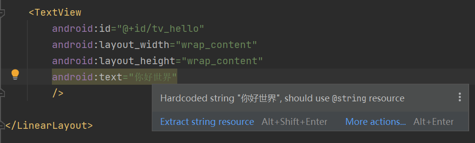

# Android基础学习_简单控件


# 1.Android开发 简单控件
## 1.1 文本的显示
文本的显示有两种:一种为xml文件中设置,一种为java代码中设置。具体可以设置文本内容,文字大小,文本颜色,文本背景色等。
### 1.1.1 设置文件内容
文本内容设置有两种方式,一种是在XML文件中通过属性andorid:text设置文本,如下面这样:  
```xml
    <TextView
        android:id="@+id/tv_hello"
        android:layout_width="wrap_content"
        android:layout_height="wrap_content"
        android:text="你好世界"
        />
```
另外一种是在java代码中调用文本视图对象的setText方法设置文本,如下面这样:
```java
//获取名为tv_hello的文本视图
TextView tv_hello = findViewById(R.id.tv_hello);
tv_hello.setText(R.string.hello);
```
在XML文件中设置文本的话,在页面的右上方会出现一个黄色感叹号点击感叹号会出现如下解释。
  
看到提示内容为“Hardcoded string "你好,世界", should use @string resouce”,意思说这几个字是硬编码的字符串,建议使用来自@string的资源。原来Android Studio不推荐在XML布局文件里直接写字符串,因为可能有好几个页面都显示“你好,世界”,若想把这句话换成“你吃饭了吗？”,就得一个一个XML文件改过去,无疑费时费力。故而Android Studio推荐把字符串放到专门的地方管理,这个名为@string的地方位于res/values目录下的strings.xml,打开该文件发现它的初始内容如下所示：
```xml
<resources>
<string name="app_name">chapter03</string>
</resources>
```
strings.xml定义了一个名为“app_name”的字符串常量，其值为“chapter03”。
为了解除硬编码问题，只需要在strings.xml内定义一个名为"hello"的字符串,字符串的值为"你好，世界"。如下所示:
```xml
<resources>
<string name="app_name">chapter03</string>
<string name="hello">你好，世界</string>
</resources>
```
在strings.xml内添加完新的字符串定义之后。回到res/layout/下的XML文件内,将android:text属性值改为@string/字符串(即为@string/hello),就可以解决硬编码问题。
<TextView
android:id="@+id/tv_hello"
android:layout_width="wrap_content"
android:layout_height="wrap_content"
android:text="@string/hello" />
```
如果要在Java代码中引用字符串资源，则在调用setText方法时填写R.string.字符串名(即为R.string.hello)。就可以设置文本内容了.

```java
//获取名为tv_hello的文本视图
TextView tv_hello = findViewById(R.id.tv_hello);
tv_hello.setText(R.string.hello);
```
解决硬编码只需要利用解耦的思想，在strings.xml内定义一个字符串资源，每次修改这个字符串资源只需要在strings.xml内修改即可。

---

### 1.1.2 设置文本大小
TextView设置文本大小也有两种，即为XML内定义或者java代码内部定义。  
xml内部定义只需要在TextView内定义android:textSize属性即可。  
java内定义只需要根据id获取TextView的文本视图，调用setTextSize()方法设置文字大小即可。  


```java
//从布局文件中获取id为text_size的文本视图
TextView textSize = findViewById(R.id.text_size);
textSize.setTextSize(30);//设置text_size的大小
```
这里的大小数值越大，文本就越大。大小数值越小，文本越小。并且深入看setTextSize()的实现代码可以发现。数值的单位其实就是sp。
```java
@android.view.RemotableViewMethod
public void setTextSize(float size) {
    setTextSize(TypedValue.COMPLEX_UNIT_SP, size);
}
```
在XML文件中则通过属性android:textSize指定文本大小，可是如果给TextView标签添加“android:textSize="30"”，数字马上变成红色如图3-2所示，鼠标移过去还会提示错误“Cannot resolve symbol '30'”，意思是无法解析“30”这个符号。
  

文本大小存在不同的字号单位，XML文件要求在字号数字后面写明单位类型，常见的字号单位主要有px、dp、sp 3种
|名称|解释|
|---------|---------|
|px（Pixel像素|也称为图像元素，是作为图像构成的基本单元，单个像素的大小并不固定，跟随屏幕大小和像素数量的关系变化，一个像素点为1px。|
|Resolution（分辨率）|是指屏幕的垂直和水平方向的像素数量，如果分辨率是 1920*1080 ，那就是垂直方向有 1920 个像素，水平方向有 1080 个像素。|
|Dpi（像素密度）|是指屏幕上每英寸（1英寸 = 2.54 厘米）距离中有多少个像素点。|
|Density（密度）|是指屏幕上每平方英寸（2.54 ^ 2 平方厘米）中含有的像素点数量。|
|Dip / dp (设备独立像素)|也可以叫做dp，长度单位，同一个单位在不同的设备上有不同的显示效果，具体效果根据设备的密度有关|

---

### 1.1.3 设置文本颜色
文本颜色的修改，可以在java代码中使用setTextColor方法即可设置文本颜色，具体在color类中定义了12种颜色。
|Color类中的颜色类型|说明|
|---|---|
|BLACK|黑色|
|DKGRAY|深灰|
|GRAY|灰色|
|LTGRAY|浅灰|
|WHITE|白色|
|RED|红色|
|GREEN|绿色|
|BLUE|蓝色|
|YELLOW|黄色|
|CYAN|青色|
|MAGENTA|玫红|
|TRANSPARENT|透明|

比如，下列代码将视图的文字改为绿色。
```java
        //从布局文件中获取tc_col的文本视图
        TextView tv_col = findViewById(R.id.tc_col);
        //将文本的颜色设置为Color类自带的红色
        tv_col.setTextColor(Color.RED);
```

可是XML文件无法引用Color类的颜色常量，为此Android制定了一套规范的编码标准，将色值交由透明度alpha和RGB三原色（红色red、绿色green、蓝色blue）联合定义。该标准又有**八位十六进制数**与**六位十六进制数**两种表达方式，例如八位编码FFEEDDCC中，FF表示透明度，EE表示红色的浓度，DD表示绿色的浓度，CC表示蓝色的浓度。透明度为FF表示完全不透明，为00表示完全透明。RGB三色的数值大，表示颜色越浓，也就越暗；数值越小，表示颜色越淡，也就越亮。RGB亮到极致就白色，暗到极致就是黑色。至于六位十六进制编码，则有两种情况，它在XML文件中默认不透明（等价于透明度为FF），而在代码中默认透明（等价于透明度为00）。以下代码给两个文本视图分别设置六位色值与八位色值，注意添加0x前缀表示十六进制数：

```java
// 从布局文件中获取名为tv_code_six的文本视图
TextView tv_code_six = findViewById(R.id.tv_code_six);
// 将tv_code_six的文字颜色设置为透明的绿色，透明就是看不到
tv_code_six.setTextColor(0x00ff00);
// 从布局文件中获取名为tv_code_eight的文本视图
TextView tv_code_eight = findViewById(R.id.tv_code_eight);
// 将tv_code_eight的文字颜色设置为不透明的绿色，即正常的绿色
tv_code_eight.setTextColor(0xff00ff00);
```
运行测试App，发现tv_code_six控件的文本不见了（其实是变透明了），而tv_code_eight控件的文本显示正常的绿色  

在XML文件中可通过属性android:textColor设置文字颜色，但要给色值添加井号前缀“#”，设定好文本颜色的TextView标签示例如下：

```xml
<TextView
android:id="@+id/tv_xml"
android:layout_width="wrap_content"
android:layout_height="wrap_content"
android:text="布局文件设置六位文字颜色"
android:textColor="#00ff00"
android:textSize="17sp" />
```

---

## 1.2 视图基础
### 1.2.1 设置视图的宽高
手机屏幕是块长方形区域，较短的那条边叫作宽，较长的那条边叫作高。App控件通常也是长方形状，控件宽度通过属性android:layout_width表达，控件高度通过属性android:layout_height表达，宽高的取值主要有下列3种：  

1\.match_parent：表示与上级视图保持一致。上级视图的尺寸有多大，当前视图的尺寸就有多大  

2\.wrap_content：表示与内容自适应。对于文本视图来说，内部文字需要多大的显示空间，当前视图就要占据多大的尺寸。但最宽不能超过上级视图的宽度，一旦超过就要换行；最高不能超过上级视图的高度，一旦超过就会隐藏。  

3\.以dp为单位的具体尺寸，比如300dp，表示宽度或者高度就是这么大。  


在XML文件中采用以上任一方式均可设置视图的宽高，但在Java代码中设置宽高就有点复杂了，首先确保XML中的宽高属性值为wrap_content，这样才允许在代码中修改宽高。接着打开该页面对应的Java代码，依序执行以下3个步骤：  

1\.调用控件对象的getLayoutParams方法，获取该控件的布局参数，参数类型为
ViewGroup.LayoutParams。  

2\.布局参数的width属性表示宽度，height属性表示高度，修改这两个属性值，即可调整控件的宽高。  

3\.调用控件对象的setLayoutParams方法，填入修改后的布局参数使之生效。
不过布局参数的width和height两个数值默认是px单位，需要将dp单位的数值转换为px单位的数值，然后才能赋值给width属性和height属性。下面是把dp大小转为px大小的方法代码：

```java
// 根据手机的分辨率从 dp 的单位 转成为 px(像素)
public static int dip2px(Context context, float dpValue) {
// 获取当前手机的像素密度（1个dp对应几个px）
float scale = context.getResources().getDisplayMetrics().density;
return (int) (dpValue * scale + 0.5f); // 四舍五入取整
}
```
有了上面定义的公共方法dip2px，就能将某个dp数值转换成px数值，比如准备把文本视图的宽度改为300dp，那么调整宽度的Java代码示例如下：  
```java
// 获取名为tv_code的文本视图
TextView tv_code = findViewById(R.id.tv_code);
// 获取tv_code的布局参数（含宽度和高度）
ViewGroup.LayoutParams params = tv_code.getLayoutParams();
// 修改布局参数中的宽度数值，注意默认px单位，需要把dp数值转成px数值
params.width = Utils.dip2px(this, 300);
tv_code.setLayoutParams(params); // 设置tv_code的布局参数
```

---

### 1.2.2 设置视图的间距
设置视图的间距，通过编写TextView的属性,layout_margin或者padding来修改当前视图与视图外部以及视图内部间的间距。

|属性名|作用|
|---|---|
|layout_margin|当前视图与上下左右间隔的距离|
|layout_marginTop|当前视图与上方间隔的距离|
|layout_marginLeft|当前视图与左边间隔的距离|
|layout_marginRight|当前视图与左边间隔的距离|
|layout_marginBottom|当前视图与下方间隔的距离|
|padding|当前视图的内部间距|
|paddingTop|当前视图与视图内容上方的间距|
|paddingLeft|当前视图与视图内容左边的间距|
|paddingRight|当前视图与视图内容右边的间距|
|paddingBottom|当前视图与视图内容下方的间距|

### 1.2.3 设置视图的对齐方式

App界面上的视图排列，默认靠左朝上对齐，这也符合日常的书写格式。然而页面的排版不是一成不变的，有时出于美观或者其他原因，要将视图排列改为朝下或靠右对齐，为此需要另外指定视图的对齐方式。在XML文件中通过属性android:layout_gravity可以指定当前视图的对齐方向，当属性值为top时表示视图朝上对齐，为bottom时表示视图朝下对齐，为left时表示视图靠左对齐，为right时表示视图靠右对齐。如果希望视图既朝上又靠左，则用竖线连接top与left，此时属性标记为android:layout_gravity="top|left"；如果希望视图既朝下又靠右，则用竖线连接bottom与right，此时属性标记为android:layout_gravity="bottom|right"。注意layout_gravity规定的对齐方式，指的是当前视图往上级视图的哪个方向对齐，并非当前视图的内部对齐。若想设置内部视图的对齐方向，则需由当前视图的android:gravity指定，该属性一样拥有top、bottom、left、right 4种取值及其组合。它与layout_gravity的不同之处在于：layout_gravity设定了当前视图相对于上级视图的对齐方式，而gravity设定了下级视图相对于当前视图的对齐方式；前者决定了当前视图的位置，而后者决定了下级视图的位置。

---

## 1.3 常用布局
### 1.3.1 线性布局LinearLayout
LinearLayout布局它的学名为线性布局。顾名思义，线性布局像是用一根线把它的内部视图串起来，故而内部视图之间的排列顺序是固定的，要么从左到右排列，要
么从上到下排列。在XML文件中，LinearLayout通过属性android:orientation区分两种方向，其中从左到右排列叫作水平方向，属性值为horizontal；从上到下排列叫作垂直方向，属性值为vertical。如果LinearLayout标签不指定具体方向，则系统默认该布局为水平方向排列，也就是默认android:orientation="horizontal"。


### 1.3.2 相对布局RelativeLayout
相对布局的下级视图位置由其他视图决定。相对布局名为RelativeLayout,因为下级视图的位置是相对位置，所以得有具体的参照物才能确定最终的位置。如果不设置下级视图的参照物，那么下级视图默认显示在RelativeLayout内部的左上角。  

用于确定下级视图位置的参照物分两种，一种是与该视图自身平级的视图；另一种是该视图的上级视图（也就是它归属的RelativeLayout）。

|相对位置的属性取值|相对位置说明|
|---|---|
|layout_toLeftOf|当前视图在指定视图的左边|
|layout_toRightOf|当前视图在指定视图的右边|
|layout_above|当前视图在指定视图的上方|
|layout_below|当前视图在指定视图的下方|
|layout_alignLeft|当前视图与置顶视图的左侧对齐|
|layout_alignRight|当前视图与指定视图的右侧对齐|
|layout_alignTop|当前视图与指定视图的顶部对齐|
|layout_alignBottom|当前视图与指定视图的底部对齐|
|layout_centerInParent|当前视图在上级视图的中间|
|layout_centerHorizontal|当前视图在上级视图的水平方向居中|
|layout_centerVertical|当前视图在上级视图的垂直方向居中|
|layout_alignParentLeft|当前视图与上级视图的左侧对齐|
|layout_alignParentRight|当前视图与上级视图的右侧对齐|
|layout_alignParentTop|当前视图与上级视图的顶部对齐|
|layout_alignParentBottom|当前视图与上级视图的底部对齐|


### 1.3.3 网格布局GridLayout
实现多行多列的布局方式，可以采用网格布局GridLayout。  
网格布局默认从左往右、从上到下排列，它先从第一行从左往右放置下级视图，塞满之后另起一行放置其余的下级视图，如此循环往复直至所有下级视图都放置完毕。为了判断能够容纳几行几列，网格布局新增了android:columnCount与android:rowCount两个属性，其中columnCount指定了网格的列数，即每行能放多少个视图；rowCount指定了网格的行数，即每列能放多少个视图。


### 1.3.4 滚动布局ScrollView
手机屏幕的显示空间有限，常常需要上下滑动或左右滑动才能拉出其余页面内容，可惜一般的布局节点都不支持自行滚动，这时就要借助滚动视图了。与线性布局类似，滚动视图也分为垂直方向和水平方向两类，其中垂直滚动视图名为ScrollView，水平滚动视图名为HorizontalScrollView。这两个滚动视图的
使用并不复杂，主要注意以下3点：  

（1）垂直方向滚动时，layout_width属性值设置为match_parent，layout_height属性值设置为wrap_content。  

（2）水平方向滚动时，layout_width属性值设置为wrap_content，layout_height属性值设置为match_parent。  

（3）滚动视图节点下面必须且只能挂着一个子布局节点，否则会在运行时报错Caused by：java.lang.IllegalStateException：ScrollView can host only one direct child。  

---

## 1.4 按钮触控
### 1.4.1 按钮控件Button
除了文本视图之外，按钮Button也是一种基础控件。因为Button是由TextView派生而来，所以文本视图拥有的属性和方法，包括文本内容、文本大小、文本颜色等，按钮控件均能使用。不同的是，Button拥有默认的按钮背景，而TextView默认无背景；Button的内部文本默认居中对齐，而TextView的内部文本默认靠左对齐。此外，按钮还要额外注意textAllCaps与onClick两个属性，分别介绍如下：

#### 1.textAllCaps属性
对于TextView来说，text属性设置了什么文本，文本视图就显示什么文本。但对于Button来说，不管text属性设置的是大写字母还是小写字母，按钮控件都默认转成大写字母显示。比如在XML文件中加入下面的Button标签：
```xml
<Button
android:layout_width="match_parent"
android:layout_height="wrap_content"
android:text="Hello World"/>
```
编译运行后的App界面，按钮上显示全大写的“HELLO WORLD”，而非原来大小写混合的“HelloWorld”。显然这个效果不符合预期，为此需要给Button标签补充textAllCaps属性，该属性默认为true表示全部转为大写，如果设置为false则表示不转为大写。于是在布局文件添加新的Button标签，该标签补充了android:textAllCaps="false"，具体内容如下所示：
```xml
<Button
android:layout_width="match_parent"
android:layout_height="wrap_content"
android:text="Hello World"
android:textAllCaps="false"/>
```

#### 2.onClick属性(已废弃)
按钮之所以成为按钮，是因为它会响应按下动作，就手机而言，按下动作等同于点击操作，即手指轻触屏幕然后马上松开。每当点击按钮之时，就表示用户确认了某个事项，接下来轮到App接着处理了。onClick属性便用来接管用户的点击动作，该属性的值是个方法名，也就是当前页面的Java代码存在这么一个方法：当用户点击按钮时，就自动调用该方法。

### 1.4.2 点击事件和长按事件
虽然按钮控件能够在XML文件中通过onClick属性指定点击方法，但是方法的名称可以随便叫，既能叫doClick也能叫doTouch，甚至叫它doA或doB都没问题，这样很不利于规范化代码，倘若以后换了别人接手，就不晓得doA或doB是干什么用的。因此在实际开发中，不推荐使用Button标签的onClick属性，而是在代码中给按钮对象注册点击监听器。所谓监听器，意思是专门监听控件的动作行为，它平时无所事事，只有控件发生了指定的动作，监听器才会触发开关去执行对应的代码逻辑。点击监听器需要实现接口View.OnClickListener，并重写onClick方法补充点击事件的处理代码，再由按钮调用setOnClickListener方法设置监听器对象。比如下面的代码给按钮控件btn_click_single设置了一个点击监听器：
```java
// 从布局文件中获取名为btn_click_single的按钮控件
Button btn_click_single = findViewById(R.id.btn_click_single);
// 给btn_click_single设置点击监听器，一旦用户点击按钮，就触发监听器的onClick方法
btn_click_single.setOnClickListener(new MyOnClickListener());
```
上面的点击监听器名为MyOnClickListener，它的定义代码示例如下：
```java
// 定义一个点击监听器，它实现了接口View.OnClickListener
class MyOnClickListener implements View.OnClickListener {
@Override
    public void onClick(View v) { // 点击事件的处理方法
    String desc = String.format("%s 您点击了按钮：%s",DateUtil.getNowTime(), ((Button)v).getText());
    tv_result.setText(desc); // 设置文本视图的文本内容
    }
}
```
如果一个页面只有一个按钮，单独定义新的监听器倒也无妨，可是如果存在许多按钮，每个按钮都定义自己的监听器，那就劳民伤财了。对于同时监听多个按钮的情况，更好的办法是注册统一的监听器，也就是让当前页面实现接口View.OnClickListener，如此一来，onClick方法便写在了页面代码之内。因为是统一的监听器，所以onClick内部需要判断是哪个按钮被点击了，也就是利用视图对象的getId方法检查控件编号，完整的onClick代码举例如下：
```java
@Override
public void onClick(View v) { // 点击事件的处理方法
    if (v.getId() == R.id.btn_click_public) { // 来自于按钮btn_click_public
    String desc = String.format("%s 您点击了按钮：%s",DateUtil.getNowTime(), ((Button)v).getText());
    tv_result.setText(desc); // 设置文本视图的文本内容
    }
}
```
当然该页面的onCreate内部别忘了调用按钮对象的setOnClickListener方法，把按钮的点击监听器设置成当前页面，设置代码如下所示：
```java
// 从布局文件中获取名为btn_click_public的按钮控件
Button btn_click_public = findViewById(R.id.btn_click_public);
// 设置点击监听器，一旦用户点击按钮，就触发监听器的onClick方法
btn_click_public.setOnClickListener(this);
```

除了点击事件，Android还设计了另外一种长按事件，每当控件被按住超过500毫秒之后，就会触发该控件的长按事件。若要捕捉按钮的长按事件，可调用按钮对象的setOnLongClickListener方法设置长按监听器。具体的设置代码示例如下：
```java
@Override
public boolean onLongClick(View v) { // 长按事件的处理方法
    if (v.getId() == R.id.btn_longclick_public) { // 来自于按钮
    btn_longclick_public
    String desc = String.format("%s 您长按了按钮：%s",DateUtil.getNowTime(), ((Button)v).getText());
    tv_result.setText(desc); // 设置文本视图的文本内容
    }
    return true;
}
```
值得注意的是，点击监听器和长按监听器不局限于按钮控件，其实它们都来源于视图基类View，凡是从View派生而来的各类控件，均可注册点击监听器和长按监听器。譬如文本视图TextView，其对象也能调用setOnClickListener方法与setOnLongClickListener方法，此时TextView控件就会响应点击动作和长按动作。因为按钮存在按下和松开两种背景，便于提示用户该控件允许点击，但文本视图默认没有按压背景，不方便判断是否被点击，所以一般不会让文本视图处理点击事件和长按事件。

---
### 1.4.3 禁用与恢复按钮
尽管按钮控件生来就是给人点击的，可是某些情况希望暂时禁止点击操作，譬如用户在注册的时候，有的网站要求用户必须同意指定条款，而且至少浏览10秒之后才能点击注册按钮。那么在10秒之前，注册按钮应当置灰且不能点击，等过了10秒之后，注册按钮才恢复正常。在这样的业务场景中，按钮先后拥有两种状态，即不可用状态与可用状态，它们在外观和功能上的区别如下：  

（1）不可用按钮：按钮不允许点击，即使点击也没反应，同时按钮文字为灰色。  

（2）可用按钮：按钮允许点击，点击按钮会触发点击事件，同时按钮文字为正常的黑色。  

从上述的区别说明可知，不可用与可用状态主要有两点差异：其一，是否允许点击；其二，按钮文字的颜色。就文字颜色而言，可在布局文件中使用textColor属性设置颜色，也可在Java代码中调用setTextColor方法设置颜色。至于是否允许点击，则需引入新属性android:enabled，该属性值为true时表示启用按钮，即允许点击按钮；该属性值为false时表示禁用按钮，即不允许点击按钮。在Java代码
中，则可通过setEnabled方法设置按钮的可用状态（true表示启用，false表示禁用）。

在Java代码中给3个按钮分别注册点击监听器，注册代码如下所示：
```java
// 因为按钮控件的setOnClickListener方法来源于View基类，所以也可对findViewById得到的视图直
接设置点击监听器
findViewById(R.id.btn_enable).setOnClickListener(this);
findViewById(R.id.btn_disable).setOnClickListener(this);
btn_test = findViewById(R.id.btn_test); // 获取名叫btn_test的按钮控件
btn_test.setOnClickListener(this); // 设置btn_test的点击监听器
```
同时重写页面的onClick方法，分别处理3个按钮的点击事件，修改之后的onClick代码示例如下：
```java
@Override
public void onClick(View v) { // 点击事件的处理方法
// 由于多个控件都把点击监听器设置到了当前页面，因此公共的onClick方法内部需要区分来自于哪个按钮
    if (v.getId() == R.id.btn_enable) { // 点击了按钮“启用测试按钮”
        btn_test.setTextColor(Color.BLACK); // 设置按钮的文字颜色
        btn_test.setEnabled(true); // 启用当前控件
    } else if (v.getId() == R.id.btn_disable) { // 点击了按钮“禁用测试按钮”
        btn_test.setTextColor(Color.GRAY); // 设置按钮的文字颜色
        btn_test.setEnabled(false); // 禁用当前控件
    } else if (v.getId() == R.id.btn_test) { // 点击了按钮“测试按钮”
        String desc = String.format("%s 您点击了按钮：%s",
        DateUtil.getNowTime(), ((Button)v).getText());
        tv_result.setText(desc); // 设置文本视图的文本内容
    }       
}
```

---
## 1.5 图像显示

### 1.5.1 图像视图ImageView
显示文本用到了文本视图TextView，显示图像则用到图像视图ImageView。由于图像通常保存为单独的图片文件，因此需要先把图片放到res/drawable目录，然后再去引用该图片的资源名称。比如现在有张苹果图片名为apple.png，那么XML文件通过属性android:src设置图片资源，属性值格式形如“@drawable/不含扩展名的图片名称”。添加了src属性的ImageView标签示例如下：
```xml
<ImageView
android:id="@+id/iv_scale"
android:layout_width="match_parent"
android:layout_height="220dp"
android:src="@drawable/apple" />
```
若想在Java代码中设置图像视图的图片资源，可调用ImageView控件的setImageResource方法，方法参数格式形如“R.drawable.不含扩展名的图片名称”。仍以上述的苹果图片为例，给图像视图设置图片资源的代码例子如下所示
```java
// 从布局文件中获取名为iv_scale的图像视图
ImageView iv_scale = findViewById(R.id.iv_scale);
iv_scale.setImageResource(R.drawable.apple); // 设置图像视图的图片资源
```
ImageView本身默认图片居中显示，不管图片有多大抑或有多小，图像视图都会自动缩放图片，使之刚好够着ImageView的边界，并且缩放后的图片保持原始的宽高比例，看起来图片很完美地占据视图中央。这种缩放类型在XML文件中通过属性android:scaleType定义，即使图像视图未明确指定该属性，系统也会默认其值为fitCenter，表示让图像缩放后居中显示。

|XNL中的缩放类型|Scale Type类中的缩放类型|说明|
|---|---|---|
|fitCenter|FIT_CENTER|保持宽高比例，缩放图片使其位于视图中间|
|centerCrop|CENTERT_CROP|缩放图片使其充满视图,超出部分会被裁剪,并位于视图中心|
|centerInside|CENTER_INSIDE|保持宽高比例，缩小图片使之位于视图中间,只缩小不放大|
|center|CENTER|保持图片原尺寸，使其位于视图中间|
|fitXY|FIT_XY|缩放图片使其正好填满视图,视图可能被拉伸变形|
|fitStart|FIT_START|保持宽高比,缩放图片使其位于视图上方或左侧|
|fitEnd|FIT_END|保持宽高比,缩放图片使其位于视图下方或右侧|

---

### 1.5.2 图像按钮ImageButton
常见的按钮控件Button其实是文本按钮，因为按钮上面只能显示文字，不能显示图片，ImageButton才是显示图片的图像按钮。虽然ImageButton号称图像按钮，但它并非继承Button，而是继承了ImageView，所以凡是ImageView拥有的属性和方法，ImageButton统统拿了过来，区别在于ImageButton有个按钮背景。  

尽管ImageButton源自ImageView，但它毕竟是个按钮呀，按钮家族常用的点击事件和长按事件，ImageButton全都没落下。不过ImageButton和Button之间除了名称不同，还有下列差异：Button既可显示文本也可显示图片（通过setBackgroundResource方法设置背景图片），而ImageButton只能显示图片不能显示文本。ImageButton上的图像可按比例缩放，而Button通过背景设置的图像会拉伸变形，因为背景图采取fitXY方式，无法按比例缩放。Button只能靠背景显示一张图片，而ImageButton可分别在前景和背景显示图片，从而实现两张图片叠加的效果。从上面可以看出，Button与ImageButton各有千秋，通常情况使用Button就够用了。但在某些场合，比如输入法打不出来的字符，以及特殊字体显示的字符串，就适合先切图再放到ImageButton。举个例子，数学常见的开平方运算，由输入法打出来的运算符号为“√”，但该符号缺少右上角的一横，正确的开平方符号是带横线的，此时便需要通过ImageButton显示这个开方图片。不过使用ImageButton得注意，图像按钮默认的缩放类型为center（保持原始尺寸不缩放图片），而非
图像视图默认的fitCenter，倘若图片尺寸较大，那么图像按钮将无法显示整个图片。为避免显示不完整的情况，XML文件中的ImageButton标签必须指定fitCenter的缩放类型，

---

### 1.5.3 同时展示文本与图像

现在有了Button可在按钮上显示文字，又有ImageButton可在按钮上显示图像，照理说绝大多数场合都够用了。然而现实项目中的需求往往捉摸不定，例如客户要求在按钮文字的左边加一个图标，这样按钮内部既有文字又有图片，乍看之下Button和ImageButton都没法直接使用。若用LinearLayout对ImageView和TextView组合布局，虽然可行，XML文件却变得冗长许多。其实有个既简单又灵活的办法，要想在文字周围放置图片，使用按钮控件Button就能实现。原来Button悄悄提供了几个与图标有关的属性，通过这些属性即可指定文字旁边的图标，以下是有关的图标属性说明。  

drawableTop：指定文字上方的图片。  
drawableBottom：指定文字下方的图片。  
drawableLeft：指定文字左边的图片。  
drawableRight：指定文字右边的图片。  
drawablePadding：指定图片与文字的间距。  


```xml

```
```java

```

