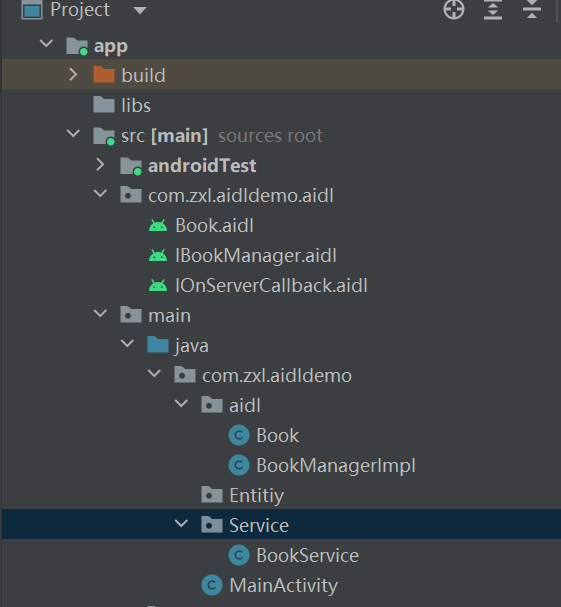
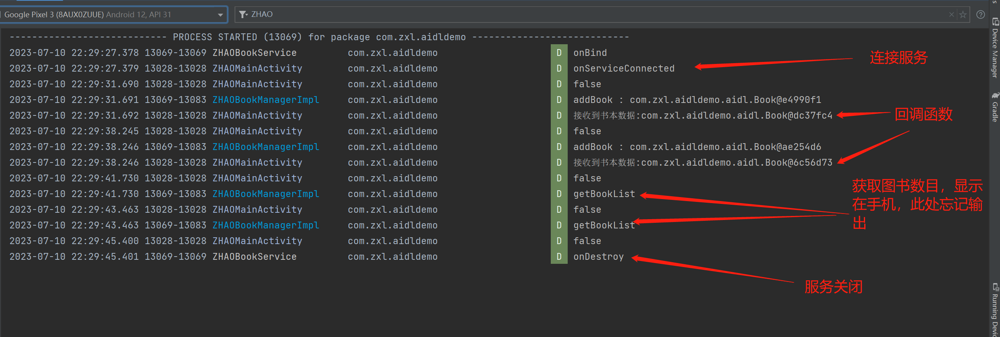

# Android学习_Aidl练习


# Aidl

## 1.什么是Aidl
AIDL 意思即 Android Interface Definition Language，翻译过来就是Android接口定义语言，是用于定义服务器和客户端通信接口的一种描述语言，可以拿来生成用于IPC的代码。从某种意义上说AIDL其实是一个模板，因为在使用过程中，实际起作用的并不是AIDL文件，而是据此而生成的一个IInterface的实例代码，AIDL其实是为了避免我们重复编写代码而出现的一个模板  
AIDL文件以 .aidl 为后缀名


## 2.使用及样例

### 2.1 初期设置

使用Aidl需要在build.gradle(:app)内的android内添加如下

```xml
    buildFeatures {
        aidl = true
    }
```

### 2.2 样例
1.定义一个IBookManager.aidl接口,管理Aidl通信  
2.定义一个Book.aidl，用于IPC传输实体  
3.定义一个IOnServerCallBack.aidl，用于在IBookManager中设置回调函数，从而实现服务端向客户端传输数据。在客户端实现  

文件结构如下图:


#### IBookManager
如下是aidl
```java
// IBookManager.aidl
package com.zxl.aidldemo.aidl;

import com.zxl.aidldemo.aidl.Book;
import com.zxl.aidldemo.aidl.IOnServerCallback;
// Declare any non-default types here with import statements

interface IBookManager {
    /**
     * Demonstrates some basic types that you can use as parameters
     * and return values in AIDL.
     */
    void basicTypes(int anInt, long aLong, boolean aBoolean, float aFloat,
            double aDouble, String aString);

    //从远端获取BookList
    int getBookList();
    //添加一本书
    void addBook(in Book book);
    //注册回调
    void registerCallback(IOnServerCallback callback);
    void unregisterCallback(IOnServerCallback callback);
}
```

其对应的Java实现类:
```java
package com.zxl.aidldemo.aidl;

import android.os.RemoteCallbackList;
import android.os.RemoteException;
import android.util.Log;

import java.util.ArrayList;
import java.util.List;

/**
 *  图书管理类
 */

public class BookManagerImpl extends IBookManager.Stub{
    private static final String TAG = "ZHAOBookManagerImpl";
    private RemoteCallbackList<IOnServerCallback> mListener ;
    private ArrayList<Book> list ;

    public BookManagerImpl(RemoteCallbackList<IOnServerCallback> mListener){
        this.mListener = mListener;
        list = new ArrayList<>();
    }

    @Override
    public void basicTypes(int anInt, long aLong, boolean aBoolean, float aFloat, double aDouble, String aString) throws RemoteException {

    }

    @Override
    public int getBookList() throws RemoteException {
        log("getBookList");
        return list.size();
    }

    @Override
    public void addBook(Book book) throws RemoteException {
        log("addBook : "+book.toString());
        list.add(book);
        if(mListener!=null){
            int num = mListener.beginBroadcast();
            for (int i = 0; i < num; i++) {
                IOnServerCallback broadcastItem = mListener.getBroadcastItem(i);
                broadcastItem.onBookRecived(book);
            }
            mListener.finishBroadcast();
        }
    }

    @Override
    public void registerCallback(IOnServerCallback callback) throws RemoteException {
        if(mListener != null){
            mListener.register(callback);
        }
    }

    @Override
    public void unregisterCallback(IOnServerCallback callback) throws RemoteException {
        mListener.unregister(callback);
    }

    private void log(String str){
        Log.d(TAG,str);
    }
}

```

---

#### Book.aidl
Book.aidl，用于IPC传输实体  
```xml
// Book.aidl
package com.zxl.aidldemo.aidl;

// Declare any non-default types here with import statements

parcelable Book;
```

其对应的java类 继承了Parcelable

```java
package com.zxl.aidldemo.aidl;

import android.os.Parcel;
import android.os.Parcelable;

import androidx.annotation.NonNull;

public class Book implements Parcelable {
    private int BookId;
    private String BookName;

    public Book(int BookId,String BookName){
        this.BookId = BookId;
        this.BookName = BookName;
    }

    protected Book(Parcel in){
        BookId = in.readInt();
        BookName = in.readString();
    }

    public static final Creator<Book> CREATOR = new Creator<Book>() {
        @Override
        public Book createFromParcel(Parcel in) {
            return new Book(in);
        }

        @Override
        public Book[] newArray(int size) {
            return new Book[size];
        }
    };


    @Override
    public int describeContents() {
        return 0;
    }

    @Override
    public void writeToParcel(@NonNull Parcel dest, int flags) {
        dest.writeInt(BookId);
        dest.writeString(BookName);
    }
}

```

---

#### IOnServerCallback
作为回调函数，查看Book信息是否传递到服务端。  
aidl接口如下  
```xml
// IOnServerCallback.aidl
package com.zxl.aidldemo.aidl;

import com.zxl.aidldemo.aidl.Book;

// Declare any non-default types here with import statements

interface IOnServerCallback {
    /**
     * Demonstrates some basic types that you can use as parameters
     * and return values in AIDL.
     */
    void basicTypes(int anInt, long aLong, boolean aBoolean, float aFloat,
            double aDouble, String aString);

    //接收到书的反应函数
    void onBookRecived(in Book book);
}

```

---

#### MainActivity

定义了四个btn，一个TextView显示服务端的书本数目，原先想将Book的集合回传并显示在TextView上，但是由于还需要重写Parcelable接口，懒得写所以直接回传书本。  

其中的重点是IBinder.DeathRecipient的重写，ServiceConn的连接。

```java
package com.zxl.aidldemo;

import androidx.appcompat.app.AppCompatActivity;

import android.content.ComponentName;
import android.content.Intent;
import android.content.ServiceConnection;
import android.os.Bundle;
import android.os.IBinder;
import android.os.RemoteException;
import android.util.Log;
import android.view.View;
import android.widget.Button;
import android.widget.TextView;

import com.zxl.aidldemo.Service.BookService;
import com.zxl.aidldemo.aidl.Book;
import com.zxl.aidldemo.aidl.BookManagerImpl;
import com.zxl.aidldemo.aidl.IBookManager;
import com.zxl.aidldemo.aidl.IOnServerCallback;

import java.util.List;

public class MainActivity extends AppCompatActivity implements View.OnClickListener{
    private static final String TAG = "ZHAOMainActivity";
    private Button btnBind,btnUnBind,btnAddBook,BtnGetBookList;
    private TextView showBookList;
    private IBookManager bookManager;
    private int i = 0;
    private IBinder.DeathRecipient mDeathRecipient = new IBinder.DeathRecipient() {
        @Override
        public void binderDied() {
            log("binderDied");
            if(bookManager == null){ return;}
            bookManager.asBinder().unlinkToDeath(this,0);
        }
    };

    @Override
    protected void onCreate(Bundle savedInstanceState) {
        super.onCreate(savedInstanceState);
        setContentView(R.layout.activity_main);
        initView();
    }

    private void initView() {
        btnBind = findViewById(R.id.btnBind);
        btnUnBind = findViewById(R.id.btnUnBind);
        btnAddBook = findViewById(R.id.btnAddBook);
        BtnGetBookList = findViewById(R.id.BtnGetBookList);
        showBookList = findViewById(R.id.showBookList);
        
        btnBind.setOnClickListener(this);
        btnUnBind.setOnClickListener(this);
        btnAddBook.setOnClickListener(this);
        BtnGetBookList.setOnClickListener(this);
    }

    @Override
    public void onClick(View v) {
        if(v.getId() == R.id.btnBind){
            bindServiceClick();
        } else if (v.getId() == R.id.btnUnBind) {
            log(bookManager==null?"true":"false");
            if(bookManager != null){
                UnBindServiceClick();
            }
        } else if (v.getId() == R.id.btnAddBook) {
            try {
                log(bookManager==null?"true":"false");
                if(bookManager != null){
                    bookManager.addBook(new Book(i++,"深入剖析Android源码"));
                }
            } catch (RemoteException e) {
                throw new RuntimeException(e);
            }
        } else if (v.getId() == R.id.BtnGetBookList) {
            log(bookManager==null?"true":"false");
            try {
                if(bookManager !=null){
                    int bookList = bookManager.getBookList();
                    showBookList.setText(bookList+"");
                }
            } catch (RemoteException e) {
                throw new RuntimeException(e);
            }
        }
    }

    private ServiceConnection connection = new ServiceConnection() {
        @Override
        public void onServiceConnected(ComponentName name, IBinder service) {
            log("onServiceConnected");
            bookManager = IBookManager.Stub.asInterface(service);
            try {
                service.linkToDeath(mDeathRecipient,0);
                bookManager.registerCallback(serverListener);
            } catch (RemoteException e) {
                throw new RuntimeException(e);
            }
        }

        @Override
        public void onServiceDisconnected(ComponentName name) {
            log("onServiceDisconnected");
            bookManager = null;
        }
    };

    private IOnServerCallback.Stub serverListener = new IOnServerCallback.Stub() {
        @Override
        public void basicTypes(int anInt, long aLong, boolean aBoolean, float aFloat, double aDouble, String aString) throws RemoteException {

        }

        @Override
        public void onBookRecived(Book book) throws RemoteException {
            log("接收到书本数据:"+ book.toString());
        }
    };

    private void bindServiceClick(){
        Intent intent = new Intent(this, BookService.class);
        bindService(intent,connection,BIND_AUTO_CREATE);
    }

    private void UnBindServiceClick(){
        unbindService(connection);
    }

    private void destroyService(){
        if(connection != null && bookManager!=null && bookManager.asBinder().isBinderAlive()){
            try {
                bookManager.unregisterCallback(serverListener);
            } catch (RemoteException e) {
                throw new RuntimeException(e);
            }
        }
    }

    @Override
    protected void onDestroy() {
        super.onDestroy();
        destroyService();
    }

    private void log(String str){
        Log.d(TAG,str);
    }
}
```

---

## 输出效果图

