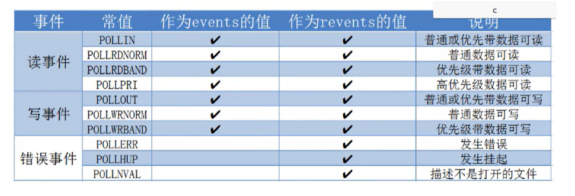

# IO多路复用(select,poll,epoll)


# IO多路复用
I/O 多路复用使得程序能够同时监听多个文件描述符，能够提高程序的性能，Linux下实现I/O多路复用的系统调用主要有select ，poll和epoll

## 2.select

缺点：  
1.每次调用select，都需要把fd集合从用户态拷贝到内核态，这个开销在fd很多时会很大。  
2.同时每次调用select都需要在内核遍历传递进来的所有fd，这个开销在fd很多的时候也很大。  
3.select支持的文件描述符数量太小了，默认是1024  
4.fds集合不能重用，每次都需要重置。  

```c++
/*
主旨思想：
 1.要构造一个关于文件描述符的列表(将要监听的文件描述符)
 2.调用系统函数 select，监听该列表中的文件描述符，直到这些描述符中的一个或者多个进行了I/O操作时，该函数才返回。
    a:这个函数时阻塞的
    b:函数对文件描述符的检测是由内核完成的
 3.在返回时，它会告诉进程有多少(哪些)描述符进行I/O操作。

//sizeof(fd_set) = 128  ---->1024bit
*/
#include <sys/time.h>
#include <sys/types.h>
#include <unistd.h>
#includ <sys/select.h>
int select(int nfds,fd_set *readfds,fd_set *writefds,
            fd_set *exceptfds,struct timeval *timeout);
    -参数
        -nfds:委托内核检测的最大文件描述符的值 + 1
        -readfds:要检测的读的文件描述符的集合，委托内核检测哪些文件描述符的读的属性。
        一般只检测读操作。
        对应的是对方发送过来的数据，因为读是被动的接受数据，检测的是读缓冲区。
        -writefds:要检测的文件描述符的写集合，委托内核检测哪些文件描述符的写的属性。
        委托内核检测写缓冲区是不是还可以写数据(不满就可以写)。
        -exceptfds:检测发生异常的文件操作描述符的集合。
        -timeout:设置的超时时间
            struct timeval {
               long    tv_sec;         /* seconds */
               long    tv_usec;        /* microseconds */
           };
           -NULL：永久阻塞
           -tv_sec=0,tv_usec =0; 不阻塞
           -tv_sec>0,tv_usec >0; 阻塞对应的时间
    -返回值：
        --1:失败
        >0:检测的集合中有n个文件描述符发生变化

//将参数文件描述符fd对应的标志位清零
void FD_CLR(int fd,fd_set *set);
//判断fd对应的标志位是0还是1，返回值是fd对应的标志位的值
int FD_ISSET(int fd,fd_set *set);
//将fd对应的标志位设为1
void FD_SET(int fd,fd_set *set);
//清空整个标志位
void FD_ZERO(fd_set *set);
```


## 3.poll
1.移除了select的大小的限制  
2.移除了fds这样的不可重用的限制。
```c++
#include <poll.h>
struct pollfd{
    int fd;     //委托内核检测的文件描述符
    short events;//委托内核检测文件描述符的什么事件
    short revents;//文件描述符实际发生的事件
};
int poll(struct pollfd *fds,nfds_t nfds,int timeout);
    参数:
        -fds:结构体数组，需要检测的文件描述符集合
        -nfs:这个是第一个参数数组中最后一个有效元素的下标 + 1
        -timeout :阻塞时长
            -1：永远阻塞
            0:不阻塞
            1：阻塞，当检测到需要检测的文件描述符有变化，就解除阻塞
    返回值:
        -1：失败
        >0：成功 表示检测到集合中有n个文件描述符发生变化。
```
 

## epoll

```c++
#include <sys/epoll.h>
//在内核中创建了一个新的实例，在这个数据中有两个重要的数据，一个数需要检测文件描述符信息的红黑树，还有一个就绪列表，存放检测到数据发生改变的文件描述符的信息(双向链表)
int epoll_create(int size);
    -参数:
        size:目前乜有意义了，随便写一个就行。
    -返回值
        -1:失败
        >0:文件描述符，操作epoll实例的

typedef union epoll_data{
    void *ptr;
    int fd;
    uint32_t u32;
    uint64_t u64;
}epoll_data_t;

struct epoll_event{
    uint32_t events;        //epoll event
    epoll_data_t data;      //user data variable
};
//对epoll实例进行管理：添加，删除，修改
int epoll_ctl(int epfd,int op,int fd,struct epoll_event *event);
    参数:
        epfd:epoll实例
        op：进行什么操作
        fd：需要操作的文件描述符
        event：对该文件描述符需要检测的事件

//检测函数
int epoll_wait(int epfd,struct epoll_event *events,int maxevents,int timeout);
        参数:
        epfd:epoll实例
        events:传出参数，保存了发生变化的文件描述符的信息
        maxevents：发生改变的事件的数量(第二个参数的大小)
        timeout：阻塞时间
            0：不阻塞
            -1：阻塞，直到检测到数据发生变化
            >0：阻塞时长
        返回值：
            成功:返回发生变化的文件描述符的个数
            失败:返回-1
```

### Epoll的工作模式
#### LT模式(水平触发)
```text
假设委托内核检测该事件 ---> 检测fd缓冲区
    读缓冲区有数据    --->epoll检测到会给用户通知
        a.用户不读数据 数据一直在缓冲区，epoll一直通知
        b.用户只读了一部分，epoll继续通知
        c.缓冲区的数据读完了,不通知
```
LT(level-triggered)是缺省的工作方式，并且同时支持block和no-block socket。在这种做法中，内核告诉你一个文件描述符是否就绪了，然后你可以对这个描述符的fd进行I/O操作。如果你不作任何操作，内核还是会继续通知你。  

#### ET模式(边沿触发)
```text
假设委托内核检测该事件 ---> 检测fd缓冲区
    读缓冲区有数据    --->epoll检测到会给用户通知
        a.用户不读数据，数据一直在缓冲区,epoll下一次检测就不通知了
        b.用户只读了一部分数据，epoll不通知
        c.缓冲区的数据读完了,不通知
```
ET(edge-triggered)是高速工作方式，只支持no-block scoket。在这种模式下，当描述符从未就绪变为就绪时，内核通过epoll告诉你，然后它会假设你知道文件描述符已经就绪，并且不会再为那个文件描述符发送更多的就绪通知，知道你做了某些操作导致那个文件描述符不再为就绪状态了。但是请注意，如果一直不对这个fd做I/O操作(从而导致它再次编程未就绪)，内核不会发送更多的通知(only once)。   

ET模式在很大程度上减少了epoll时间被重复触发的次数，因此效率要比LT模式高。epoll工作在ET模式的时候，必须使用非阻塞套接口，以避免由于一个文件句柄的阻塞读/阻塞写操作把处理多个文件描述的任务饿死。   

