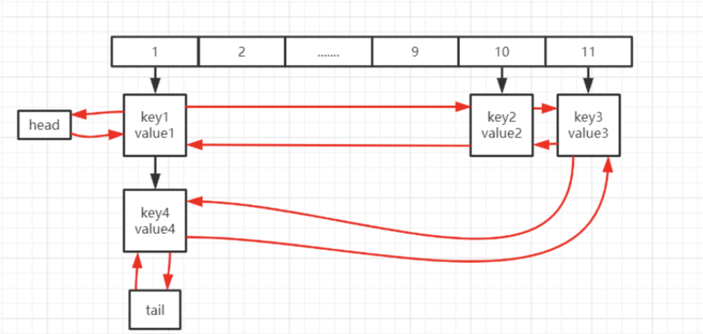

# LinkedHashMap 详解


# 1. LinkedHashMap(JDK1.8)

## 1 简介

```java
public class LinkedHashMap<K,V>
    extends HashMap<K,V>
    implements Map<K,V>
```

LinkedHashMap继承自HashMap，它的多种操作都是建立在HashMap的操作上的。同HashMap上不同的是，LinkedHashMap维护了一个Entry的双向链表，保证了插入的Entry的顺序。

---



---

LinkedHashMap为了实现双向链表结构,通过继承Hash的Node类，添加了双向链表所需要的Before，After。从而实现双向链表

```java
    /**
     * HashMap.Node subclass for normal LinkedHashMap entries.
     */
    static class Entry<K,V> extends HashMap.Node<K,V> {
        Entry<K,V> before, after;
        Entry(int hash, K key, V value, Node<K,V> next) {
            super(hash, key, value, next);
        }
    }
```

---

## 2. LinkedHashMap主要原理

### 2.1 主要元素

以下为LinkedHashMap的主要类内部成员，其余参数均继承自HashMap父类

```java
     //序列化UID
     private static final long serialVersionUID = 3801124242820219131L;

    /**
     * 链表头
     */
    transient LinkedHashMap.Entry<K,V> head;

    /**
     * 链表尾
     */
    transient LinkedHashMap.Entry<K,V> tail;

    /**
     * 一个条件变量，它控制了是否在get操作后需要将新的get的节点重新放到链表的尾部
     * LinkedHashMap可以维持了插入的顺序，但是这个顺序不是不变的，可以被get操作打乱。
     *
     * @serial
     */
    final boolean accessOrder;
```

---

### 2.2 构造函数

```java
    /**
     * Constructs an empty insertion-ordered <tt>LinkedHashMap</tt> instance
     * with the specified initial capacity and load factor.
     *
     * @param  initialCapacity the initial capacity
     * @param  loadFactor      the load factor
     * @throws IllegalArgumentException if the initial capacity is negative
     *         or the load factor is nonpositive
     */
    public LinkedHashMap(int initialCapacity, float loadFactor) {
        super(initialCapacity, loadFactor);
        accessOrder = false;
    }

    /**
     * Constructs an empty insertion-ordered <tt>LinkedHashMap</tt> instance
     * with the specified initial capacity and a default load factor (0.75).
     *
     * @param  initialCapacity the initial capacity
     * @throws IllegalArgumentException if the initial capacity is negative
     */
    public LinkedHashMap(int initialCapacity) {
        super(initialCapacity);
        accessOrder = false;
    }

    /**
     * Constructs an empty insertion-ordered <tt>LinkedHashMap</tt> instance
     * with the default initial capacity (16) and load factor (0.75).
     */
    public LinkedHashMap() {
        super();
        accessOrder = false;
    }

    /**
     * Constructs an insertion-ordered <tt>LinkedHashMap</tt> instance with
     * the same mappings as the specified map.  The <tt>LinkedHashMap</tt>
     * instance is created with a default load factor (0.75) and an initial
     * capacity sufficient to hold the mappings in the specified map.
     *
     * @param  m the map whose mappings are to be placed in this map
     * @throws NullPointerException if the specified map is null
     */
    public LinkedHashMap(Map<? extends K, ? extends V> m) {
        super();
        accessOrder = false;
        putMapEntries(m, false);
    }

    /**
     * Constructs an empty <tt>LinkedHashMap</tt> instance with the
     * specified initial capacity, load factor and ordering mode.
     *
     * @param  initialCapacity the initial capacity
     * @param  loadFactor      the load factor
     * @param  accessOrder     the ordering mode - <tt>true</tt> for
     *         access-order, <tt>false</tt> for insertion-order
     * @throws IllegalArgumentException if the initial capacity is negative
     *         or the load factor is nonpositive
     */
    public LinkedHashMap(int initialCapacity,
                         float loadFactor,
                         boolean accessOrder) {
        super(initialCapacity, loadFactor);
        this.accessOrder = accessOrder;
    }
```

链表中元素的顺序可以将LinkedHashMap分为：保持插入顺序的LinkedHashMap 和 保持访问顺序的LinkedHashMap，其中LinkedHashMap的默认实现是按插入顺序排序的。只要不在构造器指定accessOrder，LinkedHashMap默认为插入顺序。

---

### 2.3 维护链表的操作

维护链表主要使用三个方法。

afterNodeRemoval，afterNodeInsertion，afterNodeAccess。这三个方法的主要作用是，在删除，插入，获取节点之后，对链表进行维护。简单来说，这三个方法中执行双向链表的操作：

afterNodeRemoval();

```java
//根据名称可以知道这个方法是在remove方法之后被调用的
void afterNodeRemoval(Node<K,V> e) { // unlink
    //p是需要删除的节点
    //b指向删除节点的前驱的临时变量
    //a指向删除节点的后驱的临时变量
    LinkedHashMap.Entry<K,V> p =
        (LinkedHashMap.Entry<K,V>)e, b = p.before, a = p.after;
    //以下为双向链表删除的逻辑
    //将删除节点自身的前驱和后驱置为null
    p.before = p.after = null;
    //如果前驱为空，代表p为链表的首个元素，则将head指向删除节点p的后驱节点
    if (b == null)
        head = a;
    //否则 p的前驱的after指向p的after
    else
        b.after = a;
    //如果a(即p的after为null)则将a置为tail
    if (a == null)
        tail = b;
    //否则 将p的after的before置为p的before
    else
        a.before = b;
}
```

---

afterNodeInsertion();

```java
//根据名称可以指定，这是插入之后的操作方法  
//根据removeEldestEntry方法可以知道   afterNodeInsertion其实什么都没做
void afterNodeInsertion(boolean evict) { // possibly remove eldest
    LinkedHashMap.Entry<K,V> first;
    if (evict && (first = head) != null && removeEldestEntry(first)) {
        K key = first.key;
        removeNode(hash(key), key, null, false, true);
    }
}

//该方法返回false
protected boolean removeEldestEntry(Map.Entry<K,V> eldest) {
        return false;
}
```

---

afterNodeAccess

```java
//在节点被访问后根据accessOrder判断是否需要调整链表顺序
void afterNodeAccess(Node<K,V> e) { // move node to last
    LinkedHashMap.Entry<K,V> last;
    //如果accessOrder为false则什么都不做
    if (accessOrder && (last = tail) != e) {
        //p指向等待删除的元素
        LinkedHashMap.Entry<K,V> p =
            (LinkedHashMap.Entry<K,V>)e, b = p.before, a = p.after;
        //指向双向链表删除操作
        p.after = null;
        if (b == null)
            head = a;
        else
            b.after = a;
        if (a != null)
            a.before = b;
        else
            last = b;
        //将p放入尾部
        if (last == null)
            head = p;
        else {
            p.before = last;
            last.after = p;
        }
        tail = p;
        //操作次数计数
        ++modCount;
    }
}
```

---

### 2.4 get方法

```java
//该方法简单易懂
public V get(Object key) {
    //存储数据的临时变量
    Node<K,V> e;
    //调用HashMap的getNode方法
    if ((e = getNode(hash(key), key)) == null)
        return null;
    //如果accessOrder为true，将访问的数据放入尾部
    if (accessOrder)
        afterNodeAccess(e);
    //返回数据的值
    return e.value;
}
```

---

### 2.5 put()方法

LinkedHashMap并没有重写HashMap的put方法。

但是却可以维持双向链表，其原因是HashMap的put方法所调用的putVal方法内，调用了维护链表的方法.

```java
final V putVal(int hash, K key, V value, boolean onlyIfAbsent,boolean evict) {
    Node<K,V>[] tab; //用来临时存放数组table的引用
    Node<K,V> p;    //用来临时存放数组tab中的bin的内容
    int n, i;    //n存放Hashmap大小，i表示插入数据的下标
    //如果table为空或者table的长度为0 调用resize()为其扩容
    if ((tab = table) == null || (n = tab.length) == 0)
        n = (tab = resize()).length;
    //i = (n - 1) & hash 表示计算数组的索引赋值给i，即确定元素存放在哪个桶中
    //p = tab[i = (n - 1) & hash] 将计算出的数组索引对应的数据赋值给节点p
    //判断p是否为null，即当前桶没有哈希冲突，则直接把键值对插入空间位置
    if ((p = tab[i = (n - 1) & hash]) == null)
        tab[i] = newNode(hash, key, value, null);
    else {//说明p不为空，表示这个位置已经有值
        //..........
        //..........
        //..........
        if (e != null) { // existing mapping for key
            //记录旧的值
            V oldValue = e.value;
            //onlyIfAbsent为false或者旧值为null
            if (!onlyIfAbsent || oldValue == null)
                //用新值替换旧值:e.value 表示旧值  value表示新值 
                e.value = value;
            // 替换旧值时会调用的方法（默认实现为空）
            afterNodeAccess(e);
            // 返回旧值
            return oldValue;
        }
    }
    // 结构性修改，记录HashMap被修改的次数，主要用于多线程并发时候
    ++modCount;
    //++size当前HashMap存放的键值对进行更新
    //如果大于当前的threshold阈值，则对齐进行扩容
   if (++size > threshold)
        resize();
    // 插入成功时会调用的方法（默认实现为空）
    afterNodeInsertion(evict);
     // 没有找到原有相同key和hash的元素，则直接返回Null
    return null;
}
```

在put方法中，HashMap会在合适的位置使用 afterNodeAccess(e)，和afterNodeInsertion(evict)方法。因为在HashMap中也定义了这三个函数，但是都是为空函数，在LInkedHashMap中只是重写了这3个方法。我们在使用map.put(key,value)的时候，实际调用HashMap#putVal(key,value)方法，然后再调用afterNodeAccess方法，

---

### 2.6 remove操作

也是调用了HashMap中的remove方法，此处不过多展示.

---

