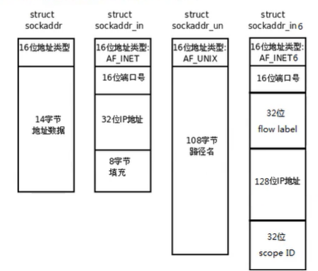

# Socket地址


# socket地址

## 通用socket地址
socket网络编程接口中表示socket地址的是结构体sockaddr，其定义如下：  
```c++
#include <bits/socket.h>
struct sockaddr {
    sa_family_t sa_family;
    char        sa_data[14];
};
typedef unsigned short int sa_family_t;

```
sa_family成员是地址族类型(sa_family_t)的变量。地址族类型通常与协议族类型对应，常见的协议族(protocol family,也成domain)和对应的地址族如下所示:  

|协议族|地址族|描述|
|-----|-----|-----|
|PF_UNIX|AF_UNIX|UNIX本地域协议族|
|PF_INET|AF_INET|TCP/IPv4协议族|
|PF_INET6|AF_INET6|TCP/IPv6协议族|

宏PF_*和AF_*都定义在bit/socket.h头文件中，且后者与前者有完全相同的值，所有二者通常混用。sa_data成员用于存放socket地址值.但是，不同的协议族的地址值具有不同的含义和长度，如下表示：  

|协议族|地址值含义和长度|
|-----|------------|
|PF_UNIX|文件的路径名，长度可达到108字节|
|PF_INET|16bit端口号和32bitIPv4地址，共6字节|
|PF_INET6|16bit端口号，32bit流标识，128bitIPv6地址，32bit范围ID，共26字节|

由上表可知，14字节的sa_data根本无法容纳多数协议族的地址值。因此，Linux定义了下面这个新的通用socket地址结构体，这个结构体不仅提供了足够大的空间用于存放地址值，而且是内存对象的。

```c++
#include <bits/socket.h>
struct sockadr_storage{
    sa_family_t sa_family;
    unsigned long int __sa_align;
    char __ss_padding[128 - sizeof(__sa_align)];
}
typedef unsigned short int sa_family_t;
```

---

## 专用socket地址
很多网络编程函数诞生早于IPv4协议，那时候都使用的是struct sockaddr结构体，为了向前兼容，现在的sockaddr退化成(void *)的作用，传递一个地址给函数，至于这个函数时sockaddr_in 还是sockaddr_in6，由地址族确定，然后函数内部再强制类型转换为所需的地址类型。  
 

UNIX本地域协议族使用如下专用的socket地址结构体
```c++
#include <sys/un.h>
struct sockaddr_un{
    sa_family_t sin_family;
    char sun_path[108];
}
```
TCP/IP协议族由sockaddr_in和sockaddr_in6两个专用的socket地址结构体，他们分别用于IPv4和Ipv6  

```c++
#include <netinet/in.h>
struct sockaddr_in{
    sa_family_t sa_family;
    in_port_t sin_port;
    struct in_addr sin_addr;
    unsigned char sin_zero[sizeof(struct sockaddr)-__SOCKADDR_COMMON_SIZE-sizeof(in_port_t)-sizeof(struct in_addr)];
};
struct in_addr{
    in_addr_t s_addr;
};


struct sockaddr_in6{
    sa_family_t sa_family;
    in_port_t sin6_port;
    uint32_t sin6_flowinfo;
    struct in6_addr sin6_addr;
    uint32_t sin6_scope_id;
};
typedef unsigned short uint16_t;
typedef unsigned int uint32_t;
typedef uint16_t in_port_t;
typedef uint32_t in_addr_t;
#define __SOCKADDR_COMMON_SIZE (sizeof(unsigned short int))
```

所有专用socket地址(以及sockaddr_storage)类型的变量在实际使用时都需要转化为通用socket地址类型sockaddr(强制转换即可),因为所有socket编程接口使用的地址参数类型都是sockaddr。  


# IP地址转换
通常，人们习惯用可读性好的字符串来表示ip地址，比如用点分十进制字符串表示IPv4地址，以及用十六进制字符串表示IPv6地址。但编程中我们需要先把它们转化成整数(二进制)方能使用。而记录日志时则相反，我们要把整数表示的IP地址转化成为可读的字符串。下面3个函数可用于用点分是兼职字符串表示的IPv4地址和用网络字节序整数表示的IPv4地址之间的转换：  
```c++
#includ <arpa/inet.h>
in_addr_t inet_addr(const char *cp);
int inet_aton(const char *cp,struct in_addr *inp);
char *inet_ntoa(struct in_addr in);
```
下面这对更新的函数也能完成前面3个函数同样的功能，并且它们同时适用IPv4地址和IPv6地址
```c++
#includ <arpa/inet.h>
//p : 点分十进制的字符串
//n : 表示network字节序的整数
int inet_pton(int af,const char *src,void *dest);
    //af:地址族
    //src ：需要转换的点分十进制字符串
    //dest：转换后保存的目标
const char  *inet_ntop(int af,const void *src,char *dest,socklen_t size);
    //af:地址族
    //src ：需要转换的Ip的整数
    //dest：转换后保存的目标
    //size : 第三个参数的大小
    //返回值:返回转换后的字符串
```
