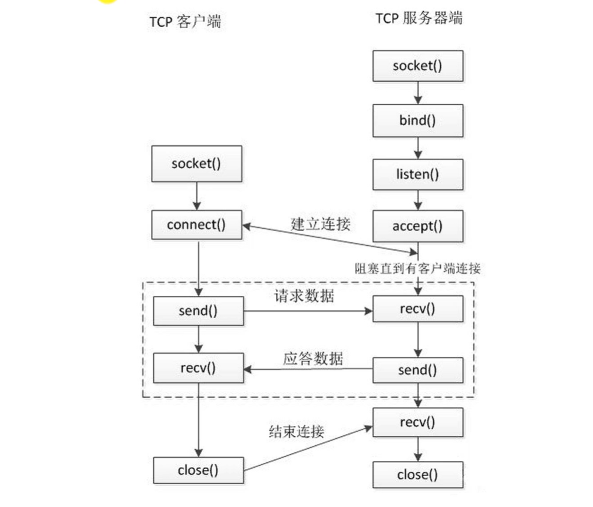

# Socket通信


## TCP通信流程

! 
```text
//TCP通信流程
//服务器端(被动接受的角色)
1.创建一个用于监听的套接字
    -监听：监听有无客户端连接
    -套接字：这个套接字其实是一个文件描述符
2.将这个监听文件描述符和本地的Ip和端口绑定(IP和端口就是服务器的地址信息);
    -客户端连接服务器的时候使用的就是这个ip和端口
3.设置监听，监听的fd开始工作
4.阻塞等待，当有客户端发起连接，接触阻塞，接受客户端的连接，会得到一个和客户端通信的套接字(fd)
5.通信
    - 接收数据
    - 发送数据
6.通信结束，断开连接  
```
```text
//客户端
1.创建一个用于通信的套接字
2.连接服务器，需要指定的服务器的ip和端口
3.通信
    -接收数据
    -发送数据
4.通信结束，断开连接
```

---

# 

socket编程有三种

1.流式套接字(SOCKET_STREAM)

2.数据报式套接字(SOCKET_DGRAM)

3,原始套接字(SOCKET_RAW)

前两者较常使用，基于TCP使用的是SOCKET_STREAM(流式套接字)

服务端

1.socket():创建流式socket

```c++
int     socket(int, int, int);
头文件： 
#include <sys/types.h>
#include <sys/socket.h>
函数原型：
int socket(int domain, int type, int protocol)
    domain: 协议类型，一般为AF_INET
    type: socket类型(SOCKET_STREAM,SOCKET_DGRAM,SOCKET_RAW)
    protocol:用来指定socket所使用的传输协议编号，通常设为0即可
```

2.bind():指定用于通信的IP地址和port端口

```c++
bind()
头文件：
#include <sys/types.h>
#include <sys/socket.h>
函数原型：
int bind(int sockfd, struct sockaddr *my_addr, int addrlen)
    sockfd: socket描述符
    my_addr:是一个指向包含有本机ip地址和端口号等信息的sockaddr类型的指针
    addrlen:常被设为sizeof(struct sockaddr)
```

3.listen():把socket设为监听对象

```c++
3 listen()
头文件：
#include <sys/socket.h>
函数原型：
int listen(int sockfd, int backlog);
sockfd:socket()系统调用返回的socket描述符
backlog:指定在请求队列中的最大请求数，进入的连接请求将在队列中等待accept()它们。
```

4.accept():接受客户端发来的连接请求

```c++
4 accept()
头文件：   
#include <sys/types.h>
#inlcude <sys/socket.h>
函数原型：
int accept(int sockfd, void *addr, int addrlen)
    sockfd:是被监听的socket描述符
    addr:通常是一个指向sockaddr_in变量的指针，该变量用来存放提出连接请求服务的主机的信息
    addrlen:sizeof(struct sockaddr_in)
```

5.recv()/send():接受或者发送

```c++
send()
头文件：
#include <sys/socket.h>
函数原型：
int send(int sockfd, const void *msg, int len, int flags);
    sockfd:用来传输数据的socket描述符
    msg:要发送数据的指针 
    flags: 0

recv()
头文件：
#include <sys/types.h>
#include <sys/socket.h>
函数原型:
int recv(int sockfd, void *buf, int len, unsigned int flags)
   sockfd：接收数据的socket描述符
   buf:存放数据的缓冲区
   len:缓冲的长度
   flags:0
```

6.close():关闭socket连接

客户端

1.socket():创建流式套接字

2.connect():连接服务器，发起请求

3.send()/recv():接受或者发送

4.close():关闭socket连接 释放资源

## 备注

```c++
htons
头文件:
#include <arpa/inet.h>
uint16_t htons(uint16_t hostshort);　
htons的功能：
    将一个无符号短整型数值转换为网络字节序，即大端模式(big-endian)　
    参数u_short hostshort: 16位无符号整数　
返回值:
    TCP / IP网络字节顺序.


htonl()
#include <arpa/inet.h>　　
uint32_t htonl(uint32_t hostlong);　　
简述：将主机的无符号长整形数转换成网络字节顺序。　
hostlong：主机字节顺序表达的32位数。　　
注释：
  　　本函数将一个32位数从主机字节顺序转换成网络字节顺序。　　
返回值：　
     htonl()返回一个网络字节顺序的值。
```

```c++
使用gethostname(const char *name);
返回如下结构体
struct hostent {
      char  *h_name;            /* official name of host */
      char **h_aliases;         /* alias list */
      int    h_addrtype;        /* host address type */
      int    h_length;          /* length of address */
      char **h_addr_list;       /* list of addresses */
}
hostent->h_name
表示的是主机的规范名。例如www.baidu.com的规范名其实是www.a.shifen.com。

hostent->h_aliases
表示的是主机的别名。www.baidu.com就是baidu他自己的别名。

hostent->h_addrtype    
表示的是主机ip地址的类型。只会是ipv4(AF_INET)， 这个函数处理不了ipv6

hostent->h_length      
表示的是主机ip地址的长度。

hostent->h_addr_list
表示的是主机的ip地址。是网络字节序，需要通过inet_ntop函数转换。
```

---

### 代码样例
需求:客户端向服务器发送消息，服务器回传该消息给客户端。  
#### 服务器部分:  
```c++
#include <stdio.h>
#include <stdlib.h>
#include <arpa/inet.h>
#include <sys/socket.h>
#include <sys/types.h>
#include <unistd.h>
#include <string.h>

//服务端
int main(){
    int socket_fd,connect_fd;
    struct sockaddr_in saddr,caddr;
    //创建套接字
    if((socket_fd=socket(AF_INET,SOCK_STREAM,0))==-1){
        perror("socket");
        exit(0);
    }
    //定义服务器地址
    saddr.sin_family = AF_INET;
    saddr.sin_addr.s_addr = htonl(INADDR_ANY);
    saddr.sin_port = htons(8000);

    if((bind(socket_fd,(struct sockaddr *)&saddr,sizeof(saddr)))==-1){
        perror("bind");
        exit(0);
    }
    //监听
    if((listen(socket_fd,10))==-1){
        perror("listen");
        exit(0);
    }
    //阻塞接受
    socklen_t clen = sizeof(caddr);
    if((connect_fd=accept(socket_fd,(struct sockaddr * )&caddr,&clen))==-1){
        perror("accept");
        exit(0);
    }
    //客户端信息
    char cip[16];//客户端ip
    inet_ntop(AF_INET,&caddr.sin_addr.s_addr,cip,sizeof(cip));
    unsigned int cport = ntohs(caddr.sin_port);//客户端端口
    //接受消息
    char recvbuf[1024]={0};
    while(1){
         
        // recvbuf
        int num = read(connect_fd, recvbuf, sizeof(recvbuf));
        if(num == -1) {
            perror("read");
            exit(-1);
        } else if(num > 0) {
            printf("我接受到了客户端的数据 : %s\n", recvbuf);
        } else if(num == 0) {
            // 表示客户端断开连接
            printf("clinet closed...\n");
            break;
        }
 
        char * data = recvbuf;
        // 给客户端发送数据（实现回射服务器）
        write(connect_fd, data, strlen(data));
    }
    //关闭文件描述符
    close(connect_fd);
    close(socket_fd);

    return 0;
}
```
#### 客户端部分
```c++
#include <stdio.h>
#include <stdlib.h>
#include <arpa/inet.h>
#include <sys/socket.h>
#include <sys/types.h>
#include <unistd.h>
#include <string.h>

int main(){
    int socket_fd;
    struct sockaddr_in saddr;

    //描述符
    if((socket_fd = socket(AF_INET,SOCK_STREAM,0))==-1){
        perror("socket");
        exit(0);
    }
    //设置服务器信息
    saddr.sin_family=AF_INET;
    inet_pton(AF_INET,"127.0.0.1",&saddr.sin_addr.s_addr);
    saddr.sin_port=htons(8000);
    
    //连接
    int ret = connect(socket_fd, (struct sockaddr *)&saddr, sizeof(saddr));
 
    if(ret == -1) {
        perror("connect");
        exit(-1);
    }
    //发送消息
    char recvbuf[1024]={0};
    while(1){
        // 从键盘输入，给客户端发送数据
        char data[1024];
        memset(data,0,sizeof data);
        printf("请输入发送数据：");
        scanf("%s", data);
        write(socket_fd, data , strlen(data));
 
        sleep(1);
         
        int len = read(socket_fd, recvbuf, sizeof(recvbuf));
        if(len == -1) {
            perror("read");
            exit(-1);
        } else if(len > 0) {
            printf("我接受到了回射服务器的返回的数据 : %s\n", recvbuf);
        } else if(len == 0) {
            // 表示服务器端断开连接
            printf("server closed...\n");
            break;
        }
    }
    close(socket_fd);

    return 0;
}
```
