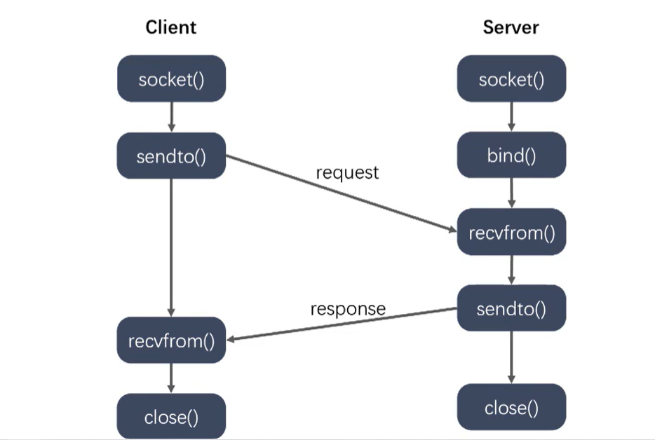
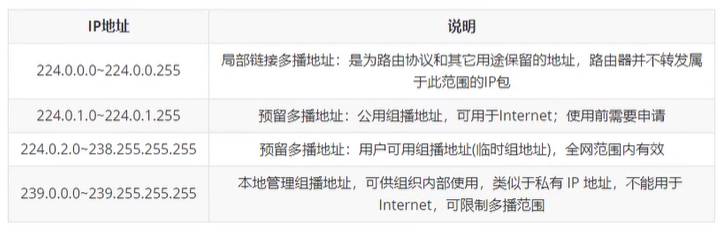

# UDP

# UDP

## UDP通信
 

```text
#include <sys/types.h>
#include <sys/socket.h>

ssize_t sendto(int sockfd,const void *buf,size_t len,int flags,const struct sockaddr *dest_addr,socklen_t addrlen);
    参数:
        -sockfd：通信的fd
        -buf:需要发送的数据
        -len:数组的大小
        -flags:设置一些标志
        -dest_addr:通信的另外一端的地址信息
        -addrlen :地址的内存大小
    返回值:。。。
ssize_t recvfrom(int sockfd,void *buf,size_t len,int flags,struct sockaddr *src_addr,socklen_t *addrlen);
    参数
        -sockfd:通信的fd
        -buf:接受数据的数组
        -len:数组的大小
        -flags:0
        -src_addr:接收方的地址指针
        -addrlen:接收方地址的内存大小
``` 

## 广播
向子网中多台计算机发送消息，并且子网中所有计算机都可以接受到发送方发送的消息，每个广播消息都包含一个特殊的IP地址，这个IP中子网内主机标志部分的二进制全部为1  
a.只能在局域网中使用  
b.客户端要绑定服务器广播使用的端口，才可以接收到广播的消息。  

```text
//设置广播属性
int setsockopt(int sockfd, int level, int optname,const void *optval, socklen_t optlen);
    sockfd：文件描述符
    level:级别 SOL_SOCKET
    optname:SO_BROADCAST
    optval : 1表示允许广播
    optlen : optval的大小
```

## 组播
单播地址标识单个IP接口，广播地址标识某个子网的所有IP接口，多播地址标识一组IP接口。单播是寻址方案的两个极端(要么单个要么全部)，多播则实在两者之间提供一个折中的方案。多播数据报只应该由对它感兴趣的接口接受。也就是说由允许相应多播会话系统的主机上的接口接受。另外，广播一般局限于局域网使用，而多播既可以用于局域网，也可跨局域网使用。  
a.既可以局域网，也可以跨局域网  
b.客户端需要加入多播组，才能接收到多播的数据  

### 组播地址  
IP多播通信必须依赖于IP多播地址，在IPv4中它的范围224.0.0.0到239.255.255.255,并被划分为局部链接多播地址，预留多播地址和管理权限多播地址三类。  
 

#### 设置组播
```text
int setsockopt(int sockfd, int level, int optname,const void *optval, socklen_t optlen);
//服务器设置多播信息，外出接口
    sockfd：文件描述符
    level:级别 IPPROTO_IP
    optname:
    optval : struct in_addr
    optlen : optval的大小
//客户端加入到多播组
    -level :IPPROTO_IP
    -optname : IP_ADD_MEMBERSHIP
    -optval : struct ip_mreqn;

struct ip_mreq{
    //组播组的IP地址
    struct in_addr_imr_multiaddr;  //组播组的ip地址
    //本地某一网路设备接口的IP地址
    struct in_addr imr_address;
    int imr_ifindex; //网卡编号
}

typedef uint32_t in_addr_t;
struct in_addr{
    
}

```
