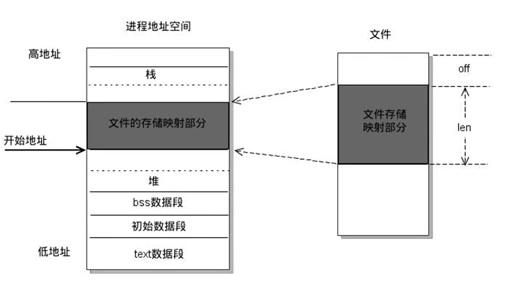

# 内存映射


# 内存映射
内存映射(Memory-mapped I/O)是将磁盘文件的数据映射到内存，用户通过修改内存就能修改磁盘文件。  
 

## 内存映射相关系统调用
```c++
#include <sys/mman.h>
void *mmap(void *addr, size_t length, int prot, int flags,int fd, off_t offset);
int munmap(void *addr, size_t length);
```


### 使用父子进程通信
```c++
/*
#include <sys/mman.h>
void *mmap(void *addr, size_t length, int prot, int flags,
    int fd, off_t offset);
    功能:将一个文件或者设备的数据映射到内存中
    参数：
        -void *addr:NULL 由内核指定
        -size_t lenght:映射的数据的长度，这个值不能为0，建议使用文件的长度
        int port:申请的内存映射区的操作权限
            PROT_EXEC  Pages may be executed.
            PROT_READ  Pages may be read.
            PROT_WRITE Pages may be written.
            PROT_NONE  Pages may not be accessed.

        int flag:
            - MAP_SHARED : 映射区的数据会自动和磁盘文件进行同步
            - MAP——PRIVATE：映射区的数据会自动和磁盘文件不同步

        int fd: 需要映射的文件的文件描述符
            注意:通过open得到
                文件的大小不能为0，open指定的权限不能和port冲突
                port:PROT_READ  open：只读/只写
                prot:PROT_READ | PROT_WRITE open  open:读写
        off_t offset : 偏移量，一般不用，必须指定4K的整数倍，0 表示从头
    返回值：
        成功：返回首地址
        错误：返回MAP_FAILED  并且set errno
int munmap(void *addr, size_t length);
    -功能：释放内存映射
    -参数：
        -addr : 要释放的内存的地址
        length: 释放的内存的大小,要和mmap里的length大小相同
*/

#include <sys/mman.h>
#include <stdio.h>
#include <sys/types.h>
#include <fcntl.h>
#include <unistd.h>
#include <string.h>
#include <stdlib.h>
#include <sys/wait.h>


int main(){
    //1.打开一个文件
    int fd = open ("test.txt",O_RDWR);
    //获取文件大小
    int size = lseek(fd,0,SEEK_END);
    //创建内存映射区
    void *addr = mmap(NULL,size,PROT_READ|PROT_WRITE,MAP_SHARED,fd,0);
    if(addr == MAP_FAILED){
        perror("mmap");
        exit(0);
    }
    //创建子进程
    pid_t pid = fork();
    if(pid>0){
        //父
        //回收
        wait(NULL);
        //定义数组
        char buffer[64];
        strcpy(buffer,(char * )addr);
        printf("read date : %s\n",buffer);
    }else if(pid == 0){
        //子
        strcpy((char *)addr,"你好");
    }
    //关闭
    munmap(addr,size);

    return 0;
}
```

### 无关系进程通信
process1
```c++
#include <sys/mman.h>
#include <sys/types.h>
#include <sys/stat.h>
#include <fcntl.h>
#include <stdio.h>
#include <stdlib.h>
#include <string.h>
#include <unistd.h>


int main(){
    //执行没有关系的两个文件的读写操作
    //打开文件
    int fd1 = open("test1.txt",O_RDWR);
    int size1 = lseek(fd1,0,SEEK_END);

    //创建内存映射区
    void * ptr1 = mmap(NULL,size1,PROT_READ|PROT_WRITE,MAP_SHARED,fd1,0);
    if(ptr1==MAP_FAILED){
        perror("mmap");
        exit(0);
    }
    //执行写入数据
    strcpy((char *)ptr1,"呵呵呵呵呵呵");

    munmap(ptr1,size1);
    

}
```


process2
```c++
#include <sys/mman.h>
#include <sys/types.h>
#include <sys/stat.h>
#include <fcntl.h>
#include <stdio.h>
#include <stdlib.h>
#include <string.h>
#include <unistd.h>


int main(){
    //执行没有关系的两个文件的读写操作
    //打开文件
    int fd1 = open("test1.txt",O_RDONLY);
    int size1 = lseek(fd1,0,SEEK_END);


    //创建内存映射区
    void * ptr1 = mmap(NULL,size1,PROT_READ,MAP_SHARED,fd1,0);
    if(ptr1==MAP_FAILED){
        perror("mmap");
        exit(0);
    }
    //执行读
    char buffer[128];
    memset(buffer,'0',128);
    strcpy(buffer,(char * )ptr1);
    printf("recv data :%s\n",buffer);
    munmap(ptr1,size1);
}
```

## 思考问题
1.如果对mmap的返回值(ptr)做++操作，mmap是否能够成功?  
```c++
void * ptr - mmap(..)
ptr++;//可以进程操作
munmap(ptr,len);//错误，需要保存之前的地址
```
2.如果open时O_RDONLY,mmap时port参数指定PORT_READ|PORT_WRITE会如何？ 
```text 
错误，会返回MAP_FAILED   不可以执行写权限  
```
3.如果文件偏移量为1000 
```text
偏移量必须是4 * 1024的整数倍，一般情况错误返回MAP_FAILED
``` 
4.mmap什么情况下调用失败?  
```text
第二个参数length： = 0,会调用失败
第三个参数PORT权限，如果只是指定了PORT_WRITE也会失败，一般需要指定PORT_READ|PORT_WRITE
                   如果权限大于open的权限，也会失败
``` 
5.可以open的时候O_CREAT一个新文件来创建映射区么？  
```text
可以的，但是创建的文件的大小如果为0的话，肯定不行
可以对新的文件进行拓展,lseek();truncate()
``` 
6.mmap后关闭文件描述符，对mmap有无影响？  
```text
 int fd = open(...)
 void* ptr = mmap(..,..,..,fd,..);
 close(fd)
 映射区还是存在的
``` 
7.对ptr越界操作会如何  
```text
void * ptr = mmap(NULL,100,...);
会以内存的分页的大小，来指定大小
越界操作的是非法的内存，会产生段错误
``` 


### 实现文件拷贝
```c++
/*
使用内存映射拷贝文件

思路:
    1.对原始文件进行内存映射
    2.创建新文件，lseek，truncate
    3.把新文件的数据映射到内存中
    4.通过内存拷贝，将第一个文件的内存数据拷贝到第二个文件的内存中
    5.释放资源
*/
#include <sys/mman.h>
#include <sys/types.h>
#include <sys/stat.h>
#include <fcntl.h>
#include <stdio.h>
#include <stdlib.h>
#include <string.h>
#include <unistd.h>

int main(){
    //1.对原始文件进行内存映射
    int fd = open("english.txt",O_RDWR);
    if(fd==-1){
        perror("open");
        exit(0);
    }
    
    //创建新的文件
    int fd2 = open("copy.txt",O_RDWR|O_CREAT,0664);
    if(fd2==-1){
        perror("open");
        exit(0);
    }
    //获取源文件的大小
    int size = lseek(fd,0,SEEK_END);

    //对新创建的文件进行拓展
    // lseek(fd2,size,SEEK_SET);
    truncate("copy.txt",size);
    write(fd2," ",1);

    //内存映射
    void * ptr1 = mmap(NULL,size,PROT_READ,MAP_SHARED,fd,0);
    void * ptr2 = mmap(NULL,size,PROT_READ|PROT_WRITE,MAP_SHARED,fd,0);

    if(ptr1==MAP_FAILED||ptr2==MAP_FAILED){
        perror("mmap");
        exit(0);
    }
    //内存拷贝
    memcpy(ptr2,ptr1,size);
    //关闭
    munmap(ptr1,size);
    munmap(ptr2,size);
    close(fd2);
    close(fd);

    return 0;
}
```


