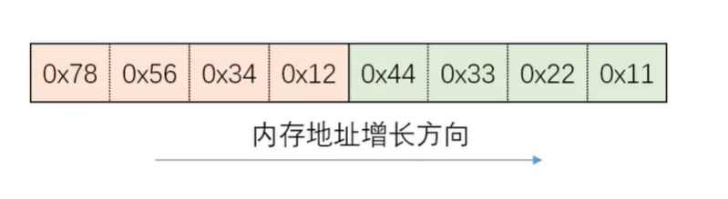
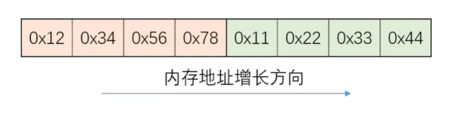

# 字节序


# 字节序
现代CPU的累加器一次都能装载至少4字节(32位机器),即一个整数。那么这四个字节在内存中排列的顺序将影响它被累加器装载成的整数的值，这就是字节序问题。在各种计算机体系结构中，对于字节，字等的存储机制有所不同，因而引发了计算机通信领域中一个很重要的问题，即通信双方交流的信息单元(比特，字节，字，双字节等)应该以什么样的顺序进行传送。如果不达成一致的规则，通信双方将无法进行正确的编码/译码从而导致通信失败。  

字节序，顾名思义字节的顺序，就是大于一个字节类型的数据在内存中的存放顺序(一个字节的数据当然就无需谈顺序的问题了)。  

字节序分为大端字节序(Big-Ending)，和小端字节(Little-Ending)。**大端字节序是指一个整数的最高位字节(23~31bit)存储在内存的低地址处，低位字节（0-7bit）存储在内存的高地址处；小端字节序则是指整数的高位字节存储在内存的高地址处，而低位字节则存储在内存的低地址处。**

## 字节序举例
### 小端字节序
小端字节序:最高有效位存于最高内存地址，最低有效位存于最低内存处

内存方向----->  

内存低------>内存高  

 

### 大端字节序
大端字节序:最高有效位存于最低内存地址处，最低有效位存于最高内存处

内存方向----->  

内存低------>内存高  

 

### 整体视图

 

---

## 字节序转换函数 
当格式化的数据在两台不同字节序的主机之间直接传递时，接收端必然错误的解释。解决问题的方法是：发送端总是把要发送的数据转换成大端字节序数据后再发送，而接收端知道对方传送过来的数据总是采用大端字节序，所以接收端可以根据自身采用的字节序决定是否对接收到的数据进行转换(小端机转换，大端机不转换)  

网络字节顺序是TCP/IP中规定好的一种数据表示格式，它与具体的CPU类型，操作系统等无关，从而可以保证数据在不同主机之间传输是能够被正确解释，网络字节顺序采用大端排序方式。  

BSD Socket_t提供了封装好的转换接口，方便程序员使用。包括从主机字节序到网络字节序的转换函数:htons，htonl：从网络字节序到主机字节序的转换函数：ntohs，ntohl。  

```c
h   - host :主机，主机字节序
to  - 转换成什么
n   - network:网络字节序
s   - short：unsigned short
l   - long: unsigned int
```


```c++
#include <arpa/inet.h>
//转换端口
uint_16_t htons(uint_16_t hostshort);//主机字节序到网络字节序
uint_16_t ntohs(uint_16_t netshort);//网络字节序到主机字节序

//转换ip
uint_16_t htonl(uint_16_t hostlong);//转ip
uint_16_t ntohl(uint_16_t netlong);
```


