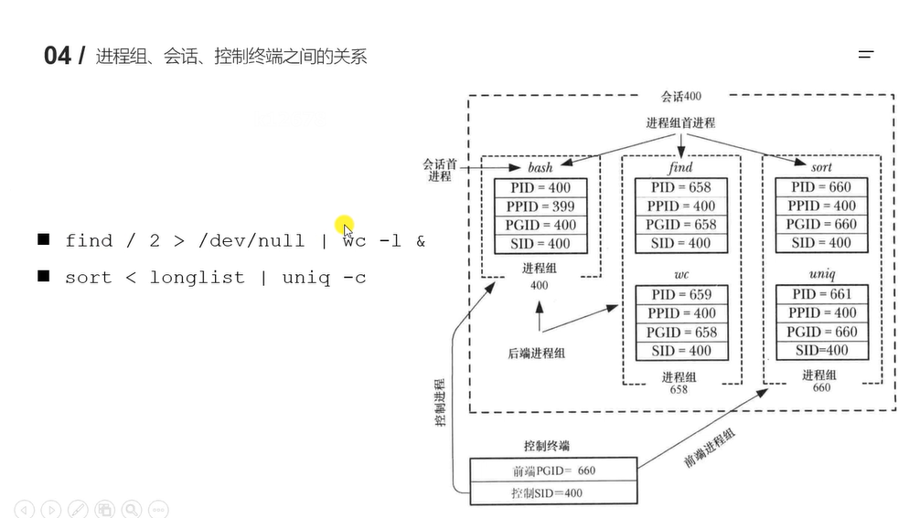

# 守护进程


## 终端
1.在UNIX系统中，用户通过终端登陆系统后得到一个shell进程，这个终端成为shell进程的控制终端(Controlling Terminal),进程中，控制终端是保存在PCB中的信息，而fork()会复制PCB中的信息，因此由Shell进程启动的其他进程的控制终端也是这个终端。  

2.默认情况下(没有重定向)，每个进程的标准输入，标准输出和标准错误输出都是指向控制终端，进程从标准输入读也就是读用户的键盘输入，进程往标准输出或标准错误输出写，也就是输出到显示器上。  

3。在控制终端输入一些特殊额控制键可以给前台进程发信号。例如Ctrl+C会产生SIGINT信号，CTRL+\会产生SIGQUIT信号  

## 进程组
1.进程组和会话在进程之间形成了一种两级层次的关系:进程组是一组相关进程的集合。会话是一组相关进程组的集合。进程组和会话是为了支持shell作业控制，而定义的抽象概念，用户通过shell能够交互式的在前台或者后台运行命令。  

2.进程组由一个或多个共享同一进程组标识符(PGID)的进程组成，一个进程组拥有一个进程组首进程，该进程是创建该组的进程，其进程ID为该进程组的ID，新警察会继承其父进程的所属的进程组ID。

3.进程组拥有一个生命周期，其开始时间为首进程创建组的时刻，结束时间为最后一个成员进程退出组的时刻。一个进程可能会因为终止而退出进程组，也可能会因为加入另一个进程组而退出当前进程组。进程组首进程无需是最后一个离开进程组的成员  

## 会话
1.会话是一组进程组的集合。会话首进程是创建新会话额进程。其进程ID会称为会话ID。新进程会继承其父进程的会话ID。

2.一个会话中的所有进程共享一个控制终端。控制终端会在会话首进程首次打开一个终端设备时被建立。一个终端最多可能会成为一个会话的控制终端。  

3.在任一时刻，会话中的其中一个进程组会成为终端的前台进程组，其他进程组会成为后台进程组。只有前台进程组中的进程才能从控制终端读取输入。当用户在控制终端中输入终端字符产生信号后，该信号会被发送到前台进程组中的所有成员。  

4.当控制终端的连接建立起来之后，会话首进程会成为该终端的控制进程。  

## 进程组，会话，控制终端之间的关系
如下图：  
 


## 进程组，会话操作函数
```text
pid_t getpgrp(void);//获取组id
pid_t getpgid(pid_t pid);//获取当前进程的进程组id
int setpgid(pid_t pid,pid_t pgid);//设置进程的进程组id
pid_t getsid(pid_t pid);//获取会话id
pid_t setsid(void);//设置会话id
```

## 守护进程
1.守护进程(Daemon Process),也就是通常说的Daemon进程(精灵进程),是Linux中的后台服务进程。它是一个生存期较长的进程，通常独立于控制终端并且周期性地执行某种任务或等待处理某些发生的事件。一般采用d结尾的名字。  

2.守护进程具备一下特性：  
2.1 生命周期长，守护进程会在系统启动的时候被创建并一直运行知道系统关闭  
2.2 他在后台运行并且不拥有控制终端，没有控制终端确保了内核永远不会为守护进程自动生成任何控制信号以及终端相关的信号  

3Linux的大多数服务器就是用守护进程实现的。比如Internet服务器inetd，Web服务器httpd等  

### 守护进程创建步骤
1.执行一个fork(),之后父进程退出，子进程继续执行  

2.子进程调用setsid()并开启一个会话。  

3.清除进程的umask以确保当守护进程创建文件和目录时拥有所需的权限  

4.修改进程的当前工作目录，通常会改为根目录(/)  

5、关闭守护进程从其父进程继承而来的所有打开着的文件描述符  

6 在关闭了文件描述符0,1,2之后，守护进程通常会打开/dev/null并使用dup2()使所有这些描述符指向这个设备、  

7 核心业务逻辑  

#### 例子
使用守护进程去实现每2秒记录系统时间并写入磁盘
```c++
/*

写一个守护进程，每隔两秒获取一下系统时间，将这个时间写入磁盘文件中

*/
#include <stdio.h>
#include <stdlib.h>
#include <sys/types.h>
#include <unistd.h>
#include <sys/stat.h>
#include <fcntl.h>
#include <sys/time.h>
#include <signal.h>
#include <time.h>
#include <string.h>

void work(int num){
    printf("捕捉到信号:%d\n",num);
    //获取系统时间
    time_t t = time(NULL);
    //将描述转换成系统时间
    struct tm * loc = localtime(&t);
    // char buffer[1024];
    // sprintf(buffer,"%d-%d-%d %d:%d:%d\n",loc->tm_year,loc->tm_mon,loc->tm_mday,loc->tm_hour,loc->tm_min,loc->tm_sec);

    char *buffer = asctime(loc);
    //写文件
    int fd = open("time.txt",O_RDWR|O_CREAT|O_APPEND,0775);
    write(fd,buffer,strlen(buffer));
    close(fd);
}


int main(){
    //创建子进程，退出父进程
    pid_t pid = fork();
    if(pid>0){
        //父进程直接退出
        exit(0);
    }

    //将子进程重新创建一个会话
    //新的会话脱离终端
    setsid();

    //修改进程的umask
    umask(022);

    //更改工作目录
    chdir("/home/zxl/");

    //关闭重定向文件描述符
    int fd = open("/dev/null",O_RDWR);
    dup2(fd,STDIN_FILENO);
    dup2(fd,STDERR_FILENO);
    dup2(fd,STDOUT_FILENO);

    //业务逻辑

    //需要信号捕捉
    struct sigaction act;
    act.sa_flags = 0;
    act.sa_handler =work;
    sigemptyset(&act.sa_mask);
    sigaction(SIGALRM,&act,NULL);

    //每隔两秒获取系统时间
    struct itimerval val;
    val.it_value.tv_sec=2;
    val.it_value.tv_usec=0;
    val.it_interval.tv_sec=2;
    val.it_interval.tv_usec=0;
    setitimer(ITIMER_REAL,&val,NULL);

    //不让进程结束
    while(1){
        sleep(3);
    }

    return 0;
}
```
