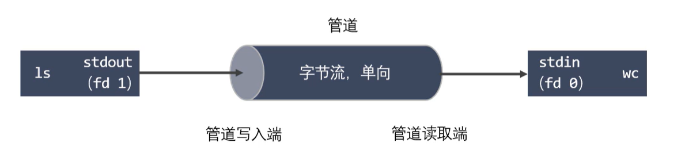
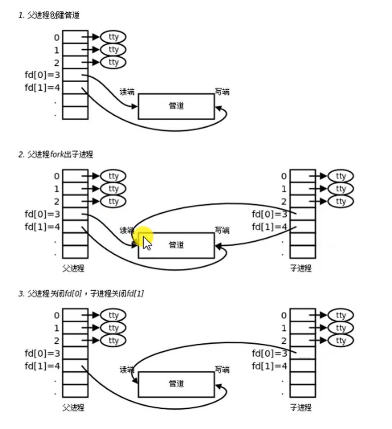

# 进程间通信概念


# 进程间通讯概念
1.进程是一个独立的资源分配单元，不同的进程(用户进程)之间的资源是独立的，没有关联，不能在一个进程中直接访问另一个进程的资源  
2.但是，进程不是孤立的，不同的进程需要进行信息的交互和状态的传递等，因此需要进程间通信
3.进程间通信的目的  
3.1数据传输:一个进程需要将它的数据发送给另一个进程
3.2通知时间:一个进程需要向另一个或一组进程发送信息，通知他们发生了某种时间(如进程终止时通知父进程)  
3.3资源共享:多个进程之间共享同样的资源，为了做到这一点，需要内核提供互斥和同步机制  
3.4进程控制:游戏进程希望完全控制另一个进程的执行(如DEBUG)，此时控制进程希望能够拦截另一个进程的所有陷入和异常，并能够及时知道它的状态改变.  

## 同一主机进程间通信
Unix进程间通信方式:1.匿名管道2.有名管道3.信号  
SystemV进程间通信方式:1.消息队列2.共享内存3.信号量  
POSIX进程间通信方式:1.消息队列2.共享内存3.信号量  
### 匿名管道
1.管道也叫匿名管道，他是UNIX系统IPC(进程间通信)最古老的形式，所有UNIX系统都支持这种通信机制  
2.统计一个目录中文件的数目命令：ls|wc -l,为了执行该命令，shell创建了两个进程来分别执行ls和wc  
  

#### 管道的特点
1.管道其实是一个在内核内存中维护的缓冲器，这个缓冲器的存储能力是有限的，不同的操作系统大小不一定相同  
2.管道拥有文件的特质:读操作.写操作，**匿名管道没有文件实体，有名管道有文件实体**，但不存储数据，可以按照操作文件的方式对管道进行操作。  
3.一个管道是一个字节流，使用管道时不存在消息或者消息边界的概念，从管道读取数据的进程可以读取任意大小的数据块，而不管写入进程写入管道的数据块的大小是多少  
4.通过管道传递的数据是顺序的，从管道中读取的字节的顺序和它们被写入管道的顺序是一样的。  

#### 管道的特点
1.在管道中的数据传递方向是单向的，一端用于写入，一端用于读取，管道时半双工的  
2.从管道读数据是一次操作，数据一旦被读走，它就从管道中被抛弃，释放空间以便写更多的数据，在管道中无法使用lseek()来随机访问数据  
3.匿名管道只能在具有公共先祖的进程(父进程子进程，兄弟进程)之间使用。

#### 匿名管道的使用
1.创建匿名管道
```c++
#include <unistd.h>
int pipe(int pipefd(2));
```
2.查看管道缓冲大小命令
ulimit -a
3.查看管道缓冲大小的函数
```c++
#include <unistd.h>
long fpathconf(int fd,int name);
```
example int pipe(int pipefd(2));
```c++
/*
    #include <unistd.h>
    int pipe(int pipefd[2]);
    作用：创建一个匿名管道
    参数:
        int pipefd[2]:这个数组是一个传出参数
        pipefd[0]:对应的是读端
        pipefd[1]:对应的是写端
    返回值：
        success:0
        fail：-1 and set errno
    
    管道默认是阻塞的，如果管道中没有数据 read阻塞，如果管道满了，write阻塞
    注意:匿名管道只能用于有关系的进程间通信
*/

#include <unistd.h>
#include <sys/types.h>
#include <stdio.h>
#include <stdlib.h>
#include <string.h>

//子进程发送数据给父进程
int main(){
    //管道需要在fork之前创建管道
    int pipefd[2];
    int ret = pipe(pipefd);
    if(ret==-1){
        perror("pipe");
        exit(0);
    }
    //创建子进程
    pid_t pid =fork();

    //判断
    if(pid > 0){
        //父进程
        printf("parent process pid %d\n",getpid());
        char buf[1024]={0};
        while(1){ 
            int len = read(pipefd[0],buf,sizeof(buf));
            printf("parent recv %s, pid %d\n",buf,getpid());
            
            char * str = "Hello I m parent";
            write(pipefd[1],str,strlen(str));
            sleep(1);
        }

    }else if(pid == 0){
        printf("child process, pid %d\n",getpid());
        while(1){
            //从管道的读取端读取数据
            char * str = "Hello I m child";
            write(pipefd[1],str,strlen(str));

            sleep(1);
            char buf[1024]={0};
            int len = read(pipefd[0],buf,sizeof(buf));
            printf("child recv %s, pid %d\n",buf,getpid());
        }
    }

    return 0;
}
```
example long fpathconf(int fd,int name);
```c++
/*
    #include <unistd.h>

    long fpathconf(int fd, int name);
    long pathconf(const char *path, int name);
*/


#include <unistd.h>
#include <sys/types.h>
#include <stdio.h>
#include <stdlib.h>


int main(int argc ,char *argv[]){
    int pipefd[2];
    int ret = pipe(pipefd);
    if(ret==-1){
        perror("pipe");
        exit(0);
    }
    pid_t pid = fork();

    if(pid>0){
        //father process
        printf("father process pid = %d\n",getpid());
        printf("pipe read buffer size = %ld,pipe write buffer size = %ld\n",fpathconf(pipefd[0],_PC_PIPE_BUF),fpathconf(pipefd[1],_PC_PIPE_BUF));
    }else if(pid==0){
        printf("child process pid = %d\n",getpid());
        printf("pipe read buffer size = %ld,pipe write buffer size = %ld\n",fpathconf(pipefd[0],_PC_PIPE_BUF),fpathconf(pipefd[1],_PC_PIPE_BUF));
    }
    return 0;
}
```

由于上述代码使用sleep控制输出，才没有导致单一进程读写管道内数据。基本上管道只作为单一方向通信时使用。其使用的模型分为三种，如下图所示  
  
所以，如果我们想要双方通信的话，可以选择模式3，关闭写方读通道，关闭读方写通道。具体代码如下：

```c++
/*
    #include <unistd.h>
    int pipe(int pipefd[2]);
    作用：创建一个匿名管道
    参数:
        int pipefd[2]:这个数组是一个传出参数
        pipefd[0]:对应的是读端
        pipefd[1]:对应的是写端
    返回值：
        success:0
        fail：-1 and set errno
    
    管道默认是阻塞的，如果管道中没有数据 read阻塞，如果管道满了，write阻塞
    注意:匿名管道只能用于有关系的进程间通信
*/

#include <unistd.h>
#include <sys/types.h>
#include <stdio.h>
#include <stdlib.h>
#include <string.h>

//子进程发送数据给父进程
int main(){
    //管道需要在fork之前创建管道
    int pipefd[2];
    int ret = pipe(pipefd);
    if(ret==-1){
        perror("pipe");
        exit(0);
    }
    //创建子进程
    pid_t pid =fork();

    //判断
    char buf[1024]={0};//buffer
    if(pid > 0){
        //父进程读
        printf("parent process pid %d\n",getpid());
        //关闭写
        close(pipefd[1]);
        while(1){ 
            int len = read(pipefd[0],buf,sizeof(buf));
            printf("parent recv %s, pid %d\n",buf,getpid());
            memset(buf,'\0',sizeof(buf));
            sleep(1);
        }

    }else if(pid == 0){
        //子进程写
        printf("child process, pid %d\n",getpid());
        //关闭读
        close(pipefd[0]);
        char *str = "我爱洗澡皮肤好好,噢噢噢噢！";
        while(1){
            write(pipefd[1],str,strlen(str));
            sleep(1);
        }
    }

    return 0;
}
```

#### 案例
实现ps aux | grep xxx

```c++
/*
    实现ps aux | grep xxx
    父子进程间通信

    子进程执行ps aux，子进程结束之后，将数据发送给父进程
    父进程获取到数据，过滤

    pipe()
    fork()
    execlp()
    子进程讲标准输出stdout_fileno 重定向到管道的写端  dup
*/
#include <unistd.h>
#include <sys/types.h>
#include <stdio.h>
#include <stdlib.h>
#include <string.h>
#include <regex.h>
#include <wait.h>

int main(int argc,char * argv[]){
    //先创建管道
    int pipefd[2];
    int ret = pipe(pipefd);
    if(ret==-1){
        perror("pipe");
        exit(0);
    }
    //创建进程
    pid_t pid = fork();
    char buffer[1024];
    if(pid>0){
        //father
        //关闭写端
        close(pipefd[1]);
        //从管道里读取数据
        memset(buffer,'0',sizeof(buffer));
        //读数据
        int res = 0;
        while((res=read(pipefd[0],buffer,sizeof(buffer)-1))>0){
            printf("%s",buffer);
        }
        //过滤 输出
        
        //回收
        wait(NULL);

    }else if(pid==0){
        //child
        // 文件描述符的重定向  STDOUT_FILENO --> pipefd[1]
        dup2(pipefd[1],STDERR_FILENO);
        //执行ps aux
        execlp("ps","ps","aux",NULL);
        perror("execlp");
    }

    return 0;
}
```
#### 管道的读写特点
使用管道时，需要注意一下几种特殊情况(假设都是阻塞I/O操作)
1.所有的指向管道写端文件描述符都关闭了(管道写端引用计数为0)，有进程从管道的读端读数据，那么管道中剩余的数据被读取以后，再次read会返回0，或者-1.就像读到文件末尾一样。  

2.如果有指向管道写端的文件描述符没有关闭(管道写端的引用计数大于0),而持有管道写端的进程也没有忘管道中写数据，那么这个时候有进程从管道中读取数据，管道中剩余的数据被读取后，再次read后会阻塞，知道管道中有数据可以被读取，才读取数据并返回读到字节的个数。

3.如果所有指向管道读端的文件描述符都关闭了(管道的读端引用计数为0),这个时候有进程向管道中写数据，那么该进程会受到一个信号SIGPIPE,通常会导致进程异常终止。  

4.如果有指向管道读端的文件描述符没有关闭(管道的读端引用计数大于0),而持有管道读端的进程也没有从管道中读数据，这时有进程从管道中写数据，管道中剩余的空间被写满之后，那么再次调用write之后会阻塞。直到管道中有空位置才能再次写入数据并返回。  

读管道：  
    管道中有数据，read返回实际读到的字节数  
    管道中无数据:  
        写端全部关闭，read返回0  
        写端没完全关闭，read阻塞等待  
写管道:  
    管道读端全部被关闭，进程异常终止(进程收到SIGPIPE信号)  
    管道读端没有全部关闭:  
        管道已满:阻塞  
        管道没满：写入数据，如果写满，阻塞  

#### 管道设置非阻塞
可以使用fcntl()函数
```c++
//先获取flag
int flag = fcntl(fd[0],F_GETFL);
//然后修改flag
flag |= O_NONBLOCK
//设置flag
fcntl(fd[0],F_SETFL,flag);
```

### 有名管道
1.匿名管道，由于没有名字，只能用于亲缘关系的进程间通信，为了克服这一点，提出了有名管道(FIFO)，也叫命名管道，FIFO文件  
2.有名管道不同于匿名管道之处在于它提供了一个路径名与之关联，以FIFO的文件形式存在于文件系统中，并且其打开方式与打开一个普通文件是一样的。这样及时与FIFO的创建进程不存在亲缘关系的进程，也可以访问该路径，就能够彼此通过FIFO通信。  
3.一旦打开了FIFO，就能在它上面使用与操作匿名管道和其他文件的系统调用一样的IO系统调用(read,write,close)。与管道一样，FIFO也有一个写入端和一个读取端。并且从个管道中读取数据的顺序与写入的顺序是一样的。FIFO的名称也由此而来，First in First out  

#### 区别
有名管道(FIFO)和匿名管道(pipe)有一些特点相同，不一样的地方在于:  
1.FIFO在文件系统中作为一个特殊文件存在，但FIFO中的内容却存放在内存中  
2.当使用FIFO的进程退出后，FIFO文件将继续保存在文件系统中以便以后使用.  
3.FIFO有名字，不相干的进程可以打开有名管道进行通信  

#### 有名管道的使用
1.通过命令创建有名管道  
mkfifo 名字  
2.通过函数创建  
```c++
#include <sys/types/h>  
#inclued <sys/stat.h>  
int mkfifo(const char *pathname,mode_t mode);
```
3.一旦使用mkfifo创建了一个FIFO,就可以使用open打开，使用IO函数操作  
4.不支持lseek()等文件定位操作  


