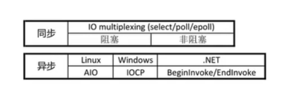

# 阻塞/阻塞_同步/异步


# 1.阻塞/非阻塞,同步/异步
典型的一次IO的两个阶段：数据的就绪和数据的读写  

```text
数据就绪:根据系统IO操作的就绪状态
1.阻塞     调用IO方法的线程进入阻塞状态，如果没数据，线程被挂起

2.非阻塞   不会改变线程的状态，通过返回值判断
--------------------------------------------
数据读写:根据应用程序和内核的交互方式  
1.同步     例如读数据，读取内核缓冲区数据，直到读取完，我们才知道有多少数据，才可以执行下面步骤

2.异步     例如读数据，读取内核缓冲区数据，我们不管读没读完，我们都可以执行下面的代码

```
  

```text
一个典型的网络IO接口的调用，分为两个阶段，分别是数据就绪和数据读写。数据就绪阶段分为阻塞和非阻塞。表现的结果就是，阻塞当前线程或者直接返回。

同步表示A向B请求一个网络接口IO的时候(或者调用某个业务逻辑API接口时)，数据的读写都是由请求方A自己来完成的(不管阻塞或者非阻塞);异步表示A向B请求调用一个网络接口IO时(或者调用某个业务API接口时),向B传入请求事件，以及事件发生时通知的方式，A就可以处理其他逻辑了，当B监听到事件处理完成之后，会用事先约定好的通知方式，通知A处理结果
```
